```{r setupq1, include=FALSE}
knitr::opts_chunk$set(comment = "#>", echo = TRUE, fig.width=6)
```

# Week 1- Welcome!

Welcome to Marine Genomics Spring 2022 at UC Davis!!!!!

You will find the lecture for week one [here](https://github.com/BayLab/MarineGenomicsSemester/blob/main/ppt/MarineGenomics_Lecture1.pdf)

## Introduction to shell computing via the data carpentry tutorial

We will be following the data carpentry tutorial (Copyright 2016 @ Software Carpentry) "Introduction to the command line for genomics". We have made some modifications to the data carpentry tutorial to fit our course. 

What is a shell and why should I care?

A shell is a computer program that presents a command line interface which allows you to control your computer using commands entered with a keyboard instead of controlling graphical user interfaces (GUIs) with a mouse/keyboard combination.

There are many reasons to learn about the shell:

+ Many bioinformatics tools can only be used through a command line interface, or have extra capabilities in the command line version that are not available in the GUI. This is true, for example, of BLAST, which offers many advanced functions only accessible to users who know how to use a shell.
+ The shell makes your work less boring. In bioinformatics you often need to do the same set of tasks with a large number of files. Learning the shell will allow you to automate those repetitive tasks and leave you free to do more exciting things.
+ The shell makes your work less error-prone. When humans do the same thing a hundred different times (or even ten times), they’re likely to make a mistake. Your computer can do the same thing a thousand times with no mistakes.
+ The shell makes your work more reproducible. When you carry out your work in the command-line (rather than a GUI), your computer keeps a record of every step that you’ve carried out, which you can use to re-do your work when you need to. It also gives you a way to communicate unambiguously what you’ve done, so that others can check your work or apply your process to new data.
+ Many bioinformatic tasks require large amounts of computing power and can’t realistically be run on your own machine. These tasks are best performed using remote computers or cloud computing, which can only be accessed through a shell.

In this lesson you will learn how to use the command line interface to move around in your file system.

## How to access the shell

For this course we will be using the shell in our Jetstream2 allocation through xsede. Jetstream2 is a cloud computing resource for which we have been allocated resources for the purposes of this course. Below is a guide for accessing and using jetstream.

In jetstream we launch what they call an "instance" which is a small allocation that specifies how much memory you need and reflects how much computing you might do (we'll guide you through this).

You'll find the Jetstream login [here](https://jetstream2.exosphere.app/exosphere/home) 


To log in first click on the "add allocation" button

```{r one, echo=FALSE, out.width = '100%'}
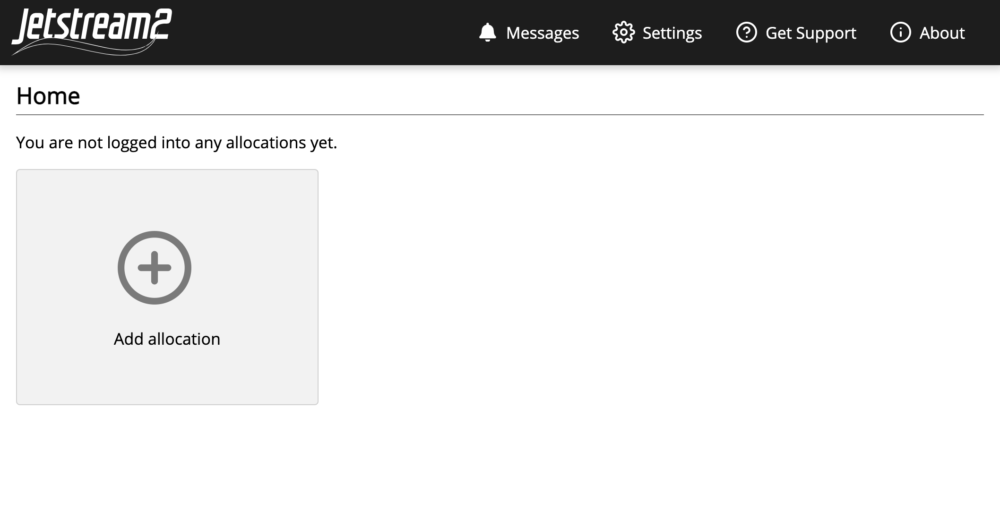
```


Then click "add XSEDE account"

```{r two, echo=FALSE, out.width = '100%'}
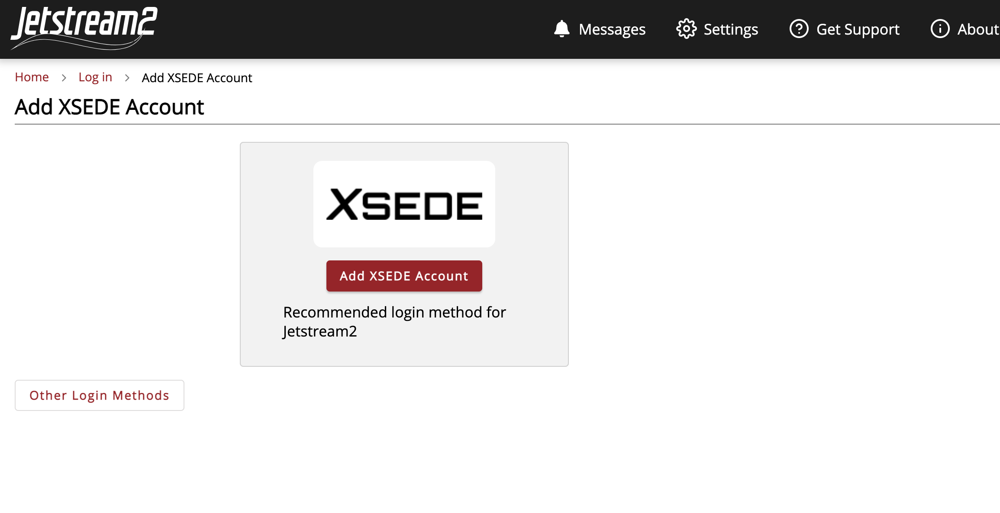
```


This will redirect you to the xsede login page. Your organization should say xsede. 

Click continue

```{r three, echo=FALSE, out.width = '100%'}
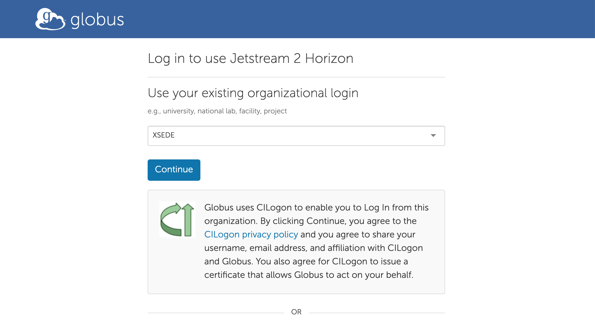
```


Next it will ask for xsede login details. Everyone should have made an account in preparation for the course. If you still need to create an account, you can find instructions [here](https://docs.jetstream-cloud.org/alloc/overview/). For assistance with creating an xsede account contact Erica Nielsen (esnielsen@ucdavis.edu)

```{r four, echo=FALSE, out.width = '100%'}
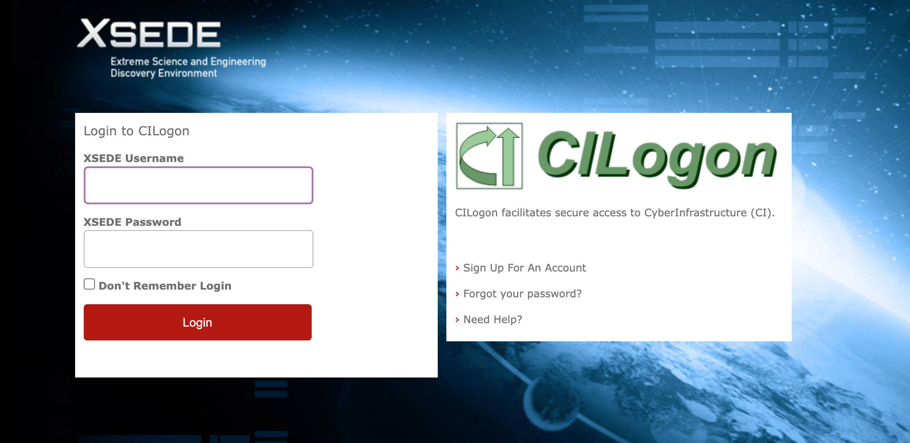
```


Once you've logged in you should be redirected to Jetstream2. You should now be able to join the allocation for the course. 

```{r six, echo=FALSE, out.width = '100%'}
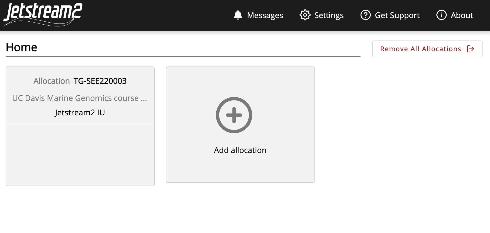
```


Click on course allocation box on the left. 

```{r seven, echo=FALSE, out.width = '100%'}
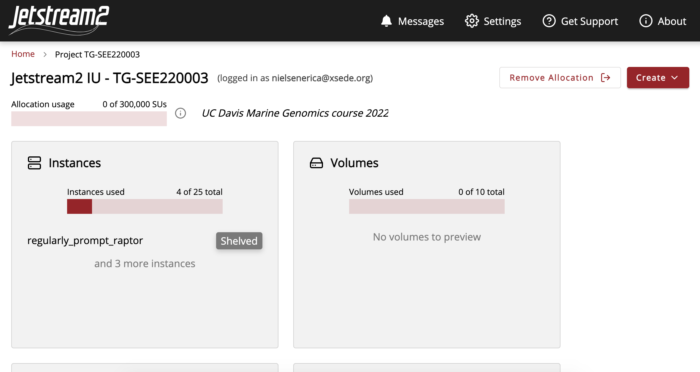
```


Once within the course allocation we can create our first instance. Go to the "Create" tab and select "instance".

```{r eight, echo=FALSE, out.width = '100%'}
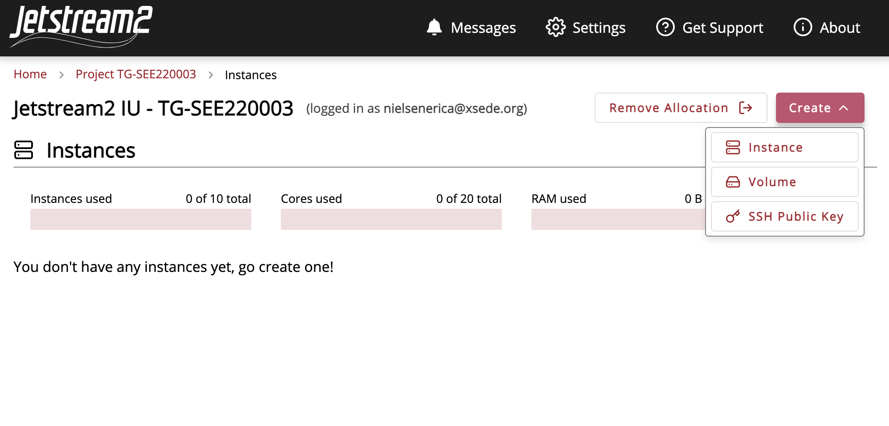
```


Select the Ubuntu v.20.04 instance source.

```{r nine, echo=FALSE, out.width = '100%'}
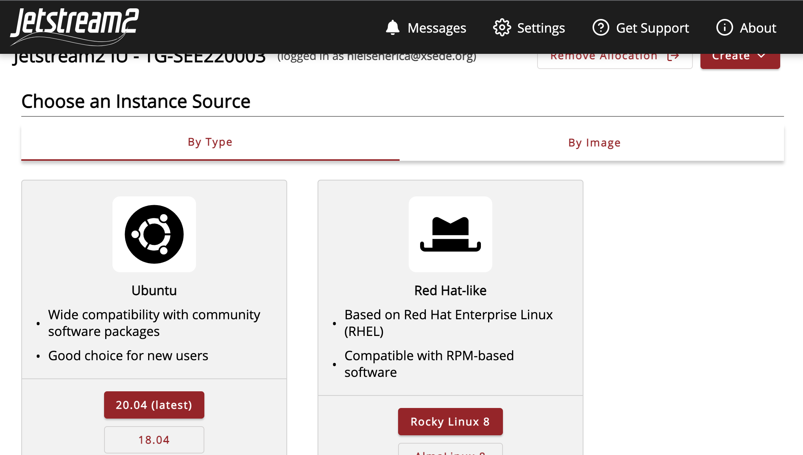
```


This will automatically generate a name, which we suggest you edit to something more meaningful, such as "MarGen2022_(yourname)". Select the small instance size "m3.small"

```{r ten, echo=FALSE, out.width = '100%'}
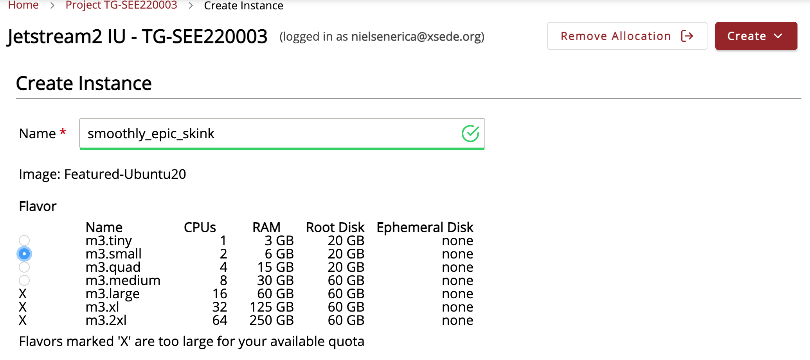
```


Select "yes" for enabling web desktop. This will give a warning but that is okay. 

```{r eleven, echo=FALSE, out.width = '100%'}
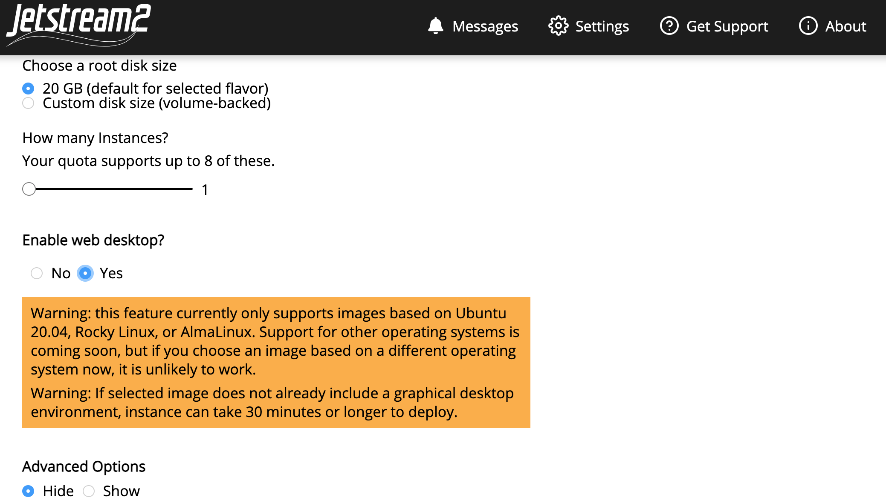
```


It will take several minutes to build our instance. Once it's ready to go you should see a green Ready sign.

```{r thirteen, echo=FALSE, out.width = '100%'}
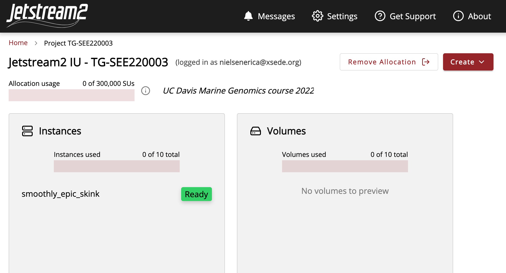
```


Now we can go to the 'Connect to' tab, and select web desktop.

```{r fourteen, echo=FALSE, out.width = '100%'}
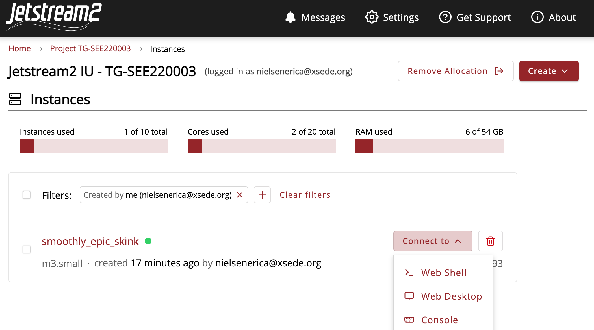
```


You should see something like the little desktop below. It may ask you to authenticate to set the time zone, but you can just press cancel. 

```{r fifteen, echo=FALSE, out.width = '100%'}
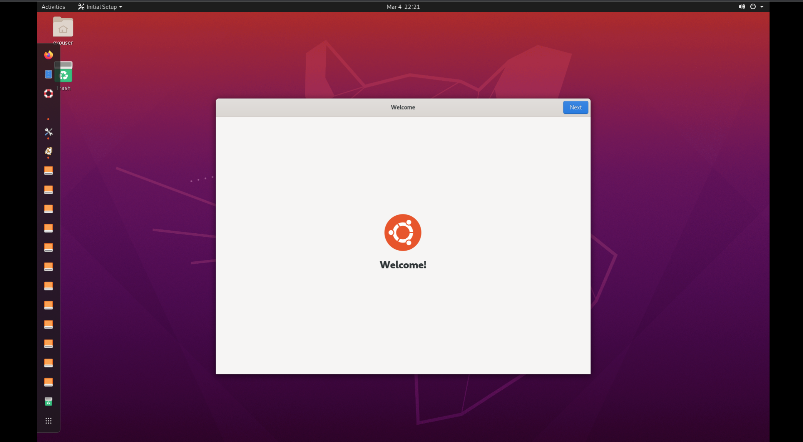
```


Follow the prompts, pressing next and skip in the upper right on the window. 

We using the command line application called Terminal. Select the grid of boxes on the bottom of side bar to show applications. You can type "terminal" in the search bar at the top, or scroll to find the Terminal application. It will open a new window that has the `$` prompt.

```{r sixteen, echo=FALSE, out.width = '100%'}
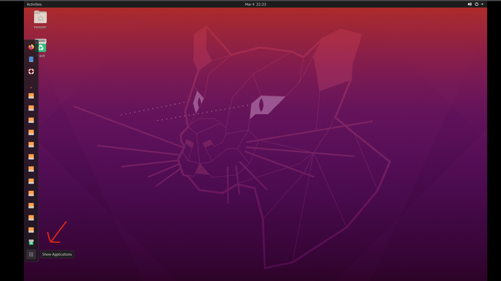
```

```{r seventeen, echo=FALSE, out.width = '100%'}
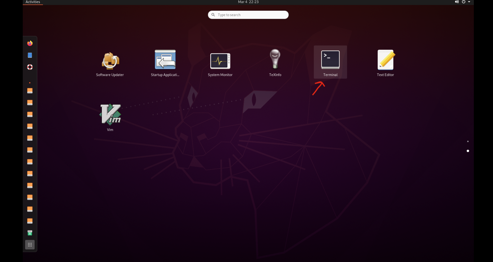
```

```{r eighteen, echo=FALSE, out.width = '100%'}
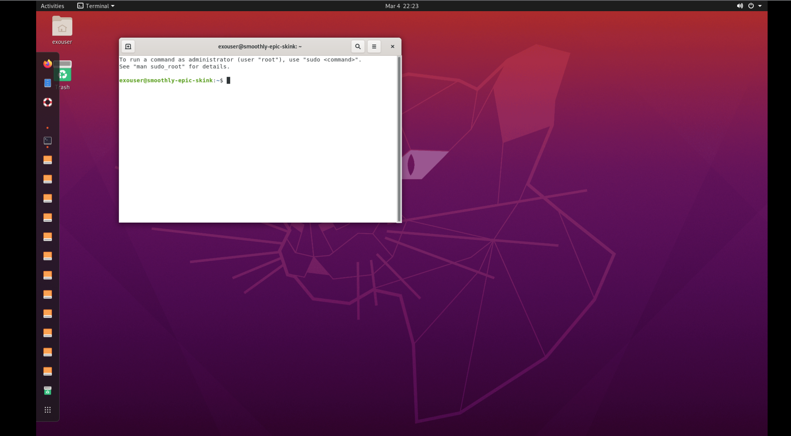
```

## Best practices for Jetstream

Once you launch your instance and it's "active" it's ready to use. 

When you're done coding it's best to close your jetstream desktop and projects folder browser window. If you are going to step away from jetstream for a while (say over the weekend), it's best to 'Shelve' or 'Suspend' your instance.

Once you're ready to code again you just have to select 'Resume' to start your instance again. This will take a few minutes. 

If in doubt of whether you should 'shelve/suspend' or keep active, it's our recommendation to shelve/suspend your instance. This frees up resources for other users and should reduce the likelihood of your active instance freezing up and being inaccessible. 


If you get an error while trying to log in or open the web shell or web desktop, follow these tips:

+ log out of the jetstream home page and log back in
+ relaunch your instance
+ reboot your instance

If those options fail then it is likely best to delete the instance and relaunch a new instance. This will result in you losing your data or work, but that should not be terribly detrimental to the course as everything resets with new data each week. 

## Week 1 Objectives

Questions to Answer:

+ How can I perform operations on files outside of my working directory?

+ What are some navigational shortcuts I can use to make my work more efficient?

Main Tasks:

+ Use a single command to navigate multiple steps in your directory structure, including moving backwards (one level up).

+ Perform operations on files in directories outside your working directory.

+ Work with hidden directories and hidden files.

+ Interconvert between absolute and relative paths.

+ Employ navigational shortcuts to move around your file system.

## Navigating your file system
The part of the operating system responsible for managing files and directories is called the file system. It organizes our data into files, which hold information, and directories (also called “folders”), which hold files or other directories.

Several commands are frequently used to create, inspect, rename, and delete files and directories.
```html
$
```

The dollar sign is a prompt, which shows us that the shell is waiting for input; your shell may use a different character as a prompt and may add information before the prompt. When typing commands, either from these lessons or from other sources, do not type the prompt, only the commands that follow it.

Let’s find out where we are by running a command called 'pwd' (which stands for “print working directory”). At any moment, our current working directory is our current default directory, i.e., the directory that the computer assumes we want to run commands in, unless we explicitly specify something else. Here, the computer’s response is /home/margeno, which is the top level directory within our cloud system:

```html
$ pwd
```
```html
/home/exouser
```
Let’s look at how our file system is organized. We can see what files and subdirectories are in this directory by running `ls`, which stands for “listing”:
```html
$ ls
```
```html
 Desktop  Documents  Downloads  Music  Pictures  Public  Templates  Videos
```  
`ls` prints the names of the files and directories in the current directory in alphabetical order, arranged neatly into columns. We’ll make a new subdirectory MarineGenomics where we will be creating new subdirectories, throughout this workshop.

To make a new directory type the command `mkdir` followed by the name of the directory, in this case MarineGenomics.
```html
$ mkdir MarineGenomics
```
Check that it's there with ls
```html
$ ls
```
```html
Desktop  Documents  Downloads  Music  Pictures  Public  Templates  Videos MarineGenomics
```
The command to change locations in our file system is cd, followed by a directory name to change our working directory. cd stands for “change directory”.

Let’s say we want to navigate to the MarineGenomics directory we saw above. We can use the following command to get there:
```html
$ cd MarineGenomics
```
```html
$ pwd
```
```html
/home/margeno/MarineGenomics
```
Use `ls` to see what is inside MarineGenomics
```html
$ ls
```
```html
```

It should be empty because we just created it and haven't put anything in it yet. Let's download some data to work with. We'll put it in our MarineGenomics directory. 

Let's first navigate back to our home directory. 

```html
cd 
```


There are many ways to do transfer files and download data. We can use the command `wget` which needs a link to the file that we want to download. If there's a file saved on a website somewhere (anywhere on the internet) `wget` will download it for you. 

```html
$ wget https://raw.githubusercontent.com/BayLab/MarineGenomicsData/main/week1.tar.gz
```

We now need to untar that file so we can access the contents

```html
tar -xzvf week1.tar.gz
```

Now that we have something in our MarineGenomics directory. Move back into that directory. We can now use the `ls` command a bit more.

We can make the ls output more comprehensible by using the flag -F, which tells ls to add a trailing / to the names of directories:

```html
$ ls -F
```
```html
week1/
```
Anything with a “/” after it is a directory. Things with a “*” after them are executable. If there are no decorations, it’s a file.

`ls` has lots of other options. To find out what they are, we can type:

```html
$ man ls
```

`man` (short for manual) displays detailed documentation (also referred as man page or man file) for `bash` commands. It is a powerful resource to explore bash commands, understand their usage and flags. Some manual files are very long. You can scroll through the file using your keyboard’s down arrow or use the Space key to go forward one page and the `b` key to go backwards one page. When you are done reading, hit `q` to quit.

Use the `-l` option for the `ls` command to display more information for each item in the directory. What is one piece of additional information this long format gives you that you don’t see with the bare `ls` command?

```html
$ ls -l
```

No one can possibly learn all of these arguments, that’s what the manual page is for. You can (and should) refer to the manual page or other help files as needed.


Now let's cd into the data directory and then use ls to see what's in that directory.

```html
$ cd week1
$ ls -F
```
```html
SRR6805880_1.fastq  SRR6805880_2.fastq
```
This directory contains two files with .fastq extensions. FASTQ is a format for storing information about sequencing reads and their quality. We will be learning more about FASTQ files in a later lesson.


## Shortcut: Tab Completion

Typing out file or directory names can waste a lot of time and it’s easy to make typing mistakes. Instead we can use tab complete as a shortcut. When you start typing out the name of a directory or file, then hit the Tab key, the shell will try to fill in the rest of the directory or file name.

Return to your home directory:

```html
$ cd
```

then enter

```html
$ cd Mar<tab>
```
The shell will fill in the rest of the directory name for `MarineGenomics`.

Now change directories to `week1` in `MarineGenomics`

```html
$ cd MarineGenomics
$ cd week1
```

Using tab complete can be very helpful. However, it will only autocomplete a file or directory name if you’ve typed enough characters to provide a unique identifier for the file or directory you are trying to access.

For example, if we now try to list the files which names start with SR by using tab complete:

```html
$ ls SR<tab.
```
The shell auto-completes your command to `SRR6805880_`, because all file names in the directory begin with this prefix. When you hit Tab again, the shell will list the possible choices.

```html
$ ls SRR68<tab><tab>
```
```html
SRR6805880_1.fastq SRR6805880_2.fastq
```
Tab completion can also fill in the names of programs, which can be useful if you remember the beginning of a program name.

```html
$ pw<tab><tab>
```
```html
pwck      pwconv    pwd       pwdx      pwunconv
```
Displays the name of every program that starts with `pw`.

## Summary & Key Points

We now know how to move around our file system using the command line. This gives us an advantage over interacting with the file system through a GUI as it allows us to work on a remote server, carry out the same set of operations on a large number of files quickly, and opens up many opportunities for using bioinformatic software that is only available in command line versions.

In the next few episodes, we’ll be expanding on these skills and seeing how using the command line shell enables us to make our workflow more efficient and reproducible.

+ The shell gives you the ability to work more efficiently by using keyboard commands rather than a GUI.

+ Useful commands for navigating your file system include: ls, pwd, and cd.

+ Most commands take options (flags) which begin with a -.

+ Tab completion can reduce errors from mistyping and make work more efficient in the shell.

\newpage

## Navigating Files and Directories

This continues the shell module from Data Carpentry's introduction to the shell, which can be found here https://datacarpentry.org/shell-genomics/02-the-filesystem/index.html


## Moving around the file system

We’ve learned how to use `pwd` to find our current location within our file system. We’ve also learned how to use cd to change locations and ls to list the contents of a directory. Now we’re going to learn some additional commands for moving around within our file system.

Use the commands we’ve learned so far to navigate to the `MarineGenomics/week1` directory, if you’re not already there.

```html
$ cd
$ cd MarineGenomics
$ cd week1
```

Make a new directory in week1 and name it after your favorite marine species. Then navigate into that directory. Use the command line to prove to your neighbors that you are indeed within that directory.

Now we want to move back up and out of this directory into our top level directory. Can we type cd MarineGenomics? Try it and see what happens.

```html
$ cd MarineGenomics
```

```html
-bash: cd: MarineGenomics: No such file or directory
```
Your computer looked for a directory or file called MarineGenomics within the directory you were already in. It didn’t know you wanted to look at a directory level above the one you were located in.

We have a special command to tell the computer to move us back or up one directory level.

```html
$ cd ..
```
Now we can use `pwd` to make sure that we are in the directory we intended to navigate to, and ls to check that the contents of the directory are correct.

```html
$ pwd

home/exouser/MarineGenomics
```

```html
$ ls

week1
```

From this output, we can see that `..` did indeed take us back one level in our file system.

You can chain these together like so:

```html
$ ls ../../
```
prints the contents of `/home`.

## Navigating practice and finding hidden directories

Go back to your home directory. From there list the contents of the home directory. There are hidden directories in our home directory. Explore the options for `ls` to find out how to see hidden directories. List the contents of the directory and identify the name of the text file in that directory. 

Hint: hidden files and folders in Unix start with `.`, for example `.my_hidden_directory`

<details><summary><span style="color: red;">Solution</span></summary>
<p>

```html
$ cd
```

Let's look at some of the options for the `ls` function using the `man` command (note this will print out several lines of text)

```html
$ man ls
```
The `-a` option is short for all and says that it causes `ls` to “not ignore entries starting with .” This is the option we want.

```html
$ ls -a

.   .ICEauthority  .Rhistory    .ansible       .bash_logout  .cache   .dbus     .fontconfig  .local    .r                .ssh  .wget-hsts        Desktop    Downloads  Pictures  Templates
..  .Renviron      .Xauthority  .bash_history  .bashrc       .config  .emacs.d  .gnupg       .profile  .rstudio-desktop  .vnc  .xsession-errors  Documents  Music      Public    Videos

```

You'll see there are many more files shown now that we can look at the hidden ones. 

In most commands the flags can be combined together in no particular order to obtain the desired results/output.

```html
$ ls -Fa
$ ls -laF
```

</p>
</details>


## Examining the contents of other directories

By default, the `ls` commands lists the contents of the working directory (i.e. the directory you are in). You can always find the directory you are in using the `pwd` command. However, you can also give `ls` the names of other directories to view. Navigate to your home directory if you are not already there.

```html
$ cd
```

Then enter the command:

```html
$ ls MarineGenomics

week1
```

This will list the contents of the MarineGenomics directory without you needing to navigate there.

The `cd` command works in a similar way.

Try entering:

```html
$ cd
$ cd MarineGenomics/week1
```
This will take you to the MarineGenomics directory without having to go through an intermediate directory.

Navigating practice

Navigate to your home directory. From there, list the contents of the Week1 directory.

<details><summary><span style="color: red;">Solution</span></summary>
<p>
```html
$ cd
$ ls MarineGenomics/week1

SRR6805880_1.fastq SRR6805880_2.fastq
```
</p>
</details>

## Full vs Relative Paths

The `cd` command takes an argument which is a directory name. Directories can be specified using either a relative path or a full absolute path. The directories on the computer are arranged into a hierarchy. The full path tells you where a directory is in that hierarchy.

Navigate to the home directory, then enter the `pwd` command.

```html
$ cd
$ pwd
```
You should see:

```html
/home/exouser
```

This is the full name of your home directory. This tells you that you are in a directory called `exouser`, which sits inside a directory called home which sits inside the very top directory in the hierarchy. The very top of the hierarchy is a directory called `/` which is usually referred to as the `root` directory. So, to summarize: exouser is a directory in `home` which is a directory in /. More on `root` and `home` in the next section.

Now enter the following command:

```html
$ cd /home/exouser/MarineGenomics/week1
```

This jumps several levels to the `week1` directory. Now go back to the home directory.

```html
$ cd 
```

You can also navigate to the `week1` directory using:

```html
$ cd MarineGenomics/week1
```
These two commands have the same effect, they both take us to the `Week1` directory. The first uses the absolute path, giving the full address from the home directory. The second uses a relative path, giving only the address from the working directory. A full path always starts with a /. A relative path does not.

A relative path is like getting directions from someone on the street. They tell you to “go right at the stop sign, and then turn left on Main Street”. That works great if you’re standing there together, but not so well if you’re trying to tell someone how to get there from another country. A full path is like GPS coordinates. It tells you exactly where something is no matter where you are right now.

You can usually use either a full path or a relative path depending on what is most convenient. If we are in the home directory, it is more convenient to enter the full path. If we are in the working directory, it is more convenient to enter the relative path since it involves less typing.

Over time, it will become easier for you to keep a mental note of the structure of the directories that you are using and how to quickly navigate amongst them.


> ## Exercise
> 1. Navigate to your home directory
> 2. Use cd with the full path to go into the directory you named after your favorite marine taxa
> 3. Within that directory examine the contents of MarineGenomics/week1
> 4. Then navigate to the directory two levels above

<details><summary><span style="color: orange;">Solution</span></summary>
<p>

```html
$ cd
$ pwd

$ cd /home/exouser/MarineGenomics/week1/*your_unique_directory
$ pwd

$ ls ..

$ cd ../../
$ pwd

```

</p>
</details>
&nbsp;

## Navigational shortcuts

The root directory is the highest level directory in your file system and contains files that are important for your computer to perform its daily work. While you will be using the root (/) at the beginning of your absolute paths, it is important that you avoid working with data in these higher-level directories, as your commands can permanently alter files that the operating system needs to function. In many cases, trying to run commands in root directories will require special permissions which will be discussed later, so it’s best to avoid them and work within your home directory. Dealing with the home directory is very common. The tilde character, ~, is a shortcut for your home directory. In our case, the root directory is two levels above our home directory, so cd or cd ~ will take you to `/home/exouser` and cd `/` will take you to `/`. 

Navigate to the MarineGenomics directory:
```html
$ cd
$ cd MarineGenomics
```
Then enter the command:
```html
$ ls ~

Desktop  Documents  Downloads  Music  Pictures  Public  Templates  Videos MarineGenomics
```

This prints the contents of your home directory, without you needing to type the full path.

The commands `cd`, and `cd ~` are very useful for quickly navigating back to your home directory. We will be using the ~ character in later lessons to specify our home directory.

## Key Points

+ The /, ~, and .. characters represent important navigational shortcuts.

+ Hidden files and directories start with . and can be viewed using ls -a.

+ Relative paths specify a location starting from the current location, while absolute paths specify a location from the root of the file system.

## Creature of the Week!


