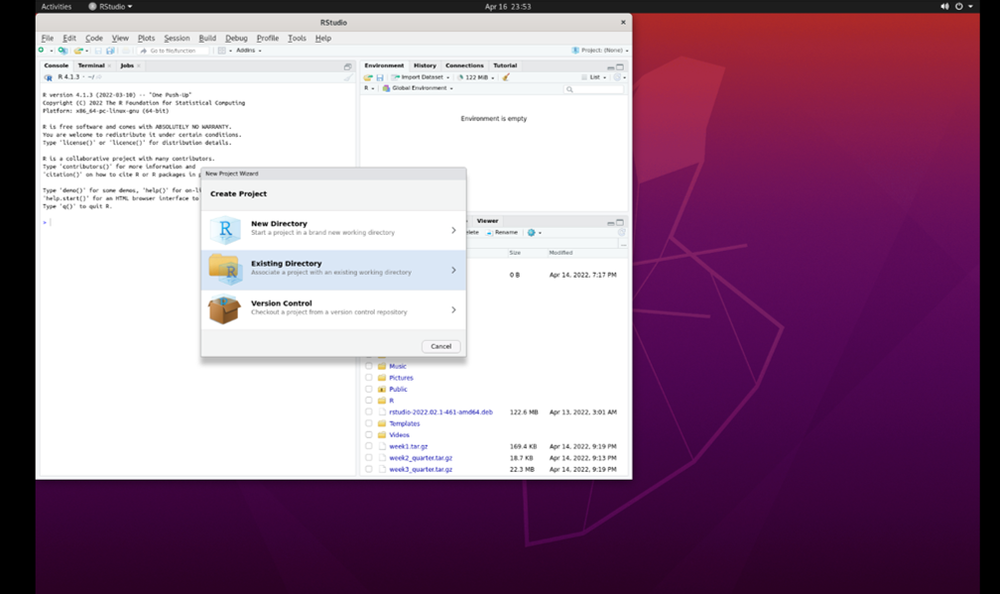
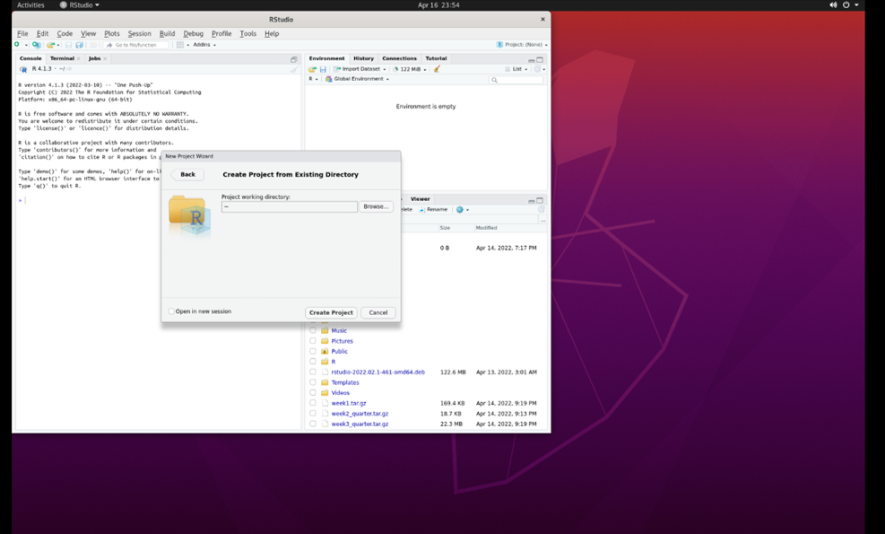
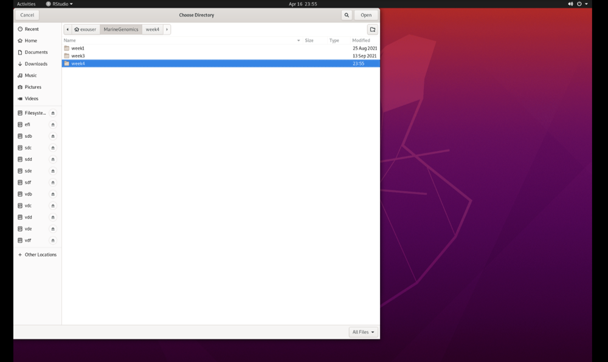
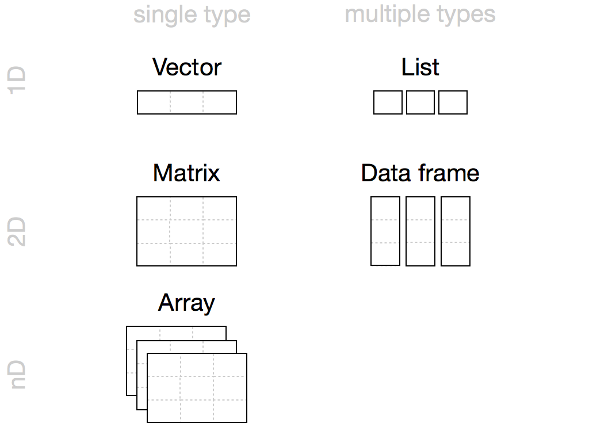

---
title:
author:
date:
output:
  bookdown::html_book:
    toc: yes
    css: toc.css
---


# Week 4 - The R environment

This lesson is modified from materials of the STEMinist_R lessons produced by several UC Davis graduate student and which can be found [here](https://github.com/ecalfee/STEMinist_R.git). We have made some modifications to the data carpentry tutorial to fit our course.

Download the data from the MarineGenomicsData repository on git hub via wget in the terminal with the following link:
(first we navigate to the MarineGenomics directory)
```{html
cd MarineGenomics
wget https://raw.githubusercontent.com/BayLab/MarineGenomicsData/main/week4_2022.tar.gz

```
Use tar to uncompress the file:
```
tar -xzvf week4_2022.tar.gz

```

You can now open Rstudio by searching for Rstudio in Applications. When we first open Rstudio, it has 3 parts: the window to the left (console/terminal/jobs), and two windows to the right (environment/history/connections/tutorial and files/plots/packages/help/viewer). When we open a script, a fourth window will appear. We can change the location and size of these windows as we please, and we will get used to using them when we code in Rstudio. 

Before we begin coding, for good practice, let's start by creating a Project. Working in a project allows us to save all our scripts in the same place, and to automatically have access to the files we are working with without repeatedly specifying paths. This will be especially important once you start working on multiple projects at a time. 

## Create a project in Rstudio
Go to 'File' and select 'New Project'. You will then see this:
&nbsp;


Select 'Existing Directory'. Then, select 'browse':
(this may take a minute)
&nbsp;


Select the 'Marine Genomics' directory and then select 'week4_2022':
&nbsp;


Click 'Open', and then 'Create Project'. You have now created a project ('week4_2022.Rproj') that is located together with the other files that we will be working with. 

There are a few types of files we can work with in Rstudio. The most basic file is an *.R file, which contains simple code. We will orientate ourselves with Rstudio using such a file. 

## Orientation to R

When we work in R, we document our work using a script (for example, an R file). We can open a new R file by selecting File > New File > R Script, which generates a simple text file. 
It's very important to add comments to our code, that explain the commands that we are using, by using the '#' sign - anything that follows a '#' is not code!
Commenting on code is very important! It explains to someone else what your code does, and can even be useful when you revisit your own code after a few weeks/months/years. Be nice to your future self, comment your code. 
We can use this script to copy (from the website) the commands we use and paste them (onto the R file).

R can be used for basic arithmetic:


```r
5+10+23
```

```
## [1] 38
```
The number in the brackets is the line the number. 

It can also store values in objects. There are five different types of objects in R: vector, list, matrix, data frame and array. (image taken from [this](https://rstudio-education.github.io/hopr/r-objects.html#summary-2) website)
&nbsp;



You can assign values to an object using an assignment operator `<-` or  `=`. Notice that once you've created an object, it will appear in the 'Environment' section in the window on the upper right.

```r
number <- 10

numbers <- c(10, 11, 12, 14, 16)
```

You can see your assigned object by typing the name you gave it.

```r
number
```

```
## [1] 10
```

```r
numbers
```

```
## [1] 10 11 12 14 16
```

Objects can be numbers or characters:

```r
cat <- "meow"
dog <- "woof"
```


We can use colons to get sequences of numbers:

```r
n <- 1:100
```

Vectors can also include characters (in quotes): 
`c()`=concatenate, aka link things together!

```r
animals <- c("woof", "meow", "hiss", "baa")
```

## Manipulating a vector object 

We can get summaries of vectors with `summary()`

```r
summary(n)
```

```
##    Min. 1st Qu.  Median    Mean 3rd Qu.    Max. 
##    1.00   25.75   50.50   50.50   75.25  100.00
```

We can see how long a vector is with `length()`

```r
length(n)
```

```
## [1] 100
```
You can use square brackets `[]` to get parts of vectors. For example, the third part of the 'animals' vector we created:

```r
animals[3]
```

```
## [1] "hiss"
```

## Characterizing a dataframe


We'll now move from working with objects and vectors to working with dataframes:

* Here are a few useful functions: 
  + install.packages()
  + library()
  + data()
  + str()
  + dim()
  + colnames() and rownames()
  + class()
  + as.factor()
  + as.numeric()
  + unique() 
  + t()
  + max(), min(), mean() and summary()


We're going to use data on sleep patterns in mammals. This requires installing a package (ggplot2) and loading the data
 
Install the package `ggplot2`. This only has to be done once and after installation we should then **comment out the command to install the package with a #.**


```r
#install.packages("ggplot2")

#load the package

library (ggplot2)
```
 
Load the data (it's called msleep).


```r
data("msleep")
```


There are many functions in R that allow us to get an idea of what the data looks like. For example, what are its dimensions (how many rows and columns)? 


```r
# head() -look at the beginning of the data file
# tail() -look at the end of the data file

head(msleep)
```

```
## # A tibble: 6 × 11
##   name    genus vore  order conservation sleep_total sleep_rem sleep_cycle awake
##   <chr>   <chr> <chr> <chr> <chr>              <dbl>     <dbl>       <dbl> <dbl>
## 1 Cheetah Acin… carni Carn… lc                  12.1      NA        NA      11.9
## 2 Owl mo… Aotus omni  Prim… <NA>                17         1.8      NA       7  
## 3 Mounta… Aplo… herbi Rode… nt                  14.4       2.4      NA       9.6
## 4 Greate… Blar… omni  Sori… lc                  14.9       2.3       0.133   9.1
## 5 Cow     Bos   herbi Arti… domesticated         4         0.7       0.667  20  
## 6 Three-… Brad… herbi Pilo… <NA>                14.4       2.2       0.767   9.6
## # … with 2 more variables: brainwt <dbl>, bodywt <dbl>
```

```r
tail(msleep)
```

```
## # A tibble: 6 × 11
##   name    genus vore  order conservation sleep_total sleep_rem sleep_cycle awake
##   <chr>   <chr> <chr> <chr> <chr>              <dbl>     <dbl>       <dbl> <dbl>
## 1 Tenrec  Tenr… omni  Afro… <NA>                15.6       2.3      NA       8.4
## 2 Tree s… Tupa… omni  Scan… <NA>                 8.9       2.6       0.233  15.1
## 3 Bottle… Turs… carni Ceta… <NA>                 5.2      NA        NA      18.8
## 4 Genet   Gene… carni Carn… <NA>                 6.3       1.3      NA      17.7
## 5 Arctic… Vulp… carni Carn… <NA>                12.5      NA        NA      11.5
## 6 Red fox Vulp… carni Carn… <NA>                 9.8       2.4       0.35   14.2
## # … with 2 more variables: brainwt <dbl>, bodywt <dbl>
```

```r
# str()
str(msleep)
```

```
## tibble [83 × 11] (S3: tbl_df/tbl/data.frame)
##  $ name        : chr [1:83] "Cheetah" "Owl monkey" "Mountain beaver" "Greater short-tailed shrew" ...
##  $ genus       : chr [1:83] "Acinonyx" "Aotus" "Aplodontia" "Blarina" ...
##  $ vore        : chr [1:83] "carni" "omni" "herbi" "omni" ...
##  $ order       : chr [1:83] "Carnivora" "Primates" "Rodentia" "Soricomorpha" ...
##  $ conservation: chr [1:83] "lc" NA "nt" "lc" ...
##  $ sleep_total : num [1:83] 12.1 17 14.4 14.9 4 14.4 8.7 7 10.1 3 ...
##  $ sleep_rem   : num [1:83] NA 1.8 2.4 2.3 0.7 2.2 1.4 NA 2.9 NA ...
##  $ sleep_cycle : num [1:83] NA NA NA 0.133 0.667 ...
##  $ awake       : num [1:83] 11.9 7 9.6 9.1 20 9.6 15.3 17 13.9 21 ...
##  $ brainwt     : num [1:83] NA 0.0155 NA 0.00029 0.423 NA NA NA 0.07 0.0982 ...
##  $ bodywt      : num [1:83] 50 0.48 1.35 0.019 600 ...
```
dim(), ncol(), nrow()- dimensions, number of columns, number of rows
colnames(), rownames() - column names, row names

It's important to know the class of data if you want to work with it. `msleep` contains several different types of data. Some common classes are: factors, numeric, integers, characters, logical
 

```r
 # class()

class(msleep)
```

```
## [1] "tbl_df"     "tbl"        "data.frame"
```

Rstudio also allows us to just look into the data file with `View()`. We can also click on our dataframe in the 'Environment'. 


