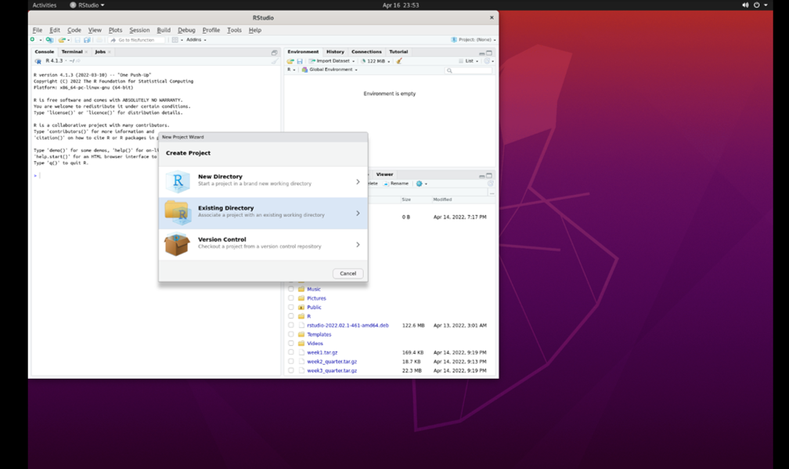
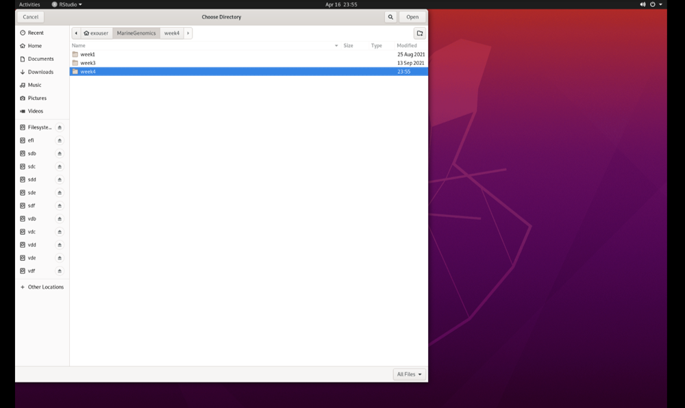

---
title:
author:
date:
output:
  bookdown::html_book:
    toc: yes
    css: toc.css
---


# Week 4 - The R environment

This lesson is modified from materials of the STEMinist_R lessons produced by several UC Davis graduate student and which can be found [here](https://github.com/ecalfee/STEMinist_R.git). We have made some modifications to the data carpentry tutorial to fit our course.

Download the data from the MarineGenomicsData repository on git hub via wget in the terminal with the following link:
(first we navigate to the MarineGenomics directory)
```{html
cd MarineGenomics
wget https://raw.githubusercontent.com/BayLab/MarineGenomicsData/main/week4_2022.tar.gz

```
Use tar to uncompress the file:
```
tar -xzvf week4_2022.tar.gz

```

You can now open Rstudio by searching for Rstudio in Applications. When we first open Rstudio, it has 3 parts: the window to the left (console/terminal/jobs), and two windows to the right (environment/history/connections/tutorial and files/plots/packages/help/viewer). When we open a script, a fourth window will appear. We can change the location and size of these windows as we please, and we will get used to using them when we code in Rstudio. 

Before we begin coding, for good practice, let's start by creating a Project. Working in a project allows us to save all our scripts in the same place, and to automatically have access to the files we are working with without repeatedly specifying paths. This will be especially important once you start working on multiple projects at a time. 

## Create a project in Rstudio
Go to 'File' and select 'New Project'. You will then see this:
&nbsp;


Select 'Existing Directory'. Then, select 'browse':
(this may take a minute)
&nbsp;


Select the 'Marine Genomics' directory and then select 'week4_2022':
&nbsp;


Click 'Open', and then 'Create Project'. You have now created a project ('week4_2022.Rproj') that is located together with the other files that we will be working with. 

There are a few types of files we can work with in Rstudio. The most basic file is an *.R file, which contains simple code. We will orientate ourselves with Rstudio using such a file. 

## Orientation to R studio

When we work in R, we document our work using a script (for example, an R file). We can open a new R file by selecting File > New File > R Script, which generates a simple text file. 
It's very important to add comments to our code, that explain the commands that we are using, by using the '#' sign - anything that follows a '#' is not code!
Commenting on code is very important! It explains to someone else what your code does, and can even be useful when you revisit your own code after a few weeks/months/years. Be nice to your future self, comment your code. 
We can use this script to copy (from the website) the commands we use and paste them (onto the R file).

R can be used for basic arithmetic:


```r
5+10+23
```

```
## [1] 38
```
The number in the brackets is the line the number. 

It can also store values in objects. There are five different types of objects in R: vector, list, matrix, data frame and array. (image taken from [this](https://rstudio-education.github.io/hopr/r-objects.html#summary-2) website)
&nbsp;


You can assign values to an object using an assignment operator `<-` or  `=`. Notice that once you've created an object, it will appear in the 'Environment' section in the window on the upper right.

```r
number <- 10

numbers <- c(10, 11, 12, 14, 16)
```

You can see your assigned object by typing the name you gave it.

```r
number
```

```
## [1] 10
```

```r
numbers
```

```
## [1] 10 11 12 14 16
```

Objects can be numbers or characters:

```r
cat <- "meow"
dog <- "woof"
```


We can use colons to get sequences of numbers:

```r
n <- 1:100
```

Vectors can also include characters (in quotes): 
`c()`=concatenate, aka link things together!

```r
animals <- c("woof", "meow", "hiss", "baa")
```

## Manipulating a vector object 

We can get summaries of vectors with `summary()`

```r
summary(n)
```

```
##    Min. 1st Qu.  Median    Mean 3rd Qu.    Max. 
##    1.00   25.75   50.50   50.50   75.25  100.00
```

We can see how long a vector is with `length()`

```r
length(n)
```

```
## [1] 100
```
You can use square brackets `[]` to get parts of vectors. For example, the third part of the 'animals' vector we created:

```r
animals[3]
```

```
## [1] "hiss"
```

## Characterizing a dataframe


We'll now move from working with objects and vectors to working with dataframes:

* Here are a few useful functions: 
  + install.packages()
  + library()
  + data()
  + str()
  + dim()
  + colnames() and rownames()
  + class()
  + as.factor()
  + as.numeric()
  + unique() 
  + t()
  + max(), min(), mean() and summary()


We're going to use data on sleep patterns in mammals. This requires installing a package (ggplot2) and loading the data
 
Install the package `ggplot2`. This only has to be done once and after installation we should then **comment out the command to install the package with a #.**


```r
#install.packages("ggplot2")

#load the package

library (ggplot2)
```
 
Load the data (it's called msleep).


```r
data("msleep")
```


There are many functions in R that allow us to get an idea of what the data looks like. For example, what are its dimensions (how many rows and columns)? 


```r
# head() -look at the beginning of the data file
# tail() -look at the end of the data file

head(msleep)
```

```
## # A tibble: 6 × 11
##   name    genus vore  order conservation sleep_total sleep_rem sleep_cycle awake
##   <chr>   <chr> <chr> <chr> <chr>              <dbl>     <dbl>       <dbl> <dbl>
## 1 Cheetah Acin… carni Carn… lc                  12.1      NA        NA      11.9
## 2 Owl mo… Aotus omni  Prim… <NA>                17         1.8      NA       7  
## 3 Mounta… Aplo… herbi Rode… nt                  14.4       2.4      NA       9.6
## 4 Greate… Blar… omni  Sori… lc                  14.9       2.3       0.133   9.1
## 5 Cow     Bos   herbi Arti… domesticated         4         0.7       0.667  20  
## 6 Three-… Brad… herbi Pilo… <NA>                14.4       2.2       0.767   9.6
## # … with 2 more variables: brainwt <dbl>, bodywt <dbl>
```

```r
tail(msleep)
```

```
## # A tibble: 6 × 11
##   name    genus vore  order conservation sleep_total sleep_rem sleep_cycle awake
##   <chr>   <chr> <chr> <chr> <chr>              <dbl>     <dbl>       <dbl> <dbl>
## 1 Tenrec  Tenr… omni  Afro… <NA>                15.6       2.3      NA       8.4
## 2 Tree s… Tupa… omni  Scan… <NA>                 8.9       2.6       0.233  15.1
## 3 Bottle… Turs… carni Ceta… <NA>                 5.2      NA        NA      18.8
## 4 Genet   Gene… carni Carn… <NA>                 6.3       1.3      NA      17.7
## 5 Arctic… Vulp… carni Carn… <NA>                12.5      NA        NA      11.5
## 6 Red fox Vulp… carni Carn… <NA>                 9.8       2.4       0.35   14.2
## # … with 2 more variables: brainwt <dbl>, bodywt <dbl>
```

```r
# str()
str(msleep)
```

```
## tibble [83 × 11] (S3: tbl_df/tbl/data.frame)
##  $ name        : chr [1:83] "Cheetah" "Owl monkey" "Mountain beaver" "Greater short-tailed shrew" ...
##  $ genus       : chr [1:83] "Acinonyx" "Aotus" "Aplodontia" "Blarina" ...
##  $ vore        : chr [1:83] "carni" "omni" "herbi" "omni" ...
##  $ order       : chr [1:83] "Carnivora" "Primates" "Rodentia" "Soricomorpha" ...
##  $ conservation: chr [1:83] "lc" NA "nt" "lc" ...
##  $ sleep_total : num [1:83] 12.1 17 14.4 14.9 4 14.4 8.7 7 10.1 3 ...
##  $ sleep_rem   : num [1:83] NA 1.8 2.4 2.3 0.7 2.2 1.4 NA 2.9 NA ...
##  $ sleep_cycle : num [1:83] NA NA NA 0.133 0.667 ...
##  $ awake       : num [1:83] 11.9 7 9.6 9.1 20 9.6 15.3 17 13.9 21 ...
##  $ brainwt     : num [1:83] NA 0.0155 NA 0.00029 0.423 NA NA NA 0.07 0.0982 ...
##  $ bodywt      : num [1:83] 50 0.48 1.35 0.019 600 ...
```
dim(), ncol(), nrow()- dimensions, number of columns, number of rows
colnames(), rownames() - column names, row names

It's important to know the class of data if you want to work with it. `msleep` contains several different types of data. Some common classes are: factors, numeric, integers, characters, logical
 

```r
 # class()

class(msleep)
```

```
## [1] "tbl_df"     "tbl"        "data.frame"
```

Rstudio also allows us to just look into the data file with `View()`. Type View(msleep) and we can see it now shows up on the top part of the window. We can also click on our dataframe in the 'Environment'. 

## How to access parts of the data

We can also look at a single column at a time. There are three ways to access this: $, [,#] or [,"a"]. 

**Quick Tip:**
Think about "rc cola" or "remote control car" to remember that [5,] means fifth row and [,5] means fifth column!

Each way has it's own advantages:

```r
msleep[,3]
```

```
## # A tibble: 83 × 1
##    vore 
##    <chr>
##  1 carni
##  2 omni 
##  3 herbi
##  4 omni 
##  5 herbi
##  6 herbi
##  7 carni
##  8 <NA> 
##  9 carni
## 10 herbi
## # … with 73 more rows
```

```r
msleep[, "vore"]
```

```
## # A tibble: 83 × 1
##    vore 
##    <chr>
##  1 carni
##  2 omni 
##  3 herbi
##  4 omni 
##  5 herbi
##  6 herbi
##  7 carni
##  8 <NA> 
##  9 carni
## 10 herbi
## # … with 73 more rows
```

```r
msleep$vore
```

```
##  [1] "carni"   "omni"    "herbi"   "omni"    "herbi"   "herbi"   "carni"  
##  [8] NA        "carni"   "herbi"   "herbi"   "herbi"   "omni"    "herbi"  
## [15] "omni"    "omni"    "omni"    "carni"   "herbi"   "omni"    "herbi"  
## [22] "insecti" "herbi"   "herbi"   "omni"    "omni"    "herbi"   "carni"  
## [29] "omni"    "herbi"   "carni"   "carni"   "herbi"   "omni"    "herbi"  
## [36] "herbi"   "carni"   "omni"    "herbi"   "herbi"   "herbi"   "herbi"  
## [43] "insecti" "herbi"   "carni"   "herbi"   "carni"   "herbi"   "herbi"  
## [50] "omni"    "carni"   "carni"   "carni"   "omni"    NA        "omni"   
## [57] NA        NA        "carni"   "carni"   "herbi"   "insecti" NA       
## [64] "herbi"   "omni"    "omni"    "insecti" "herbi"   NA        "herbi"  
## [71] "herbi"   "herbi"   NA        "omni"    "insecti" "herbi"   "herbi"  
## [78] "omni"    "omni"    "carni"   "carni"   "carni"   "carni"
```

Sometimes it is useful to know what class() the column is:

```r
class(msleep$vore)
```

```
## [1] "character"
```

```r
class(msleep$sleep_total)
```

```
## [1] "numeric"
```

We can also look at a single row at a time. There are two ways to access this: 1. by indicating the row number in square brackets next to the name of the dataframe `name[#,]` and by calling the actual name of the row (if your rows have names) `name["a",]`.

```r
msleep[3,]
```

```
## # A tibble: 1 × 11
##   name    genus vore  order conservation sleep_total sleep_rem sleep_cycle awake
##   <chr>   <chr> <chr> <chr> <chr>              <dbl>     <dbl>       <dbl> <dbl>
## 1 Mounta… Aplo… herbi Rode… nt                  14.4       2.4          NA   9.6
## # … with 2 more variables: brainwt <dbl>, bodywt <dbl>
```

```r
msleep[msleep$name == "Mountain beaver",]
```

```
## # A tibble: 1 × 11
##   name    genus vore  order conservation sleep_total sleep_rem sleep_cycle awake
##   <chr>   <chr> <chr> <chr> <chr>              <dbl>     <dbl>       <dbl> <dbl>
## 1 Mounta… Aplo… herbi Rode… nt                  14.4       2.4          NA   9.6
## # … with 2 more variables: brainwt <dbl>, bodywt <dbl>
```

We can select more than one row or column at a time:

```r
 # see two columns

msleep[,c(1, 6)]
```

```
## # A tibble: 83 × 2
##    name                       sleep_total
##    <chr>                            <dbl>
##  1 Cheetah                           12.1
##  2 Owl monkey                        17  
##  3 Mountain beaver                   14.4
##  4 Greater short-tailed shrew        14.9
##  5 Cow                                4  
##  6 Three-toed sloth                  14.4
##  7 Northern fur seal                  8.7
##  8 Vesper mouse                       7  
##  9 Dog                               10.1
## 10 Roe deer                           3  
## # … with 73 more rows
```

```r
 # and make a new data frame from these subsets

subsleep <- msleep[,c(1, 6)]
```
But what if we actually care about how many **unique** things are in a column?

```r
 # unique()
unique(msleep[, "order"])
```

```
## # A tibble: 19 × 1
##    order          
##    <chr>          
##  1 Carnivora      
##  2 Primates       
##  3 Rodentia       
##  4 Soricomorpha   
##  5 Artiodactyla   
##  6 Pilosa         
##  7 Cingulata      
##  8 Hyracoidea     
##  9 Didelphimorphia
## 10 Proboscidea    
## 11 Chiroptera     
## 12 Perissodactyla 
## 13 Erinaceomorpha 
## 14 Cetacea        
## 15 Lagomorpha     
## 16 Diprotodontia  
## 17 Monotremata    
## 18 Afrosoricida   
## 19 Scandentia
```

```r
 # table()
table(msleep$order)
```

```
## 
##    Afrosoricida    Artiodactyla       Carnivora         Cetacea      Chiroptera 
##               1               6              12               3               2 
##       Cingulata Didelphimorphia   Diprotodontia  Erinaceomorpha      Hyracoidea 
##               2               2               2               2               3 
##      Lagomorpha     Monotremata  Perissodactyla          Pilosa        Primates 
##               1               1               3               1              12 
##     Proboscidea        Rodentia      Scandentia    Soricomorpha 
##               2              22               1               5
```

```r
 # levels(), if class is factor (and if not, we can make it a factor by using 'as.factor')
levels(as.factor(msleep$order))
```

```
##  [1] "Afrosoricida"    "Artiodactyla"    "Carnivora"       "Cetacea"        
##  [5] "Chiroptera"      "Cingulata"       "Didelphimorphia" "Diprotodontia"  
##  [9] "Erinaceomorpha"  "Hyracoidea"      "Lagomorpha"      "Monotremata"    
## [13] "Perissodactyla"  "Pilosa"          "Primates"        "Proboscidea"    
## [17] "Rodentia"        "Scandentia"      "Soricomorpha"
```
## Data Manipulation

If your data is transposed in a way that isn't useful to you, you can switch it:

(Note that this often changes the class of each column! In R, each column must have the same type of data)

```r
 # t()

tr_msleep<-t(msleep)

str(tr_msleep)
```

```
##  chr [1:11, 1:83] "Cheetah" "Acinonyx" "carni" "Carnivora" "lc" "12.1" NA ...
##  - attr(*, "dimnames")=List of 2
##   ..$ : chr [1:11] "name" "genus" "vore" "order" ...
##   ..$ : NULL
```

Often we want to summarize data. There are many ways of doing this in R:

```r
 # calculate mean() of a column
mean(msleep$sleep_total)
```

```
## [1] 10.43373
```

```r
 # max()
max(msleep$sleep_total)
```

```
## [1] 19.9
```

```r
 # min()
min(msleep$sleep_total)
```

```
## [1] 1.9
```

```r
 # summary()
summary(msleep$sleep_total)
```

```
##    Min. 1st Qu.  Median    Mean 3rd Qu.    Max. 
##    1.90    7.85   10.10   10.43   13.75   19.90
```

Sometimes, the values we care about aren't provided in a data set. When this happens, we can create a new column that contains the values we're interested in:
Note: we use the $ sign to create a new column on the left part of the command, and to specify the column on the right side of the command


```r
  # what if what we cared about was our sleep_total/sleep_rem ratio?
  # add a sleep_total/sleep_rem ratio column to our msleep dataframe with $
msleep$total_rem <- msleep$sleep_total/msleep$sleep_rem

  # look at our dataframe again. It now contains 12 columns, one of them being the one we just created. use the command "View(msleep)"
```


## Practice exploring a dataframe
> ## EXERCISE 1.1

> Reminder of those useful commands: dataframename[row , col], str(), dim(), nrow(), unique(), length(), rownames(), summary(), min(), max(), mean(), range(), levels(), factor(), as.factor(), class(), ncol(), nrow(), table(), sum(), quantile(), var()

> We'll use the built-in 'iris' dataset. the command: `data(iris)` # this loads the 'iris' dataset. You can view more information about this dataset with `help(iris)` or `?iris`


> 01. How many rows are in the dataset?

<details><summary><span style="color: blue;">Solution</span></summary>
<p>


```r
data(iris)

nrow(iris)
```

```
## [1] 150
```
</p>
</details>
&nbsp;


> 02. What are three distinct ways to figure this out? 

<details><summary><span style="color: blue;">Solution</span></summary>
<p>


```r
#nrows
#str
#dim
```
</p>
</details>
&nbsp;

> 03. How many species of flowers are in the dataset?

<details><summary><span style="color: blue;">Solution</span></summary>
<p>


```r
levels(iris$Species)
```

```
## [1] "setosa"     "versicolor" "virginica"
```
</p>
</details>
&nbsp;


> 04. What class is iris?

<details><summary><span style="color: blue;">Solution</span></summary>
<p>


```r
class(iris)
```

```
## [1] "data.frame"
```
</p>
</details>
&nbsp;


> 05. How many columns does this data frame have? What are their names?

<details><summary><span style="color: blue;">Solution</span></summary>
<p>

```r
colnames(iris)
```

```
## [1] "Sepal.Length" "Sepal.Width"  "Petal.Length" "Petal.Width"  "Species"
```

</p>
</details>
&nbsp;

> 06. What class did R assign to each column?

<details><summary><span style="color: blue;">Solution</span></summary>
<p>

```r
str(iris)
```

```
## 'data.frame':	150 obs. of  5 variables:
##  $ Sepal.Length: num  5.1 4.9 4.7 4.6 5 5.4 4.6 5 4.4 4.9 ...
##  $ Sepal.Width : num  3.5 3 3.2 3.1 3.6 3.9 3.4 3.4 2.9 3.1 ...
##  $ Petal.Length: num  1.4 1.4 1.3 1.5 1.4 1.7 1.4 1.5 1.4 1.5 ...
##  $ Petal.Width : num  0.2 0.2 0.2 0.2 0.2 0.4 0.3 0.2 0.2 0.1 ...
##  $ Species     : Factor w/ 3 levels "setosa","versicolor",..: 1 1 1 1 1 1 1 1 1 1 ...
```
</p>
</details>
&nbsp;


> 07. Assign the first flower's petal's width and length to new objects called setosa1.petalwidth and setosa1.petallength

<details><summary><span style="color: blue;">Solution</span></summary>
<p>

```r
setosa1.petalwidth<-iris[1,2]

setosa1.petallength<-iris[1,3]
```
</p>
</details>
&nbsp;

> 08. Calculate the approximate area of the petal of the first flower, setosa1 (assume petal area can be approximated by a rectangle).

<details><summary><span style="color: blue;">Solution</span></summary>
<p>

```r
#using our premade objects
setosa1area2<-setosa1.petalwidth*setosa1.petallength
```
</p>
</details>
&nbsp;


> 09. Calculate the petal area of each flower in the iris dataset and assign this to a new column named PetalArea.

<details><summary><span style="color: blue;">Solution</span></summary>
<p>

```r
iris$PetalArea<-iris$Petal.Length*iris$Petal.Width
```
</p>
</details>
&nbsp;


> 10. What is the maximum sepal length of the irises?

<details><summary><span style="color: blue;">Solution</span></summary>
<p>


```r
max(iris$Sepal.Length)
```

```
## [1] 7.9
```
</p>
</details>
&nbsp;


> 11. What is the average sepal length among all flowers in the dataset?

<details><summary><span style="color: blue;">Solution</span></summary>
<p>

```r
mean(iris$Sepal.Length)
```

```
## [1] 5.843333
```
</p>
</details>
&nbsp;


> 12. How about the minimum and median sepal length? 

<details><summary><span style="color: blue;">Solution</span></summary>
<p>

```r
min(iris$Sepal.Length)
```

```
## [1] 4.3
```

```r
median(iris$Sepal.Length)
```

```
## [1] 5.8
```

</p>
</details>
&nbsp;
          
           
## Subsetting datasets & logicals


A few useful commands: equals `==`,  does not equal `!=`, greater than `>`, less than `<`, and `&`, and a pipe which can also indicate "and" `|`.

Reminder there are two assignment operators in R `<-` and a single equals sign `=`. The one you use really depends on how you learned to use R, and they are otherwise equivalent.

**Logical conditions vs. assignment operators:**

Logical values of TRUE (also 'T') and FALSE (also 'F) are special in R. What class is a logical value?


```r
TRUE
```

```
## [1] TRUE
```

```r
FALSE
```

```
## [1] FALSE
```

```r
# what class is a logical value?

class(TRUE)
```

```
## [1] "logical"
```

Logicals will be the output of various tests:


```r
1 == 1
```

```
## [1] TRUE
```

```r
1 == 2
```

```
## [1] FALSE
```

```r
 # does not equal

1 != 1
```

```
## [1] FALSE
```

```r
1 != 2
```

```
## [1] TRUE
```

```r
 # greater than

1 > 1
```

```
## [1] FALSE
```

```r
1 >= 1
```

```
## [1] TRUE
```

```r
 # less than

1 < 3
```

```
## [1] TRUE
```

```r
 # combining logical conditions with and (&), or(|)

1 == 1 & 2 == 2
```

```
## [1] TRUE
```

```r
1 == 1 & 1 == 2
```

```
## [1] FALSE
```

```r
1 == 1 | 1 == 2
```

```
## [1] TRUE
```

```r
 # we can take the opposite of a logical by using !

!TRUE
```

```
## [1] FALSE
```

This is very useful because we can use logicals to query a data frame or vector.

```r
 # Which numbers in 1:10 are greater than 3?

1:10 > 3
```

```
##  [1] FALSE FALSE FALSE  TRUE  TRUE  TRUE  TRUE  TRUE  TRUE  TRUE
```

```r
 # How many numbers in 1:10 are greater than 3?

sum(1:10 > 3)
```

```
## [1] 7
```

```r
# in our msleep data frame, which species have total sleep greater than 18 hours?
# reload the msleep data with library(ggplot2) and data(msleep) if you need to

msleep[,"sleep_total"]>18
```

```
##       sleep_total
##  [1,]       FALSE
##  [2,]       FALSE
##  [3,]       FALSE
##  [4,]       FALSE
##  [5,]       FALSE
##  [6,]       FALSE
##  [7,]       FALSE
##  [8,]       FALSE
##  [9,]       FALSE
## [10,]       FALSE
## [11,]       FALSE
## [12,]       FALSE
## [13,]       FALSE
## [14,]       FALSE
## [15,]       FALSE
## [16,]       FALSE
## [17,]       FALSE
## [18,]       FALSE
## [19,]       FALSE
## [20,]       FALSE
## [21,]       FALSE
## [22,]        TRUE
## [23,]       FALSE
## [24,]       FALSE
## [25,]       FALSE
## [26,]       FALSE
## [27,]       FALSE
## [28,]       FALSE
## [29,]       FALSE
## [30,]       FALSE
## [31,]       FALSE
## [32,]       FALSE
## [33,]       FALSE
## [34,]       FALSE
## [35,]       FALSE
## [36,]       FALSE
## [37,]        TRUE
## [38,]       FALSE
## [39,]       FALSE
## [40,]       FALSE
## [41,]       FALSE
## [42,]       FALSE
## [43,]        TRUE
## [44,]       FALSE
## [45,]       FALSE
## [46,]       FALSE
## [47,]       FALSE
## [48,]       FALSE
## [49,]       FALSE
## [50,]       FALSE
## [51,]       FALSE
## [52,]       FALSE
## [53,]       FALSE
## [54,]       FALSE
## [55,]       FALSE
## [56,]       FALSE
## [57,]       FALSE
## [58,]       FALSE
## [59,]       FALSE
## [60,]       FALSE
## [61,]       FALSE
## [62,]        TRUE
## [63,]       FALSE
## [64,]       FALSE
## [65,]       FALSE
## [66,]       FALSE
## [67,]       FALSE
## [68,]       FALSE
## [69,]       FALSE
## [70,]       FALSE
## [71,]       FALSE
## [72,]       FALSE
## [73,]       FALSE
## [74,]       FALSE
## [75,]       FALSE
## [76,]       FALSE
## [77,]       FALSE
## [78,]       FALSE
## [79,]       FALSE
## [80,]       FALSE
## [81,]       FALSE
## [82,]       FALSE
## [83,]       FALSE
```

```r
 # Using which() to identify which rows match the logical values (TRUE) and length to count how many species there are

which(msleep[,"sleep_total"]>18)  #22 37 43 62 --> the rows that contain organisms that sleep more than 18 hrs
```

```
## [1] 22 37 43 62
```

```r
length(which(msleep[,"sleep_total"]>18)) #4 --> number of species that sleep more than 18 hrs 
```

```
## [1] 4
```

```r
 # which four species are these?

msleep[which(msleep[,"sleep_total"]>18),]
```

```
## # A tibble: 4 × 12
##   name    genus vore  order conservation sleep_total sleep_rem sleep_cycle awake
##   <chr>   <chr> <chr> <chr> <chr>              <dbl>     <dbl>       <dbl> <dbl>
## 1 Big br… Epte… inse… Chir… lc                  19.7       3.9       0.117   4.3
## 2 Thick-… Lutr… carni Dide… lc                  19.4       6.6      NA       4.6
## 3 Little… Myot… inse… Chir… <NA>                19.9       2         0.2     4.1
## 4 Giant … Prio… inse… Cing… en                  18.1       6.1      NA       5.9
## # … with 3 more variables: brainwt <dbl>, bodywt <dbl>, total_rem <dbl>
```

```r
# what if we only want to see the bats that sleep more than 18 hours per 24 hour period?

msleep[which(msleep[,"sleep_total"]>18 & msleep[,"order"] == "Chiroptera"),]
```

```
## # A tibble: 2 × 12
##   name    genus vore  order conservation sleep_total sleep_rem sleep_cycle awake
##   <chr>   <chr> <chr> <chr> <chr>              <dbl>     <dbl>       <dbl> <dbl>
## 1 Big br… Epte… inse… Chir… lc                  19.7       3.9       0.117   4.3
## 2 Little… Myot… inse… Chir… <NA>                19.9       2         0.2     4.1
## # … with 3 more variables: brainwt <dbl>, bodywt <dbl>, total_rem <dbl>
```
## Practice Subsetting datasets/logicals

> ## EXERCISE 1.2 indexing by logical statements

> A few useful commands:  "==", "!=", ">", "<", "&", "|", sum(), which(), table(), !

> 1. Create your own logical vector with three TRUEs and three FALSEs

<details><summary><span style="color: blue;">Solution</span></summary>
<p>


```r
a = c(TRUE, TRUE, FALSE, FALSE, TRUE, FALSE)
a ## let's print to screen and make sure it is stored in this variable
```

```
## [1]  TRUE  TRUE FALSE FALSE  TRUE FALSE
```
</p>
</details>

> 2. Produce a vector of the index number of the `TRUE` values

<details><summary><span style="color: blue;">Solution</span></summary>
<p>


```r
which(a)  ## which gives you the index of TRUE values automatically
```

```
## [1] 1 2 5
```

```r
which(a == TRUE)   ## but sometimes it's reassuring to state exactly what you're doing
```

```
## [1] 1 2 5
```
</p>
</details>

> 3. Produce a second vector which indexes the numbers of the falses

<details><summary><span style="color: blue;">Solution</span></summary>
<p>


```r
which(!a)
```

```
## [1] 3 4 6
```

```r
which(a == FALSE)
```

```
## [1] 3 4 6
```
</p>
</details>

>  Go back to the iris dataset, which can be loaded with data(iris)

> 4. How many irises have sepals less than 5.5 cm?

<details><summary><span style="color: blue;">Solution</span></summary>
<p>


```r
data(iris)  ## this reloads the data set in case you've closed R since using iris
sum(iris[,'Sepal.Length']<5.5)  ## remember TRUE's are 1 and FALSE's are 0
```

```
## [1] 52
```

```r
length(which(iris[,'Sepal.Length']<5.5))  ## here, which() will only return the index of TRUE values, so we're counting how many there are
```

```
## [1] 52
```
</p>
</details>

> 5. Which iris individual has the largest petal length? What is the width of it's petal? 

<details><summary><span style="color: blue;">Solution</span></summary>
<p>


```r
max(iris[,'Petal.Length'])  ## this gives us the length of the longest petal
```

```
## [1] 6.9
```

```r
which(iris[,'Petal.Length'] == max(iris[,'Petal.Length']))  ## this gives us the index of the individual with the longest petal
```

```
## [1] 119
```

```r
iris[,'Petal.Width'][which(iris[,'Petal.Length'] == max(iris[,'Petal.Length']))] ## now we're subsetting the Petal.Width column by the index of the individual with the longest petal
```

```
## [1] 2.3
```

```r
## another way to do this would be to use the index of the individual with the longest petal to pick rows, and the Petal.Width name to pick columns and subset the entire data frame
iris[which(iris[,'Petal.Length'] == max(iris[,'Petal.Length'])) , 'Petal.Width']
```

```
## [1] 2.3
```
</p>
</details>

> 6.  How many of the irises are in this dataset belong to the species versicolor?

<details><summary><span style="color: blue;">Solution</span></summary>
<p>


```r
sum(iris[,'Species']=='versicolor')
```

```
## [1] 50
```

```r
table(iris[,'Species']) ## this gets us all three species
```

```
## 
##     setosa versicolor  virginica 
##         50         50         50
```
</p>
</details>

> 7. How many irises have petals longer than 6cm?

<details><summary><span style="color: blue;">Solution</span></summary>
<p>


```r
sum(iris[,'Petal.Length'] > 6)
```

```
## [1] 9
```
</p>
</details>

> 8. Create a vector of species name for each iris with sepals longer than 6cm.

<details><summary><span style="color: blue;">Solution</span></summary>
<p>


```r
iris[,'Species'][iris[,'Sepal.Length']>6]
```

```
##  [1] versicolor versicolor versicolor versicolor versicolor versicolor
##  [7] versicolor versicolor versicolor versicolor versicolor versicolor
## [13] versicolor versicolor versicolor versicolor versicolor versicolor
## [19] versicolor versicolor virginica  virginica  virginica  virginica 
## [25] virginica  virginica  virginica  virginica  virginica  virginica 
## [31] virginica  virginica  virginica  virginica  virginica  virginica 
## [37] virginica  virginica  virginica  virginica  virginica  virginica 
## [43] virginica  virginica  virginica  virginica  virginica  virginica 
## [49] virginica  virginica  virginica  virginica  virginica  virginica 
## [55] virginica  virginica  virginica  virginica  virginica  virginica 
## [61] virginica 
## Levels: setosa versicolor virginica
```

```r
iris[iris[,'Sepal.Length']>6, 'Species'] ## alternatively, we can put the logical vector in the row part, and Species in the column part, to get a vector back
```

```
##  [1] versicolor versicolor versicolor versicolor versicolor versicolor
##  [7] versicolor versicolor versicolor versicolor versicolor versicolor
## [13] versicolor versicolor versicolor versicolor versicolor versicolor
## [19] versicolor versicolor virginica  virginica  virginica  virginica 
## [25] virginica  virginica  virginica  virginica  virginica  virginica 
## [31] virginica  virginica  virginica  virginica  virginica  virginica 
## [37] virginica  virginica  virginica  virginica  virginica  virginica 
## [43] virginica  virginica  virginica  virginica  virginica  virginica 
## [49] virginica  virginica  virginica  virginica  virginica  virginica 
## [55] virginica  virginica  virginica  virginica  virginica  virginica 
## [61] virginica 
## Levels: setosa versicolor virginica
```
</p>
</details>

> 9. How many irises have sepals shorter than 5cm, but wider than 3cm?

<details><summary><span style="color: blue;">Solution</span></summary>
<p>


```r
sum( iris[,'Sepal.Length'] < 5 & iris[,'Sepal.Width'] > 3 )
```

```
## [1] 13
```
</p>
</details>

> 10. How many irises have petals narrower than 0.2cm or shorter than 1.5cm?

<details><summary><span style="color: blue;">Solution</span></summary>
<p>


```r
sum( iris[,'Petal.Width'] < 0.2 | iris[,'Petal.Length'] < 1.5 )
```

```
## [1] 26
```
</p>
</details>

> 11. What is the average width of *setosa iris* sepals that are longer than 5cm?

<details><summary><span style="color: blue;">Solution</span></summary>
<p>


```r
mean( iris[,'Sepal.Width'][iris[,'Sepal.Length'] > 5][iris[,'Species']=='setosa']) ## convince yourself the second part is a logical vector that subsets iris[,'Sepal.Width']
```

```
## [1] 3.22
```

```r
mean( iris[iris[,'Sepal.Length'] > 5, 'Sepal.Width'][iris[,'Species']=='setosa']) ## again, we can alternatively subset using logical vectors in the row position
```

```
## [1] 3.22
```
</p>
</details>

> 12. What is the difference between the longest and shortest petal lengths of the species *virginica*?

<details><summary><span style="color: blue;">Solution</span></summary>
<p>


```r
max(iris[,'Petal.Length'][iris[,'Species']=='virginica']) - min(iris[,'Petal.Length'][iris[,'Species']=='virginica'])
```

```
## [1] 2.4
```
</p>
</details>
> 13. What proportion of flowers in the dataset have petals wider than 1cm?

<details><summary><span style="color: blue;">Solution</span></summary>
<p>


```r
sum(iris[,'Petal.Width'] > 1 ) / nrow(iris) ## here, we're counting up how many are wider than 1 cm, and dividing by the total number of flowers to get a proportion
```

```
## [1] 0.62
```
</p>
</details>

> 14. Create a new column within your dataframe, called sepalCategory, and set all values equal to 'long'
>       Subset short values of this column, and set their values to 'short'
>       (Short sepals are those less than 5.5 cm)
>       How many plants with short sepals are there? How many long?

<details><summary><span style="color: blue;">Solution</span></summary>
<p>


```r
# new column for long
iris[,'sepalCategory'] = 'long'  ## this sets ever entry in the column equal to 'long'
# new column for short (< 5.5 cm)
iris[,'sepalCategory'][iris[,'Sepal.Length']<5.5] = 'short'  ## this sets only those entries that match our condition to 'short'
# how many plants with short sepals are there? How many long?
table(iris[,'sepalCategory'])
```

```
## 
##  long short 
##    98    52
```
</p>
</details>    

## A few tips for coding in Rstudio


```r
# how to get help for a function; you can also write help()
?ls

# executing a command from a script; instead of copy/paste into the console, we can also select the command and press 'Ctrl'+'Enter' OR locate our cursor at the end of the line and press 'Ctrl'+Enter'

# we can use 'tab' to complete names, just like in Bash

# 'Ctrl'+ L cleans our Console.

# we can use the 'up' arrow on our keypad to go back to the command we've used previously. 

# Don't forget to save your work!
```
