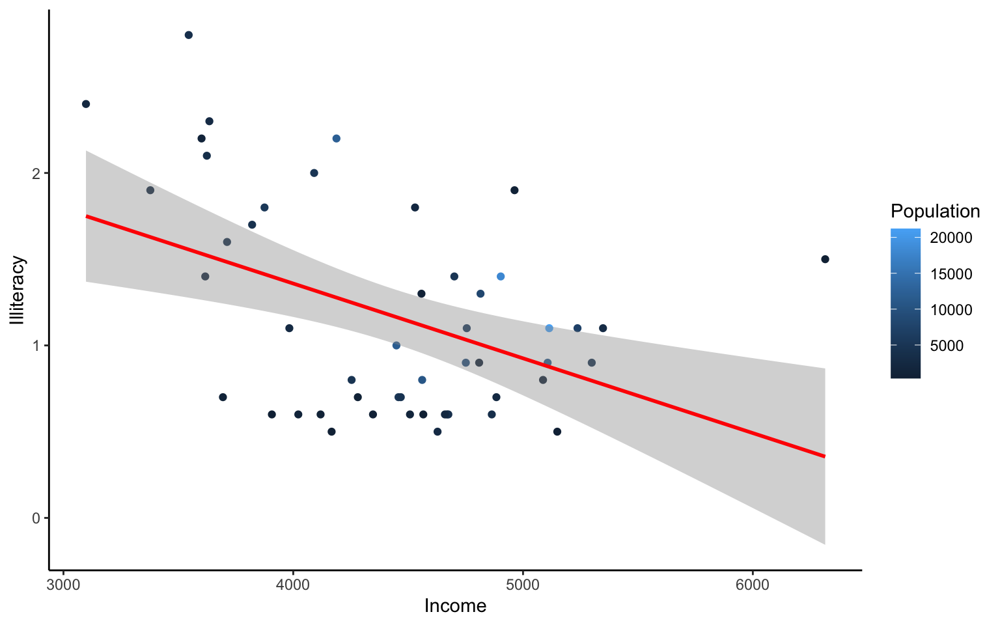

# Week 5- R Continued
We're again drawing some of this material from the STEMinist_R materials which can be found [here](https://github.com/ecalfee/STEMinist_R.git)

This class will take place with students typing directly into an R script for the exercises all of which can be found in the Week 5 file [here](https://github.com/BayLab/MarineGenomicsData.git) 

You can download just the R files for just this week via wget with the following link
```{html
wget https://raw.githubusercontent.com/BayLab/MarineGenomicsData/main/week5.tar.gz
```

this is a compressed file which can be uncompressed via:
```
tar -xzvf week5.tar.gz
```

## 2.1 Plotting 

Plots are very useful to help us understand our data and test hypotheses. Usually a plot or graph will visually display the relationship between two or more **variables**. Variables can be continuous, such as the number of cats, or categorical, such as the type of cat. 

* A few useful commands that we will cover include:
  + points()
  + lines() 
  + abline() 
  + hist() 
  + boxplot()
  + plot()
      + A few useful arguments within plot(): main, xlab, ylab, col, pch, cex

## Scatterplots
Scatterplots are useful when we have **continuous variables**, and want to assess the relationship between them. Usually we will have a predictor or independent variable, which we think has an influence on the other variable, called the response or dependent variable. 

Within our `msleep` dataframe let's plot sleep_total by sleep_rem. Here we expect the total number of hours sleeping to have an effect on the total hours of REM, or dreaming, sleep.

&nbsp;

First install the package 'ggplot2', then run the following:


```r

library(ggplot2)
data(msleep)
```


```r

plot(msleep$sleep_total, msleep$sleep_rem)
```


```r

# or plot response variable as a function "~" of the predictor variable. When we use ~, the dependent variable is always on the left hand side. 
```


```r

plot(msleep$sleep_total~msleep$sleep_rem) #you'll notice this swaps the x and y axis
```


From looking at this plot, does it look like there's a relationship between hours of sleep and hours of REM? What does each point represent on these graphs?

Also, note that plots generally show the independent "cause" variable on the x-axis, and the dependent or "effect" variable on the y. 

&nbsp;

## Customizing your plot

* There are several different arguments within plotting functions that can be used to customize your plot.
  + `col` changes color
  + `pch` changes point character
  + `cex` changes size
  + `type` changes type ("l" = line, "p" = points, "b" = both)
  + `lty` changes line type
  + `bty` changes (or removes) the border around the plot ("n" = no box, "7" = top + right, "L" = bottom+left, "C" top+left+bottom, "U" = left+bottom+right)

You can view different point characters with `?pch`

There are **many** color options in R. For some general colors you can write the name (blue, red, green, etc). There are apparently 657 named colors in R (including "slateblue3", and "peachpuff4") but you can also use the color hexidecimal code for a given color. There are several comprehensives guides for colors in R online and one of which can be found [here](https://www.nceas.ucsb.edu/sites/default/files/2020-04/colorPaletteCheatsheet.pdf)  

&nbsp;

Let's remake the total_sleep against sleep_rem plot and add-in some modifiers

```r
#Choose a pch and make the color blue and give it a bottom+left border
plot(msleep$sleep_total~msleep$sleep_rem, pch = 16, col="blue", bty="L")
```


We can change the axes and title labels using "xlab", "ylab", and "main" arguments. Let's add labels to our plot.

```r
#Choose a pch and make the color blue and give it a bottom+left border
plot(msleep$sleep_total~msleep$sleep_rem, pch = 16, col="blue", bty="L", xlab="REM Sleep (hours)", ylab= "Total Sleep (hours)") 
```


&nbsp;

We can also add lines to an existing plot with `ablines()`. Let's add a line fit from a linear model to our plot.


```r
#first make a plot
plot(msleep$sleep_total~msleep$sleep_rem, pch = 16, col="blue", bty="L", xlab="REM Sleep (hours)", ylab= "Total Sleep (hours)") 

#then add a line. The function lm runs a linear model on our x, y values.
abline(lm(msleep$sleep_total~msleep$sleep_rem))
```


&nbsp;

This adds a line of best fit, that minimizes the distance of those points from that line. These lines help us assess the overall pattern in the data. From the points and the line, does it look like there is a correlation?

You can add a legend to a plot with `legend()` which needs you to specify the location. 

To do this, let's make a cutoff for our points and color them by points above and below the cutoff. We'll use our subsetting skills from last week. Feel free to review that section (5.8).


```r
#start by defining points by whether they are greater than sleep_total 16 and storing
#first make a empty column named colors within the msleep dataframe

msleep$colors=NA
#store the colors "red" or "black" in the color column for the rows that satsify the following criteria.
msleep$colors[msleep$sleep_total >= 17] <-"red"
msleep$colors[msleep$sleep_total < 17] <-"black"
```


```r
plot(msleep$sleep_total~msleep$sleep_rem, pch = 16, col=msleep$colors, bty="L", xlab="REM Sleep (hours)", ylab= "Total Sleep (hours)") 

legend("bottomright", legend=c(">=17hrs", "<17hrs"),
      fill = c("red", "black"), cex=0.8)
```


&nbsp;

## Histograms and box plots

In addition to scatter plots you can make histograms and box plots in base R. Boxplots and histograms both include a **continuous variable** and a **categorical variable**. 

Histograms are appropriate for counts, whereas box plots should be used to represent the characteristics of a distribution.

Histograms are often used to assess the distribution of the data, and can be helpful when you want to assess the sums of a continuous variable within each group. 

Box plots are helpful when we want to compare the means and variation of values between groups. Box plots graphically represent the five most important descriptive values for a data set: the minimum value, the first quartile, the median, the third quartile, and the maximum value.

The same parameter options (pch, col, ylab, xlab, etc) apply for these plots as well as scatterplots.

R will automatically plot a barplot if you give to the `plot()` function a continuous variable and a factor. If you have a vector stored as a character converting it to a factor via `as.factor` will make a boxplot.


```r

#let's make a histogram of sleep_total and fill it with the color palette rainbow() which needs to know how many colors to use

hist(msleep$sleep_total, col=rainbow(10))
```


A quick glance at this histogram tells us that our sleep_total variable looks relatively normally distributed. This is important to know for many statistical tests. 

&nbsp;

Let's try making a box plot, comparing the amount and variation in amount of sleep across the different biological orders (how would you find out how many unique orders are in msleep?)


```r
#let's make a boxplot of sleep_total and order making each one a different color 
#using plot it would look like the following (code is silenced as it give same plot as below):

#plot(msleep$sleep_total~as.factor(msleep$order), col=rainbow(19)) 

#or we can do the following:
boxplot(msleep$sleep_total~as.factor(msleep$order), col=rainbow(19)) 
```


One thing to note is that most plots in R will order factors in alphabetical order. And if axis label names are long, the names might not all be shown (as on the x-axis on the plot above), or the labels might overlap. There are many ways to edit the axes to counter each of these things, which can be searched online. 

&nbsp;

Another example looking at sleep variation across the different types of consumers (carnivore, herbivore, insectivore and omnivore):

```r
plot(msleep$sleep_total~as.factor(msleep$vore),col=rainbow(4), xlab="Consumer type", ylab= "Total Sleep (hours)")
```


Which type of consumer shows the least variation in hours the species within it sleep?

## Practice Problems 2.1
> # Exercise 2.1
> Here we are interested in understanding the effect of different diets on the growth of baby chicks. The following exercises will help us test our hypothesis that diet type will lead to differences in growth, via chick weight. 
>
> Read in the data using `data(ChickWeight)`

```r
# Note: this dataset can also be accessed directly from the ChickWeight package in R 
# (see ?ChickWeight)
data("ChickWeight")
```

> 1. First, explore the data.
How many chicks are in the dataset? 
How many different diets are in the experiment? 

<details><summary><span style="color: red;">Solution</span></summary>
<p>

```r
length(unique(ChickWeight$Chick))
## [1] 50
length(unique(ChickWeight$Diet))
## [1] 4
```
</p>
</details>


> 2. To vizualize the basics of the data, plot weight versus time. 

<details><summary><span style="color: red;">Solution</span></summary>
<p>

```r
plot(ChickWeight$weight ~ ChickWeight$Time, 
     xlab = "Time (days)", 
     ylab = "Weight (gm)")
```


Does it look like there is a change in chick weight over time? Does that change differ across chicks?

</p>
</details>


> 3. Plot a histogram of the weights of the chicks at the final day of the experiments (i.e. only the chicks who made it to the last day). 

<details><summary><span style="color: red;">Solution</span></summary>
<p>

```r
hist(ChickWeight$weight[ChickWeight$Time == max(ChickWeight$Time)], 
     xlab = "Weight (gm)", 
     main = "Weights at final day of experiment", 
     col = rainbow(10))
```


What does this tell us about the distribution of the data?

</p>
</details>


> 4. Create a boxplot where the x-axis represents the different diets and the y-axis is the weights of the chicks at the final day of the experiments. 

<details><summary><span style="color: red;">Solution</span></summary>
<p>

```r
my.new = ChickWeight[ChickWeight$Time == max(ChickWeight$Time), ]
boxplot(weight ~ Diet, 
        data = my.new, 
        xlab = "Diet", 
        ylab = "Weight (gm)", 
        main = "Final weights given diet type", 
        col = c("red", "blue", "orange", "green"))
```


From this plot, do you think it's reasonable to assume that our hypothesis is correct (that diet affects weight)? If so, which diet leads to the highest growth in chicks?

</p>
</details>


> Try using the package R Color Brewer to generate color palettes. Go to http://colorbrewer2.org/ to vizualize palettes. You can choose palettes that are colorblind safe, print friendly, etc.


```r
# Install R Color Brewer
#install.packages("RColorBrewer")
library("RColorBrewer")
```

> 4. Define a color pallete with 10 colors and re-plot the histogram of the weights of the chicks at the final day of the experiments in these colors
Note: if histogram has n breaks and n is less than 10, it will just use first n colors. If n is greater than 10, it will reuse colors.

<details><summary><span style="color: red;">Solution</span></summary>
<p>

```r
library(RColorBrewer)
my.colors = brewer.pal(10, "Paired")
hist(ChickWeight$weight[ChickWeight$Time == max(ChickWeight$Time)], xlab = "Weight (gm)",main = "Weights at final day of experiment", col = my.colors)
```


</p>
</details>


## 2.2 plotting with ggplot2 

GGPlot is a package that allows you to make a lot of different kinds of plots and has become increasingly popular. There are also many tutorials on how to use ggplot as well as example code that could be modified to fit the data you're interested in plotting. There is a really helpful cheatsheat (here)[https://www.rstudio.com/wp-content/uploads/2015/03/ggplot2-cheatsheet.pdf]

There is a little bit of a learning curve for ggplot as the syntax is structured differently than base R plotting. One thing that remains the same and is even more noticible in ggplot is the iterative process of building a plot, one aspect at a time. 

Let's demonstrate what ggplot can do with the states data set


```r
#load in the data
data(state)
states = as.data.frame(state.x77) # convert data to a familiar format - data frame
str(states) # let's take a look at the dataframe
## 'data.frame':	50 obs. of  8 variables:
##  $ Population: num  3615 365 2212 2110 21198 ...
##  $ Income    : num  3624 6315 4530 3378 5114 ...
##  $ Illiteracy: num  2.1 1.5 1.8 1.9 1.1 0.7 1.1 0.9 1.3 2 ...
##  $ Life Exp  : num  69 69.3 70.5 70.7 71.7 ...
##  $ Murder    : num  15.1 11.3 7.8 10.1 10.3 6.8 3.1 6.2 10.7 13.9 ...
##  $ HS Grad   : num  41.3 66.7 58.1 39.9 62.6 63.9 56 54.6 52.6 40.6 ...
##  $ Frost     : num  20 152 15 65 20 166 139 103 11 60 ...
##  $ Area      : num  50708 566432 113417 51945 156361 ...

#make an initial ggplot
ggplot(data=states) 
```


We just see a grey box. In order to tell ggplot what to put in the box we use the `aes()`. The `aes()` function stands for aesthetics and will be used to specify our axes and how we want the data grouped.


```r
#lets make a scatterplot of population and income
#we specify which axes we want to be x and y with aes()
#we'll then use geom_point to tell it to make a scatterplot using the data we specified in the first command
ggplot(data=states, aes(x=Population, y=Income))+geom_point() 
```


There are many types of plots in ggplot that can be called with `geom_` including `geom_line`, `geom_boxplot` `geom_bar` and many others!

Let's add a line to our plot that of best fit for Population ~ Income. Each time we add something to our plot we use the `+` sign. We'll use `geom_smooth()` to draw a line with the method for `lm` which stands for linear model.


```r

ggplot(data=states, aes(x=Population, y=Income))+geom_point()+geom_smooth(method="lm") 
## `geom_smooth()` using formula 'y ~ x'
```


As you can already see ggplot works with many more parameters drawn in default than plotting in base R. For example, the background of our plot is grey the confidence interval of our line is drawn for us and is shaded dark grey and the line of best fit is in blue. All of these things can be modified if we wish. Many of these options can easily be changed with the `theme_` functions. 

Let's change to a minimal theme which removes the gray backgroun in the back of the plot. Play around with the other themes to see what they change.


```r

ggplot(data=states, aes(x=Population, y=Income))+geom_point()+geom_smooth(method="lm")+theme_minimal() 
## `geom_smooth()` using formula 'y ~ x'
```


Another plot example, looking at the relationship between Income and Illiteracy, colored by the population size. 


```r
ggplot(data=states, aes(x=Income, y=Illiteracy, color=Population)) +geom_point()+geom_smooth(method="lm", color="red")+theme_classic() 
## `geom_smooth()` using formula 'y ~ x'
```


Looking at this plot, what is it telling us? Is there anything you would change to assess the data better?

Let's use the `msleep` data set to explore what ggplot can do with character vectors. Make a plot of total sleep against REM sleep and then group by "vore".


```r

# because our vore vector is a character vector we must convert it to a factor before we can use it to group or color

ggplot(msleep, aes(y=sleep_total, x=sleep_rem, group=as.factor(vore), color=as.factor(vore))) +geom_point()
## Warning: Removed 22 rows containing missing values (geom_point).
```


That looks fine, but we may want to add axis labels and change the legend. The code below does just that and changes the theme.


```r
# as we add things to the plot the line can get really long, you can hit enter after the plus sign to start a new line

ggplot(msleep, aes(y=sleep_total, x=sleep_rem, group=as.factor(vore), color=as.factor(vore)))+
  geom_point()+
  labs(y= "Total Sleep (hours)", x= "REM sleep (hours)")+
  theme_minimal()+
  scale_color_manual(name="Diet", 
                        labels = c("Carnivore", 
                                   "Herbivore", 
                                   "Insectivore", 
                                   "Omnivore", 
                                    "NA"), 
                        values = c("carni"="blue", 
                                   "herbi"="red", 
                                   "insecti"="green", 
                                   "omni"="brown", 
                                   "NA"="orange"))
## Warning: Removed 22 rows containing missing values (geom_point).
```


Our plot at this point is getting very clunky. You can assign what we have so far to an object and continue to add parameters without having to copy and paste the whole plot. 

```r
#assign to an object

g<-ggplot(msleep, aes(y=sleep_total, x=sleep_rem, group=as.factor(vore), color=as.factor(vore)))+
  geom_point()+
  labs(y= "Total Sleep (hours)", x= "REM sleep (hours)")+
  theme_minimal()+
  scale_color_manual(name="Diet", 
                        labels = c("Carnivore", 
                                   "Herbivore", 
                                   "Insectivore", 
                                   "Omnivore", 
                                    "NA"), 
                        values = c("carni"="blue", 
                                   "herbi"="red", 
                                   "insecti"="green", 
                                   "omni"="brown", 
                                   "NA"="orange"))

g
## Warning: Removed 22 rows containing missing values (geom_point).
```


This example is a great way to begin to explore how the relationship between total sleep and REM sleep varies across species with different diets, but overall still shows the correlation at the whole group level. 

If we want to dive deeper and compare the relationship between two continuous variables, and how that relationship differs between groups/characters, we can use whats called a 'facet wrap'.

For example in the iris dataframe we may be interested in looking at the relationship between Sepal.Length and Sepal.Width for each species. You can look at all of these together with `facet_wrap` or `facet_grid`. 


```r

ggplot(iris, aes(y=Sepal.Length, x=Sepal.Width, group=Species, color=Species))+
  geom_point()+
  facet_wrap(~Species)+
  geom_smooth(method="lm")
## `geom_smooth()` using formula 'y ~ x'
```


How does the relationship between sepal width and length differ between the three species?

&nbsp;

Finally in ggplot we may be interested in seeing the mean values plotted with error bars for several groups. You can use the function `stat_summary` to find the mean and error around that mean for the given grouping.

Here's a plot looking at the mean chickweight by diet.

```r
ggplot(ChickWeight, aes(x=Time, y=weight, group=Diet, color=Diet))+
  stat_summary(fun=mean, geom="point", size=1)+
  stat_summary(fun=mean, geom="line", size=1)+
  stat_summary(fun.data = mean_se, geom = "errorbar", 
               aes(width=0.1), size=0.5)
```


Line plots such as this are really great to assess change over time. It is important to note that in the scatter plot earlier each point was an individual chick, but now we see each point in the mean weight of all chicks at each time point. 


&nbsp;

## Group Exercise on Data Visualization

Here we will go through an exercise using genomic data from [this study](https://onlinelibrary.wiley.com/doi/full/10.1111/jbi.14229).

Let's download and explore the data. In terminal run the following:

```html
wget https://raw.githubusercontent.com/BayLab/MarineGenomicsData/main/week5_2022.table.tar.gz

tar -xzvf week5_2022.table.tar.gz
```

&nbsp;

Move the downloaded data into your working R directory. Then we can read the data table with the 'read.csv' command, calling our data.frame "gen.data"

```html
gen.data <- read.csv(file = 'margen.wk5.table.csv', sep = ';')

gen.data
str(gen.data)
View(gen.data)

```


Looking at this dataframe we see the following variables: 

1- genomic diversity (GD; specifically expected heterozygosity values)

2- range position (RP; distance, in km, each site is from the center of the species' range) 

3- region (RE; what bioregion the site falls within)

4- species (SPP; urchin-Parechinus angulosus, crab-Cyclograpsus punctatus, limpet-Scutellastra granularis)

&nbsp;

We will do the following two exercises in groups of 2-3. You are welcome to draw out the plots first, then attempt to create them with R code (either base R or ggplot2). Make sure they are clear for others to interpret. 

There are many ways to accomplish each exercise, and therefore solutions are not given below. Students can share what they created in class.  

> # Group Exercise 1

> The central-margin theory suggest that genetic diversity should be highest within the center of the species' distributional range. Let's explore if this is true in our dataset. 
>
> 1.1 Let's take a look at the two variables GD and RP. Are they continuous or characters? Here we are also interested in the three species- is SPP continuous or categorical?

> 1.2 If we want to look at a relationship between genetic diversity (GD) and range position (RP), what type of graph will allow us to look at their correlation? 

> 1.3 We are specifically interested in comparing the relationship between GD and RP across the three species. What is the best way to view GD~RP per each individual species? Hint: have a look towards the later plots in this week's lesson for ideas. 

> 1.4 Design and plot a figure that will best show the relationship between genetic diversity and range position per species. Do we find that genetic diversity is higher towards the middle of the range in any species? Remember, smaller values of RP represent areas closer to the center of the range.

> # Group Exercise 2

> The biogeography of an area is an important feature shaping genomic diversity of multiple species. In this second exercise, we want to compare the different regions (west vs south vs east coast bioregions) in the mean and range of genetic diversity values within each region. 

> 2.1 Let's think about the variables we want to compare. What columns are we going to use to make this plot? Remember we want to look at the values of genetic diversity (of all species), and if these signficantly differ between region. 
 
> 2.2 Of the variables we want to plot, which are continuous and which are categorical?

> 2.3 Here we are interested in comparing the means and variation of values between groups. What type of plot is best suited for this? Hint: have a look at section 6.4.

> 2.4 Design and plot a graph that will show mean genetic diversity, as well as minimum and maximum values across different regions. Do we see differences in multi-species genetic diversity composition between the three regions?

 
&nbsp;


## Practice Problems 2.2
> # Exercise 2.2 Plotting in ggplot

> 1. Add best fit lines to our msleep plot (that we saved earlier as the object "g") for each order. Hint: have a look at which ggplots shown earlier have lines of best fit and try to re-create that code. 

<details><summary><span style="color: red;">Solution</span></summary>
<p>


```r
# we can just use the geom_smooth command from above and ggplot takes care of the rest!
# The code below will only work if you stored your plot in object g.
g+geom_smooth(method="lm")
## `geom_smooth()` using formula 'y ~ x'
## Warning: Removed 22 rows containing non-finite values (stat_smooth).
## Warning: Removed 22 rows containing missing values (geom_point).
```


</p>
</details>

> 2. With the msleep data, make a boxplot of sleep_total against vore. Make sure vore is a factor. Color the boxplots by vore (remember how we had to color the boxplots in base R- it is similar in ggplot). Which organisms have the most consistent hours of sleep?

<details><summary><span style="color: red;">Solution</span></summary>
<p>


```r

ggplot(msleep, aes(y=sleep_total, x=as.factor(vore), fill=as.factor(vore)))+geom_boxplot()
```


</p>
</details>


> 3. Load a new dataframe `midwest`(run data(midwest)). Explore the dataframe. Here we are looking to see if area size has an effect on population density. Plot a scatterplot of 'area' against 'popdensity' grouped and colored by state. Do a facet grid by state here.

<details><summary><span style="color: red;">Solution</span></summary>
<p>


```r

ggplot(midwest, aes(y=area, x=popdensity, col=as.factor(state)))+geom_point()+facet_grid(~state)
```


</p>
</details>


> 4. In the midwest dataframe make a scatterplot of 'popdensity' by 'poptotal' of only IL (this requires you to subset your data for Illinois).

<details><summary><span style="color: red;">Solution</span></summary>
<p>


```r

#we can subset our data first and store the subset in a new dataframe

il<-midwest[midwest$state == "IL",]

ggplot(il, aes(x=popdensity, y=poptotal))+geom_point() 
```


</p>
</details>

> 5. In the midwest dataframe plot the mean and standard error for popdensity for each state. Color this plot in your favorite palette. Hint: google how to use the 'stat_summary' command for gglplot2.

<details><summary><span style="color: red;">Solution</span></summary>
<p>

```r
ggplot(midwest, aes(x=state, y=popdensity, color=state))+
  stat_summary(fun.y=mean, geom="point", size=1)+
  stat_summary(fun.y=mean, geom="line", size=1)+
  stat_summary(fun.data = mean_se, geom = "errorbar", 
               aes(width=0.1), size=0.5)+
  theme_minimal()+
  scale_color_manual(values=rainbow(5))
## Warning: `fun.y` is deprecated. Use `fun` instead.
## `fun.y` is deprecated. Use `fun` instead.
## geom_path: Each group consists of only one observation. Do you need to adjust
## the group aesthetic?
```


</p>
</details>

