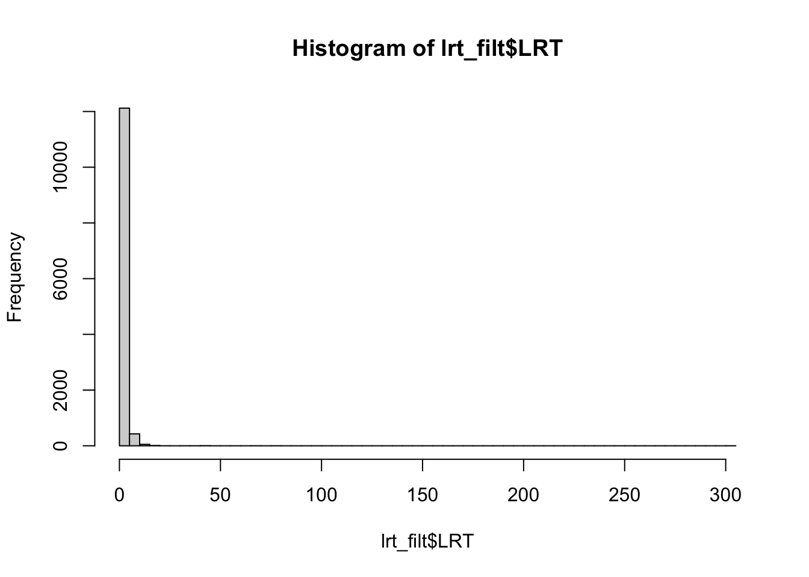
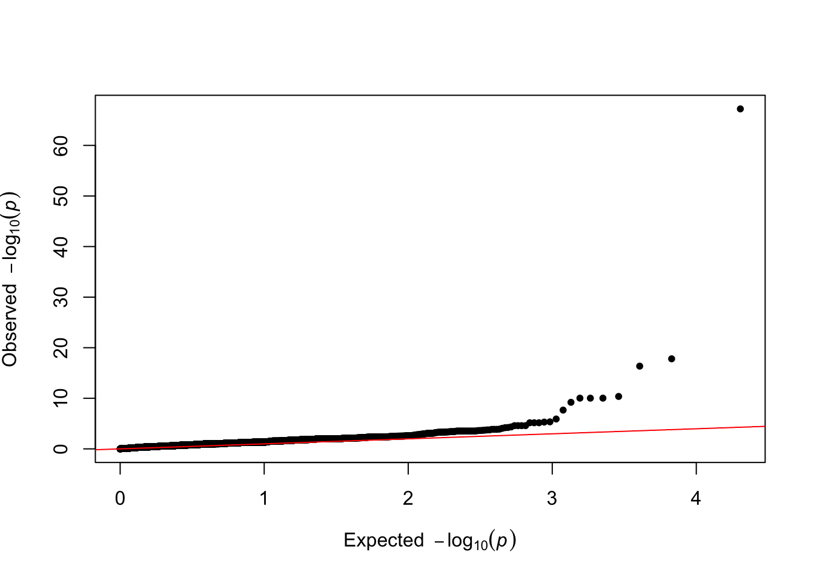
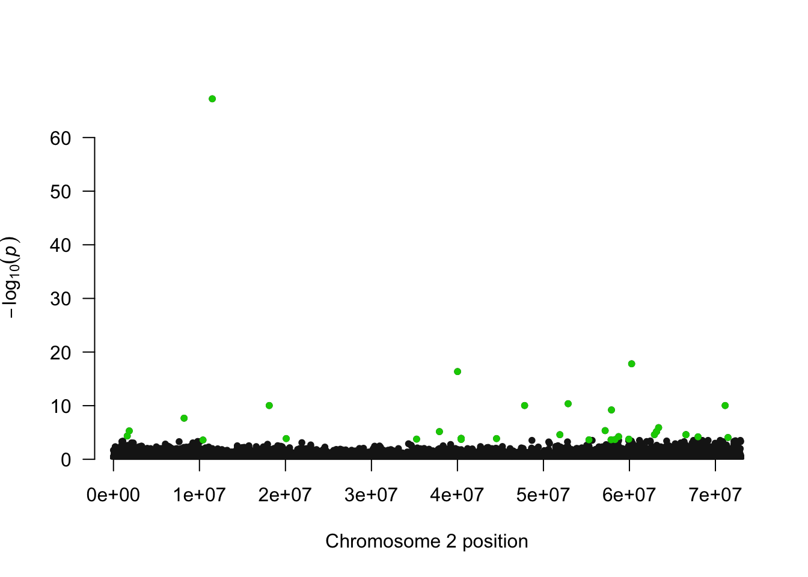

# Week 9: Genome wide association study (GWAS)

This week we're going to show you how to perform a genome wide association study or GWAS.  

## load in the data 

The data for this week consist of several files in beagle format, a genome index file (.fai), and a few small text files.
Let's start by downloading the data we will be working with this week:

```html
wget https://raw.githubusercontent.com/BayLab/MarineGenomicsData/main/Week9_2022.tar.gz

tar -xzvf Week9_2022.tar.gz
```
Move the data from MarineGenomicsData into MarineGenomics and change its name to Week9:
```
mv MarineGenomicsData/Week8 MarineGenomics/Week9
```
and one more file that was too big to upload with the others
``` {.html}
cd MarineGenomics/Week9

wget https://raw.githubusercontent.com/BayLab/MarineGenomicsData/main/salmon_chr6_19ind.BEAGLE.PL.gz
```

Now that we've finished downloading the data, let's open Rsutdio and install the package necessary for our today's lesson

## install packages in R

We'll be using the package `qqman` to make a manhattan plot. Make sure not to copy the # sign into the R console/script.


```r
# install.packages("qqman")
```

## The data

The data we're working on for the GWAS comes from the paper by Kijas et al. 2018 where they studied the genetic basis of sex determination in the atlantic Salmon. The paper can be found [here](https://www.nature.com/articles/s41598-018-23984-1#Sec2) or on Canvas. In short they examined the genetic basis of sex in 19 salmon for which they have whole genome sequence data. We'll only be looking at two chromosomes (2 and 6) of this data.

## take Beagle file and generate lrt file

To do the test of genome wide association we need to take our Beagle file and test whether there is an association with our phenotype (in this case whether a fish has a male or female phenotype). The phenotypes are coded as 0 = Female and 1 = Male in the `phenobin` file. 

Let's move back to the terminal and execute this command:

``` {.html}
$HOME/angsd/angsd -doMaf 4 -beagle salmon_chr2_19ind.BEAGLE.PL.gz -yBin phenobin -doAsso 2 -fai Salmon.fai
```
This example looks for associations between the genotypes (the genotype likelihood data - beagle file) and the phenotypes (male/female - binary 'phenobin' file). We are using the 'Salmon.fai' file as an index (remember we are using an index for the genome so that it is easier to search against it).
This will generate several output files labeled `angsdput`. We'll use the file with the `lrt0` extension to plot our manattan plot.

Let's go back to Rstudio:

## take lrt file and make a manhattan plot
LRT is the likelihood ratio statistic. This statistic is chi square distributed with one degree of freedom. Sites that fails one of the filters are given the value -999. 


```r
#Set the working directory for this week's directory
#setwd("~/MarineGenomics/Week9")

#read in the data
lrt <- read.table(gzfile("angsdput.lrt0.gz"), header=T, sep="\t")

#look at it
str(lrt)
```

```
## 'data.frame':	224460 obs. of  8 variables:
##  $ Chromosome   : int  2 2 2 2 2 2 2 2 2 2 ...
##  $ Position     : int  13 59 74 153 548 550 613 1182 1361 1533 ...
##  $ Major        : Factor w/ 4 levels "A","C","G","T": 3 3 3 2 2 2 2 2 2 2 ...
##  $ Minor        : Factor w/ 4 levels "A","C","G","T": 4 1 1 3 4 4 1 4 1 1 ...
##  $ Frequency    : num  0.237 0.5 0.316 0.184 0.316 ...
##  $ N            : int  19 19 19 19 19 19 19 19 19 19 ...
##  $ LRT          : num  -999 -999 -999 -999 -999 -999 -999 -999 -999 -999 ...
##  $ high_WT.HE.HO: Factor w/ 803 levels "0/0/19","0/1/18",..: 125 67 679 198 679 679 372 327 358 372 ...
```

```r
#we have a few LRT values that are -999, that means that the test failed. we should remove them. How many do we have?
length(which(lrt$LRT == -999))
```

```
## [1] 210597
```
The answer is 210597.

How many LRT values (in this case, loci) do we have in total?

```r
length(lrt$LRT)
```

```
## [1] 224460
```
The answer is 224460, meaning that most are filtered out.

How many do we have left when we remove loci with failed tests?

```r
length(lrt$LRT)-length(which(lrt$LRT == -999))
```

```
## [1] 13863
```
The answer is 13863.

Let's remove the values that are not -999 and or negative and assign them to a new object called 'lrt_filt'.

```r
lrt_filt <- lrt[-c(which(lrt$LRT == -999),which(lrt$LRT <= 0)),]
```

We can look at a histogram of the filtered LRT results:

```r
hist(lrt_filt$LRT, breaks=50)
```



Everything looks good to proceed to making our manhattan plot.

The function 'manhattan' requires each SNP to have it's own "name". Let's make a vector for row numbers that start with the letter 'r'. 


```r
lrt_filt$SNP <- paste("r",1:length(lrt_filt$Chromosome), sep="")
```

We also need to convert our LRT values to pvalues. We'll use the command `dchisq` to get pvalues from the LRT values.

```r
#get pvalues
lrt_filt$pvalue<-dchisq(lrt_filt$LRT, df=1)

#we also need to make sure we don't have any tricky values like those below
lrt_filt <- lrt_filt[!(lrt_filt$pvalue=="NaN" | lrt_filt$LRT=="Inf"| lrt_filt$pvalue=="Inf"),]
```
Create the manhattan plot:

```r
qqman::manhattan(lrt_filt, chr="Chromosome", bp="Position", p="pvalue", suggestiveline = F, genomewideline = F)
```


Let's look at a qq-plot of our pvalues to check the model fit

```r
qq(lrt_filt$pvalue)
```



This looks a bit weird, we would expect it to be mostly a straight line with some deviations at the upper right. If we were moving forward with this analyses we'd want to do more filtering of our data.

We can highlight the values that exceed a threshold. There are several ways to determine a threshold, but one is to make a vector of random phenotypes and re-run our association test. We can then set the highest LRT value from the random phenotype test as our upper limit for our plot with the actual phenotypes.

```r
#make a vector with 19 1's and 0's

x <- sample(c(1,0), 19, replace=T)

#write this to our week 9 directory

write.table(x, "rando_pheno", row.names = F, col.names = F)
```
And now use that phenotype file to run our association test again, making sure to specify a different output file.
Let's go back to the terminal:
``` {.html}
$HOME/angsd/angsd -doMaf 4 -beagle salmon_chr2_19ind.BEAGLE.PL.gz -yBin rando_pheno -doAsso 2 -fai Salmon.fai -out randotest
```
And rerun the code in R to see what our maximum LRT values are in this random phenotype test.


```r
lrt_rando <- read.table(gzfile("randotest.lrt0.gz"), header=T, sep="\t")

#we need to remove those -999 values again
rando_filt <- lrt_rando[!(lrt_rando$LRT==-999 | lrt_rando$LRT<= 0),]

summary(rando_filt$LRT, na.rm=T)
```

```
##     Min.  1st Qu.   Median     Mean  3rd Qu.     Max.     NA's 
## 0.000001 0.214816 0.669551      Inf 2.029913      Inf        1
```

```r
#we have some Inf values we also need to remove, let's add those to our filtering line above
rando_filt <- lrt_rando[!(lrt_rando$LRT==-999 | lrt_rando$LRT<= 0 | lrt_rando$LRT == Inf),]

#let's look at the maximum value of LRT
max(rando_filt$LRT, na.rm=T)
```

```
## [1] 12.33287
```
The maximum value is ~12 This value was generated at random, so any value higher than this is expected to be generated not at random (which is what we are looking for). So we can highlight all of the SNPs that have an LRT greater than 12 in our association test.

```r
#make a list of the candidates
candidates <- lrt_filt[which(lrt_filt$LRT > 12),]$SNP 
```
Let's highlight this list of candidate loci in our manhattan plot:

```r
qqman::manhattan(lrt_filt, chr="Chromosome", bp="Position",  p="pvalue", highlight = candidates, suggestiveline = F, genomewideline = F)
```



Comparing our results to the Kijas et al. 2018 paper, we have a similar pattern of many SNPs across the chromosome showing a relationship with phenotype (sex). Interestingly this paper found that there are three chromosomes that are associated with sex in Atlantic Salmon, but not all chromosomes give a strong signal in all individuals. For example, only three male individuals were found to have a clear association with chromosome 2, and the other males in the study were found to have an association with chromosomes 3 and 6. 

These results highlight the fluid nature of sex determination in animals, even those with a genetic basis to sex determination.

For these exercises you'll take a closer look at chromosome 6, where you'll try to find the individuals that are males from a PCA plot.

## Exercises

> 1.For this exercise, we want to see which individuals actually show genomic levels of variation at chromosome 6. Using the code that we ran for week 6. Make a PCA plot of the salmon_chr3_19ind.BEAGLE.PL.gz file. Use the function `indentify()` to find the points that are clustering apart from the other points. Verify that these are males by referring to the table in the Kijas et al. paper [here](https://www.nature.com/articles/s41598-018-23984-1/tables/1). Note their individuals are in the same order as our samples though the names don't match.

<details><summary><span style="color: orange;">Solution</span></summary>
<p>

Run pcangsd on our chr6 data
``` {.html}
pcangsd -b salmon_chr6_19ind.BEAGLE.PL.gz -o pca6_out -t 28
```
In R make a PCA plot

```r
#read in the data
cov <- as.matrix(read.table("pca6_out.cov"))

#compute the eigen values
e <- eigen(cov)

#how much variation are we explaining here?
e$values/sum(e$values)
```

```
##  [1]  0.1379496011  0.1246126748  0.0969103029  0.0920252715  0.0774570788
##  [6]  0.0685079248  0.0605808079  0.0554445095  0.0493884028  0.0444119246
## [11]  0.0423030396  0.0368221717  0.0329494215  0.0316195242  0.0269138675
## [16]  0.0184940705  0.0149661517 -0.0006450986 -0.0107116466
```
It looks like ~13% is explained by the first axis.

Let's create the PCA plot:

```r
#First, we'll install a new package called 'plotly' that lets us create interactive plots:
#install.packages("plotly")

#create a dataframe from the first two PC in object e
e_df <- as.data.frame(e$vectors[,1:2])
```
make a plot of the first two axes

```r
plotly::plot_ly(e_df, type = "scatter", mode = "markers", x=e_df$V1, y=e_df$V2, text=row.names(e_df))
```

```{=html}
<div id="htmlwidget-1291c197f20c861a6d30" style="width:672px;height:480px;" class="plotly html-widget"></div>
<script type="application/json" data-for="htmlwidget-1291c197f20c861a6d30">{"x":{"visdat":{"5f608b97ce6":["function () ","plotlyVisDat"]},"cur_data":"5f608b97ce6","attrs":{"5f608b97ce6":{"mode":"markers","x":[-0.519139785802849,-0.421668322093998,0.0728823589597481,-0.00945195017208254,0.164050295585754,0.0374794925622059,0.161893975465155,0.0167349431615272,0.217324975228053,0.205556689134182,0.235649945753755,-0.486973827070867,0.169393148665165,0.0652232253635954,0.0814548483289771,-0.110122505165937,0.214924885835122,0.0484035713690156,-0.100388847510803],"y":[-0.0126347016271288,0.0245300098185363,0.0722020301364673,-0.131409063184534,-0.276071775898028,0.155576443973626,-0.418972580420151,0.0898106283574495,0.368142497812644,0.360218778748402,0.293275329148616,-0.0298863719708143,-0.0478190017745415,0.0999834088658637,0.0181757283239082,0.100042658910541,-0.562109565077771,0.0225581007555425,0.0380157664014052],"text":["1","2","3","4","5","6","7","8","9","10","11","12","13","14","15","16","17","18","19"],"alpha_stroke":1,"sizes":[10,100],"spans":[1,20],"type":"scatter"}},"layout":{"margin":{"b":40,"l":60,"t":25,"r":10},"xaxis":{"domain":[0,1],"automargin":true,"title":[]},"yaxis":{"domain":[0,1],"automargin":true,"title":[]},"hovermode":"closest","showlegend":false},"source":"A","config":{"modeBarButtonsToAdd":["hoverclosest","hovercompare"],"showSendToCloud":false},"data":[{"mode":"markers","x":[-0.519139785802849,-0.421668322093998,0.0728823589597481,-0.00945195017208254,0.164050295585754,0.0374794925622059,0.161893975465155,0.0167349431615272,0.217324975228053,0.205556689134182,0.235649945753755,-0.486973827070867,0.169393148665165,0.0652232253635954,0.0814548483289771,-0.110122505165937,0.214924885835122,0.0484035713690156,-0.100388847510803],"y":[-0.0126347016271288,0.0245300098185363,0.0722020301364673,-0.131409063184534,-0.276071775898028,0.155576443973626,-0.418972580420151,0.0898106283574495,0.368142497812644,0.360218778748402,0.293275329148616,-0.0298863719708143,-0.0478190017745415,0.0999834088658637,0.0181757283239082,0.100042658910541,-0.562109565077771,0.0225581007555425,0.0380157664014052],"text":["1","2","3","4","5","6","7","8","9","10","11","12","13","14","15","16","17","18","19"],"type":"scatter","marker":{"color":"rgba(31,119,180,1)","line":{"color":"rgba(31,119,180,1)"}},"error_y":{"color":"rgba(31,119,180,1)"},"error_x":{"color":"rgba(31,119,180,1)"},"line":{"color":"rgba(31,119,180,1)"},"xaxis":"x","yaxis":"y","frame":null}],"highlight":{"on":"plotly_click","persistent":false,"dynamic":false,"selectize":false,"opacityDim":0.2,"selected":{"opacity":1},"debounce":0},"shinyEvents":["plotly_hover","plotly_click","plotly_selected","plotly_relayout","plotly_brushed","plotly_brushing","plotly_clickannotation","plotly_doubleclick","plotly_deselect","plotly_afterplot","plotly_sunburstclick"],"base_url":"https://plot.ly"},"evals":[],"jsHooks":[]}</script>
```
Use the cursor to identify the points that are clustered apart from the others. If you select the points on the left most of the screen, you will find they are rows 1, 2, and 12

The other two points that are leftmost from the remaining points are 16 and 19, but according to Table 1 in the Kilas paper, they are females. Therefore, it is possible that more filtering is needed to identify the particular informative SNPs that correlate well with sex in this fish species. 

</p>
</details>
&nbsp;


> 2. Make a manhattan plot for chromosome 6. Use a phenotype file called `pheno_chr6`. 

<details><summary><span style="color: orange;">Solution</span></summary>
<p>

```r
#In the terminal, run the command in angsd again using the chr6 BEAGLE file and the 'pheno_chr6' file.

# $HOME/angsd/angsd -doMaf 4 -beagle salmon_chr6_19ind.BEAGLE.PL.gz -yBin pheno_chr6 -doAsso 2 -fai Salmon.fai -out chr6_out                 
                
#and then we can remake our manhattan plot

lrt2 <- read.table(gzfile("chr6_out.lrt0.gz"), header=T, sep="\t")

#look at it
str(lrt2)

#remove the values that are not -999 and that are negative
lrt_filt2 <- lrt2[-c(which(lrt2$LRT == -999),which(lrt2$LRT <= 0)),]                 
lrt_filt2$SNP <- paste("r",1:length(lrt_filt2$Chromosome), sep="")

#we also need to make sure we don't have any tricky values like those below
lrt_filt2 <- lrt_filt2[!(lrt_filt2$pvalue=="NaN" | lrt_filt2$LRT=="Inf"| lrt_filt2$pvalue=="Inf"),]
                      
#get pvalues
lrt_filt2$pvalue<-dchisq(lrt_filt2$LRT, df=1)

#make our plot
qqman::manhattan(lrt_filt2, chr="Chromosome", bp="Position", p="pvalue")
```
                 
</p>
</details>
