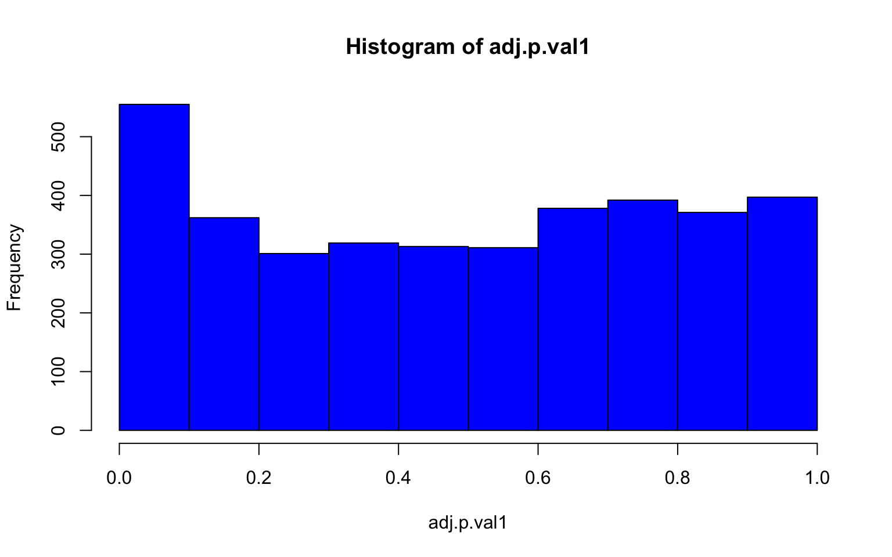
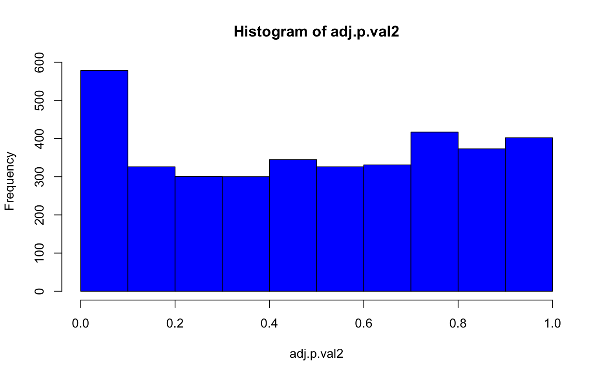
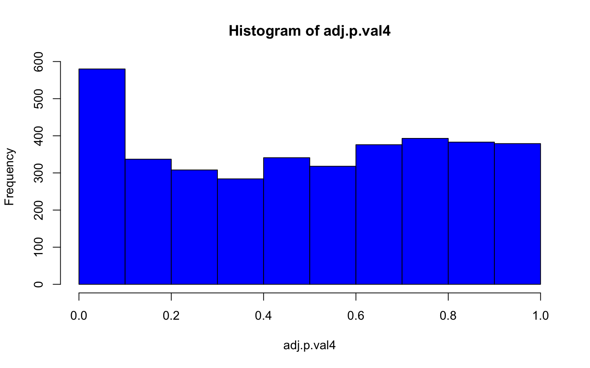
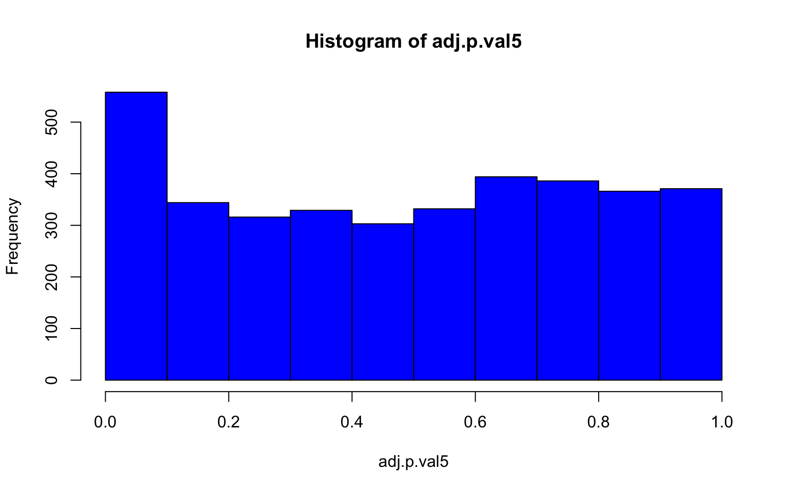

# Genome Environment Association

All of the code presented in this weeks class comes modified from a former Marine Genomics student and recent UC Davis graduate, Camille Rumberger! Thank you Camille!

## Download the data

For this week we are again using data from the wonderful Xuereb et al. 2018 paper [here](https://onlinelibrary.wiley.com/doi/abs/10.1111/mec.14589?casa_token=aBVeQUaZ6UEAAAAA:vt9cQFbQ-65F1erD-1Uq0DAWEaZ75fDhepkPomc4RMPAqQgntIcm0btk842SxvaraM2VdlZ5nwoHUhCy)
And consistes of a vcf file with 3966 Snps from 685 pacific sea cucumbers. 

```html
cd

wget https://raw.githubusercontent.com/BayLab/MarineGenomicsData/main/week11_semester.tar.gz

tar -xzvf week11_semester.tar.gz

mv MarineGenomics/Week11 MarineGenomics/Week10

```

## install a compiler for Unix/bash

Run this command below in the terminal from the home directory. It's necessary to install several R packages.

Make sure to respond with a lower case "y" and not "Y" when prompted.

```html
sudo apt update

sudo apt-get install libgdal-dev

sudo apt-get install libudunits2-dev

```


## install R packages

Make sure to run all of the commands below (without the #) to install and load programs we will be using. You may get warnings during the installation but feel free to ignore them.


```r
# devtools::install_github("bcm-uga/lfmm")

# install.packages("sf", dependencies = T)

# install.packages(c('lfmm','vegan','data.table','sdmpredictors', 'rgdal','raster'), dependencies = T)

# install.packages("psych", dependencies = T)

# install.packages("BiocManager")

# BiocManager::install("LEA", force=T)  ## choose (a) to update

library(lfmm)
library(psych)
library(vegan)
library(LEA)
library(data.table)
library(sdmpredictors)
library(leaflet)
library(ggplot2)
library(rgdal)
library(raster)
```


## Get the Environmental Data

Now we need to download the environmental data for our study. Make sure to go into the correct working directory in R (MarineGenomics/Week10).

We're just going to look at a few variables but there are many others that you could choose from here: https://www.bio-oracle.org/explore-data.php

Note that this step is rather time consuming, thus it's best to download the data once and save it as an environment file, which you can upload each time you want to modify your script.


```r
# load the environmental data and store it as objects that we can use later

# This will give you warning messages, but feel free to ignore them.

environ <- load_layers(layercodes = c("BO_chlomean","BO_ph", "BO_salinity","BO_sstmax","BO_sstmean"))

#now put each layer into it's own object

chlomean<-load_layers("BO_chlomean")
ph<-load_layers("BO_ph")
salinity<-load_layers("BO_salinity")
sst_max<-load_layers("BO_sstmax")
sst_mean<-load_layers("BO_sstmean")
```


Now we'll read in our metadata, which has lat and lon for each sample


```r
meta<-read.csv("californicus_metadata.csv")

#make a new dataframe that just contains the lat and lon and label them "lat" and "long"
#notice that the original metafile mislabels lat and lon, oops!

sites<-cbind("lat" =  meta$LONG, "lon" = meta$LAT)

head(sites)
```

```
##            lat     lon
## [1,] -126.5646 50.5212
## [2,] -126.5646 50.5212
## [3,] -126.5646 50.5212
## [4,] -126.5646 50.5212
## [5,] -126.5646 50.5212
## [6,] -126.5646 50.5212
```


## Extract Site Specific Information from our Envirornmental Layers

The data we downloaded 

```r
sites_environ <- data.frame(Name=sites, extract(environ,sites))
head(sites_environ)
```

```
##    Name.lat Name.lon BO_chlomean BO_ph BO_salinity BO_sstmax BO_sstmean
## 1 -126.5646  50.5212        3.85 8.212      30.496    12.137        8.1
## 2 -126.5646  50.5212        3.85 8.212      30.496    12.137        8.1
## 3 -126.5646  50.5212        3.85 8.212      30.496    12.137        8.1
## 4 -126.5646  50.5212        3.85 8.212      30.496    12.137        8.1
## 5 -126.5646  50.5212        3.85 8.212      30.496    12.137        8.1
## 6 -126.5646  50.5212        3.85 8.212      30.496    12.137        8.1
```

That produces for us a site specific environment file. We now need to convert this file into a format that we can save it as a matrix and export it as an environment file (i.e., in the format that the next step need it to be in which we do below)


```r
#remove lat and lon and convert to matrix

sites_environ_matrix<-as.matrix(sites_environ[,-c(1,2)])

#remove any Na's

sites_environ_matrix_nas<-na.omit(sites_environ_matrix)

#write the file to an env file

write.env(sites_environ_matrix_nas, "sites_environ_matrix.env")
```

```
## [1] "sites_environ_matrix.env"
```


## Make a Map of our environmental data

We now have enough information to make a nice map of one of our environmental parameters.


```r
#what are are min amd max lat and lon

range(sites_environ$Name.lon)
```

```
## [1] 48.40822 57.82796
```

```r
range(sites_environ$Name.lat)
```

```
## [1] -134.7153 -123.3799
```

```r
# define the area we want to map
ne.pacific<-extent(-140, -120, 40, 60)

# crop the map we are interested in (here it is maximum sea surface temp)
sst_max.crop<-crop(sst_max, ne.pacific)

#make a nice color ramp and plot the map

my.colors = colorRampPalette(c("#5E85B8","#EDF0C0","#C13127"))
plot(sst_max.crop,col=my.colors(1000),axes=FALSE, box=FALSE)
title(cex.sub = 1.25, sub = "Maximum temperature at the sea surface (ºC)")
```


## Load in genetic data


Now we need to load in our genetic data. We have data in a vcf file format and the first few steps will be to convert it to the format needed by the lfmm package.


```r
# convert our vcf file to lfmm

vcf2lfmm('filtered_3699snps_californicus_685inds.recode.vcf', 'filtered_3699snps_californicus.lfmm')
```

```
## 
## 	- number of detected individuals:	685
## 	- number of detected loci:		3699
## 
## For SNP info, please check ./filtered_3699snps_californicus_685inds.recode.vcfsnp.
## 
## 0 line(s) were removed because these are not SNPs.
## Please, check ./filtered_3699snps_californicus_685inds.recode.removed file, for more informations.
## 
## 
## 	- number of detected individuals:	685
## 	- number of detected loci:		3699
```

```
## [1] "./filtered_3699snps_californicus_685inds.recode.lfmm"
```

```r
sea_cuc_lfmm<-read.lfmm('filtered_3699snps_californicus_685inds.recode.lfmm')

# and convert to geno

lfmm2geno('filtered_3699snps_californicus_685inds.recode.lfmm', 'filtered_3699snps_californicus_685inds.recode.geno')
```

```
## 
## 	- number of detected individuals:	685
## 	- number of detected loci:		3699
```

```
## [1] "filtered_3699snps_californicus_685inds.recode.geno"
```

```r
# read in geno file

sea_cuc_geno<-read.geno('filtered_3699snps_californicus_685inds.recode.geno')
```


```r
# create a snmf object

sea_cuc200.snmf <- snmf("filtered_3699snps_californicus_685inds.recode.geno", K = 1:10, entropy=T, ploidy = 2, project = "new")
```

```
## The project is saved into :
##  filtered_3699snps_californicus_685inds.recode.snmfProject 
## 
## To load the project, use:
##  project = load.snmfProject("filtered_3699snps_californicus_685inds.recode.snmfProject")
## 
## To remove the project, use:
##  remove.snmfProject("filtered_3699snps_californicus_685inds.recode.snmfProject")
## 
## [1] 9365711
## [1] "*************************************"
## [1] "*          create.dataset            *"
## [1] "*************************************"
## summary of the options:
## 
##         -n (number of individuals)                 685
##         -L (number of loci)                        3699
##         -s (seed random init)                      9365711
##         -r (percentage of masked data)             0.05
##         -x (genotype file in .geno format)         /Users/ericaspotswoodnielsen/Desktop/PD_stuffies/teaching/MarineGenomics2022/data/Week10_gea/filtered_3699snps_californicus_685inds.recode.geno
##         -o (output file in .geno format)           /Users/ericaspotswoodnielsen/Desktop/PD_stuffies/teaching/MarineGenomics2022/data/Week10_gea/filtered_3699snps_californicus_685inds.recode.snmf/masked/filtered_3699snps_californicus_685inds.recode_I.geno
## 
##  Write genotype file with masked data, /Users/ericaspotswoodnielsen/Desktop/PD_stuffies/teaching/MarineGenomics2022/data/Week10_gea/filtered_3699snps_californicus_685inds.recode.snmf/masked/filtered_3699snps_californicus_685inds.recode_I.geno:		OK.
## 
## [1] "*************************************"
## [1] "* sNMF K = 1  repetition 1      *"
## [1] "*************************************"
## summary of the options:
## 
##         -n (number of individuals)             685
##         -L (number of loci)                    3699
##         -K (number of ancestral pops)          1
##         -x (input file)                        /Users/ericaspotswoodnielsen/Desktop/PD_stuffies/teaching/MarineGenomics2022/data/Week10_gea/filtered_3699snps_californicus_685inds.recode.snmf/masked/filtered_3699snps_californicus_685inds.recode_I.geno
##         -q (individual admixture file)         /Users/ericaspotswoodnielsen/Desktop/PD_stuffies/teaching/MarineGenomics2022/data/Week10_gea/filtered_3699snps_californicus_685inds.recode.snmf/K1/run1/filtered_3699snps_californicus_685inds.recode_r1.1.Q
##         -g (ancestral frequencies file)        /Users/ericaspotswoodnielsen/Desktop/PD_stuffies/teaching/MarineGenomics2022/data/Week10_gea/filtered_3699snps_californicus_685inds.recode.snmf/K1/run1/filtered_3699snps_californicus_685inds.recode_r1.1.G
##         -i (number max of iterations)          200
##         -a (regularization parameter)          10
##         -s (seed random init)                  140256461383887
##         -e (tolerance error)                   1E-05
##         -p (number of processes)               1
##         - diploid
## 
## Read genotype file /Users/ericaspotswoodnielsen/Desktop/PD_stuffies/teaching/MarineGenomics2022/data/Week10_gea/filtered_3699snps_californicus_685inds.recode.snmf/masked/filtered_3699snps_californicus_685inds.recode_I.geno:		OK.
## 
## 
## Main algorithm:
## 
## Least-square error: 472536.568415
## Write individual ancestry coefficient file /Users/ericaspotswoodnielsen/Desktop/PD_stuffies/teaching/MarineGenomics2022/data/Week10_gea/filtered_3699snps_californicus_685inds.recode.snmf/K1/run1/filtered_3699snps_californicus_685inds.recode_r1.1.Q:		OK.
## Write ancestral allele frequency coefficient file /Users/ericaspotswoodnielsen/Desktop/PD_stuffies/teaching/MarineGenomics2022/data/Week10_gea/filtered_3699snps_californicus_685inds.recode.snmf/K1/run1/filtered_3699snps_californicus_685inds.recode_r1.1.G:	OK.
## 
## [1] "*************************************"
## [1] "*    cross-entropy estimation       *"
## [1] "*************************************"
## summary of the options:
## 
##         -n (number of individuals)         685
##         -L (number of loci)                3699
##         -K (number of ancestral pops)      1
##         -x (genotype file)                 /Users/ericaspotswoodnielsen/Desktop/PD_stuffies/teaching/MarineGenomics2022/data/Week10_gea/filtered_3699snps_californicus_685inds.recode.geno
##         -q (individual admixture)          /Users/ericaspotswoodnielsen/Desktop/PD_stuffies/teaching/MarineGenomics2022/data/Week10_gea/filtered_3699snps_californicus_685inds.recode.snmf/K1/run1/filtered_3699snps_californicus_685inds.recode_r1.1.Q
##         -g (ancestral frequencies)         /Users/ericaspotswoodnielsen/Desktop/PD_stuffies/teaching/MarineGenomics2022/data/Week10_gea/filtered_3699snps_californicus_685inds.recode.snmf/K1/run1/filtered_3699snps_californicus_685inds.recode_r1.1.G
##         -i (with masked genotypes)         /Users/ericaspotswoodnielsen/Desktop/PD_stuffies/teaching/MarineGenomics2022/data/Week10_gea/filtered_3699snps_californicus_685inds.recode.snmf/masked/filtered_3699snps_californicus_685inds.recode_I.geno
##         - diploid
## 
## Cross-Entropy (all data):	 0.334561
## Cross-Entropy (masked data):	 0.339532
## The project is saved into :
##  filtered_3699snps_californicus_685inds.recode.snmfProject 
## 
## To load the project, use:
##  project = load.snmfProject("filtered_3699snps_californicus_685inds.recode.snmfProject")
## 
## To remove the project, use:
##  remove.snmfProject("filtered_3699snps_californicus_685inds.recode.snmfProject")
## 
## [1] "*************************************"
## [1] "* sNMF K = 2  repetition 1      *"
## [1] "*************************************"
## summary of the options:
## 
##         -n (number of individuals)             685
##         -L (number of loci)                    3699
##         -K (number of ancestral pops)          2
##         -x (input file)                        /Users/ericaspotswoodnielsen/Desktop/PD_stuffies/teaching/MarineGenomics2022/data/Week10_gea/filtered_3699snps_californicus_685inds.recode.snmf/masked/filtered_3699snps_californicus_685inds.recode_I.geno
##         -q (individual admixture file)         /Users/ericaspotswoodnielsen/Desktop/PD_stuffies/teaching/MarineGenomics2022/data/Week10_gea/filtered_3699snps_californicus_685inds.recode.snmf/K2/run1/filtered_3699snps_californicus_685inds.recode_r1.2.Q
##         -g (ancestral frequencies file)        /Users/ericaspotswoodnielsen/Desktop/PD_stuffies/teaching/MarineGenomics2022/data/Week10_gea/filtered_3699snps_californicus_685inds.recode.snmf/K2/run1/filtered_3699snps_californicus_685inds.recode_r1.2.G
##         -i (number max of iterations)          200
##         -a (regularization parameter)          10
##         -s (seed random init)                  4304333007
##         -e (tolerance error)                   1E-05
##         -p (number of processes)               1
##         - diploid
## 
## Read genotype file /Users/ericaspotswoodnielsen/Desktop/PD_stuffies/teaching/MarineGenomics2022/data/Week10_gea/filtered_3699snps_californicus_685inds.recode.snmf/masked/filtered_3699snps_californicus_685inds.recode_I.geno:		OK.
## 
## 
## Main algorithm:
## 	[                                                                           ]
## 	[========]
## Number of iterations: 21
## 
## Least-square error: 466551.565336
## Write individual ancestry coefficient file /Users/ericaspotswoodnielsen/Desktop/PD_stuffies/teaching/MarineGenomics2022/data/Week10_gea/filtered_3699snps_californicus_685inds.recode.snmf/K2/run1/filtered_3699snps_californicus_685inds.recode_r1.2.Q:		OK.
## Write ancestral allele frequency coefficient file /Users/ericaspotswoodnielsen/Desktop/PD_stuffies/teaching/MarineGenomics2022/data/Week10_gea/filtered_3699snps_californicus_685inds.recode.snmf/K2/run1/filtered_3699snps_californicus_685inds.recode_r1.2.G:	OK.
## 
## [1] "*************************************"
## [1] "*    cross-entropy estimation       *"
## [1] "*************************************"
## summary of the options:
## 
##         -n (number of individuals)         685
##         -L (number of loci)                3699
##         -K (number of ancestral pops)      2
##         -x (genotype file)                 /Users/ericaspotswoodnielsen/Desktop/PD_stuffies/teaching/MarineGenomics2022/data/Week10_gea/filtered_3699snps_californicus_685inds.recode.geno
##         -q (individual admixture)          /Users/ericaspotswoodnielsen/Desktop/PD_stuffies/teaching/MarineGenomics2022/data/Week10_gea/filtered_3699snps_californicus_685inds.recode.snmf/K2/run1/filtered_3699snps_californicus_685inds.recode_r1.2.Q
##         -g (ancestral frequencies)         /Users/ericaspotswoodnielsen/Desktop/PD_stuffies/teaching/MarineGenomics2022/data/Week10_gea/filtered_3699snps_californicus_685inds.recode.snmf/K2/run1/filtered_3699snps_californicus_685inds.recode_r1.2.G
##         -i (with masked genotypes)         /Users/ericaspotswoodnielsen/Desktop/PD_stuffies/teaching/MarineGenomics2022/data/Week10_gea/filtered_3699snps_californicus_685inds.recode.snmf/masked/filtered_3699snps_californicus_685inds.recode_I.geno
##         - diploid
## 
## Cross-Entropy (all data):	 0.32872
## Cross-Entropy (masked data):	 0.336065
## The project is saved into :
##  filtered_3699snps_californicus_685inds.recode.snmfProject 
## 
## To load the project, use:
##  project = load.snmfProject("filtered_3699snps_californicus_685inds.recode.snmfProject")
## 
## To remove the project, use:
##  remove.snmfProject("filtered_3699snps_californicus_685inds.recode.snmfProject")
## 
## [1] "*************************************"
## [1] "* sNMF K = 3  repetition 1      *"
## [1] "*************************************"
## summary of the options:
## 
##         -n (number of individuals)             685
##         -L (number of loci)                    3699
##         -K (number of ancestral pops)          3
##         -x (input file)                        /Users/ericaspotswoodnielsen/Desktop/PD_stuffies/teaching/MarineGenomics2022/data/Week10_gea/filtered_3699snps_californicus_685inds.recode.snmf/masked/filtered_3699snps_californicus_685inds.recode_I.geno
##         -q (individual admixture file)         /Users/ericaspotswoodnielsen/Desktop/PD_stuffies/teaching/MarineGenomics2022/data/Week10_gea/filtered_3699snps_californicus_685inds.recode.snmf/K3/run1/filtered_3699snps_californicus_685inds.recode_r1.3.Q
##         -g (ancestral frequencies file)        /Users/ericaspotswoodnielsen/Desktop/PD_stuffies/teaching/MarineGenomics2022/data/Week10_gea/filtered_3699snps_californicus_685inds.recode.snmf/K3/run1/filtered_3699snps_californicus_685inds.recode_r1.3.G
##         -i (number max of iterations)          200
##         -a (regularization parameter)          10
##         -s (seed random init)                  140256461383887
##         -e (tolerance error)                   1E-05
##         -p (number of processes)               1
##         - diploid
## 
## Read genotype file /Users/ericaspotswoodnielsen/Desktop/PD_stuffies/teaching/MarineGenomics2022/data/Week10_gea/filtered_3699snps_californicus_685inds.recode.snmf/masked/filtered_3699snps_californicus_685inds.recode_I.geno:		OK.
## 
## 
## Main algorithm:
## 	[                                                                           ]
## 	[==================]
## Number of iterations: 47
## 
## Least-square error: 463625.862766
## Write individual ancestry coefficient file /Users/ericaspotswoodnielsen/Desktop/PD_stuffies/teaching/MarineGenomics2022/data/Week10_gea/filtered_3699snps_californicus_685inds.recode.snmf/K3/run1/filtered_3699snps_californicus_685inds.recode_r1.3.Q:		OK.
## Write ancestral allele frequency coefficient file /Users/ericaspotswoodnielsen/Desktop/PD_stuffies/teaching/MarineGenomics2022/data/Week10_gea/filtered_3699snps_californicus_685inds.recode.snmf/K3/run1/filtered_3699snps_californicus_685inds.recode_r1.3.G:	OK.
## 
## [1] "*************************************"
## [1] "*    cross-entropy estimation       *"
## [1] "*************************************"
## summary of the options:
## 
##         -n (number of individuals)         685
##         -L (number of loci)                3699
##         -K (number of ancestral pops)      3
##         -x (genotype file)                 /Users/ericaspotswoodnielsen/Desktop/PD_stuffies/teaching/MarineGenomics2022/data/Week10_gea/filtered_3699snps_californicus_685inds.recode.geno
##         -q (individual admixture)          /Users/ericaspotswoodnielsen/Desktop/PD_stuffies/teaching/MarineGenomics2022/data/Week10_gea/filtered_3699snps_californicus_685inds.recode.snmf/K3/run1/filtered_3699snps_californicus_685inds.recode_r1.3.Q
##         -g (ancestral frequencies)         /Users/ericaspotswoodnielsen/Desktop/PD_stuffies/teaching/MarineGenomics2022/data/Week10_gea/filtered_3699snps_californicus_685inds.recode.snmf/K3/run1/filtered_3699snps_californicus_685inds.recode_r1.3.G
##         -i (with masked genotypes)         /Users/ericaspotswoodnielsen/Desktop/PD_stuffies/teaching/MarineGenomics2022/data/Week10_gea/filtered_3699snps_californicus_685inds.recode.snmf/masked/filtered_3699snps_californicus_685inds.recode_I.geno
##         - diploid
## 
## Cross-Entropy (all data):	 0.324817
## Cross-Entropy (masked data):	 0.334556
## The project is saved into :
##  filtered_3699snps_californicus_685inds.recode.snmfProject 
## 
## To load the project, use:
##  project = load.snmfProject("filtered_3699snps_californicus_685inds.recode.snmfProject")
## 
## To remove the project, use:
##  remove.snmfProject("filtered_3699snps_californicus_685inds.recode.snmfProject")
## 
## [1] "*************************************"
## [1] "* sNMF K = 4  repetition 1      *"
## [1] "*************************************"
## summary of the options:
## 
##         -n (number of individuals)             685
##         -L (number of loci)                    3699
##         -K (number of ancestral pops)          4
##         -x (input file)                        /Users/ericaspotswoodnielsen/Desktop/PD_stuffies/teaching/MarineGenomics2022/data/Week10_gea/filtered_3699snps_californicus_685inds.recode.snmf/masked/filtered_3699snps_californicus_685inds.recode_I.geno
##         -q (individual admixture file)         /Users/ericaspotswoodnielsen/Desktop/PD_stuffies/teaching/MarineGenomics2022/data/Week10_gea/filtered_3699snps_californicus_685inds.recode.snmf/K4/run1/filtered_3699snps_californicus_685inds.recode_r1.4.Q
##         -g (ancestral frequencies file)        /Users/ericaspotswoodnielsen/Desktop/PD_stuffies/teaching/MarineGenomics2022/data/Week10_gea/filtered_3699snps_californicus_685inds.recode.snmf/K4/run1/filtered_3699snps_californicus_685inds.recode_r1.4.G
##         -i (number max of iterations)          200
##         -a (regularization parameter)          10
##         -s (seed random init)                  140256461383887
##         -e (tolerance error)                   1E-05
##         -p (number of processes)               1
##         - diploid
## 
## Read genotype file /Users/ericaspotswoodnielsen/Desktop/PD_stuffies/teaching/MarineGenomics2022/data/Week10_gea/filtered_3699snps_californicus_685inds.recode.snmf/masked/filtered_3699snps_californicus_685inds.recode_I.geno:		OK.
## 
## 
## Main algorithm:
## 	[                                                                           ]
## 	[=====================================================]
## Number of iterations: 141
## 
## Least-square error: 461718.499304
## Write individual ancestry coefficient file /Users/ericaspotswoodnielsen/Desktop/PD_stuffies/teaching/MarineGenomics2022/data/Week10_gea/filtered_3699snps_californicus_685inds.recode.snmf/K4/run1/filtered_3699snps_californicus_685inds.recode_r1.4.Q:		OK.
## Write ancestral allele frequency coefficient file /Users/ericaspotswoodnielsen/Desktop/PD_stuffies/teaching/MarineGenomics2022/data/Week10_gea/filtered_3699snps_californicus_685inds.recode.snmf/K4/run1/filtered_3699snps_californicus_685inds.recode_r1.4.G:	OK.
## 
## [1] "*************************************"
## [1] "*    cross-entropy estimation       *"
## [1] "*************************************"
## summary of the options:
## 
##         -n (number of individuals)         685
##         -L (number of loci)                3699
##         -K (number of ancestral pops)      4
##         -x (genotype file)                 /Users/ericaspotswoodnielsen/Desktop/PD_stuffies/teaching/MarineGenomics2022/data/Week10_gea/filtered_3699snps_californicus_685inds.recode.geno
##         -q (individual admixture)          /Users/ericaspotswoodnielsen/Desktop/PD_stuffies/teaching/MarineGenomics2022/data/Week10_gea/filtered_3699snps_californicus_685inds.recode.snmf/K4/run1/filtered_3699snps_californicus_685inds.recode_r1.4.Q
##         -g (ancestral frequencies)         /Users/ericaspotswoodnielsen/Desktop/PD_stuffies/teaching/MarineGenomics2022/data/Week10_gea/filtered_3699snps_californicus_685inds.recode.snmf/K4/run1/filtered_3699snps_californicus_685inds.recode_r1.4.G
##         -i (with masked genotypes)         /Users/ericaspotswoodnielsen/Desktop/PD_stuffies/teaching/MarineGenomics2022/data/Week10_gea/filtered_3699snps_californicus_685inds.recode.snmf/masked/filtered_3699snps_californicus_685inds.recode_I.geno
##         - diploid
## 
## Cross-Entropy (all data):	 0.323648
## Cross-Entropy (masked data):	 0.335533
## The project is saved into :
##  filtered_3699snps_californicus_685inds.recode.snmfProject 
## 
## To load the project, use:
##  project = load.snmfProject("filtered_3699snps_californicus_685inds.recode.snmfProject")
## 
## To remove the project, use:
##  remove.snmfProject("filtered_3699snps_californicus_685inds.recode.snmfProject")
## 
## [1] "*************************************"
## [1] "* sNMF K = 5  repetition 1      *"
## [1] "*************************************"
## summary of the options:
## 
##         -n (number of individuals)             685
##         -L (number of loci)                    3699
##         -K (number of ancestral pops)          5
##         -x (input file)                        /Users/ericaspotswoodnielsen/Desktop/PD_stuffies/teaching/MarineGenomics2022/data/Week10_gea/filtered_3699snps_californicus_685inds.recode.snmf/masked/filtered_3699snps_californicus_685inds.recode_I.geno
##         -q (individual admixture file)         /Users/ericaspotswoodnielsen/Desktop/PD_stuffies/teaching/MarineGenomics2022/data/Week10_gea/filtered_3699snps_californicus_685inds.recode.snmf/K5/run1/filtered_3699snps_californicus_685inds.recode_r1.5.Q
##         -g (ancestral frequencies file)        /Users/ericaspotswoodnielsen/Desktop/PD_stuffies/teaching/MarineGenomics2022/data/Week10_gea/filtered_3699snps_californicus_685inds.recode.snmf/K5/run1/filtered_3699snps_californicus_685inds.recode_r1.5.G
##         -i (number max of iterations)          200
##         -a (regularization parameter)          10
##         -s (seed random init)                  9365711
##         -e (tolerance error)                   1E-05
##         -p (number of processes)               1
##         - diploid
## 
## Read genotype file /Users/ericaspotswoodnielsen/Desktop/PD_stuffies/teaching/MarineGenomics2022/data/Week10_gea/filtered_3699snps_californicus_685inds.recode.snmf/masked/filtered_3699snps_californicus_685inds.recode_I.geno:		OK.
## 
## 
## Main algorithm:
## 	[                                                                           ]
## 	[=====================================]
## Number of iterations: 100
## 
## Least-square error: 460616.483758
## Write individual ancestry coefficient file /Users/ericaspotswoodnielsen/Desktop/PD_stuffies/teaching/MarineGenomics2022/data/Week10_gea/filtered_3699snps_californicus_685inds.recode.snmf/K5/run1/filtered_3699snps_californicus_685inds.recode_r1.5.Q:		OK.
## Write ancestral allele frequency coefficient file /Users/ericaspotswoodnielsen/Desktop/PD_stuffies/teaching/MarineGenomics2022/data/Week10_gea/filtered_3699snps_californicus_685inds.recode.snmf/K5/run1/filtered_3699snps_californicus_685inds.recode_r1.5.G:	OK.
## 
## [1] "*************************************"
## [1] "*    cross-entropy estimation       *"
## [1] "*************************************"
## summary of the options:
## 
##         -n (number of individuals)         685
##         -L (number of loci)                3699
##         -K (number of ancestral pops)      5
##         -x (genotype file)                 /Users/ericaspotswoodnielsen/Desktop/PD_stuffies/teaching/MarineGenomics2022/data/Week10_gea/filtered_3699snps_californicus_685inds.recode.geno
##         -q (individual admixture)          /Users/ericaspotswoodnielsen/Desktop/PD_stuffies/teaching/MarineGenomics2022/data/Week10_gea/filtered_3699snps_californicus_685inds.recode.snmf/K5/run1/filtered_3699snps_californicus_685inds.recode_r1.5.Q
##         -g (ancestral frequencies)         /Users/ericaspotswoodnielsen/Desktop/PD_stuffies/teaching/MarineGenomics2022/data/Week10_gea/filtered_3699snps_californicus_685inds.recode.snmf/K5/run1/filtered_3699snps_californicus_685inds.recode_r1.5.G
##         -i (with masked genotypes)         /Users/ericaspotswoodnielsen/Desktop/PD_stuffies/teaching/MarineGenomics2022/data/Week10_gea/filtered_3699snps_californicus_685inds.recode.snmf/masked/filtered_3699snps_californicus_685inds.recode_I.geno
##         - diploid
## 
## Cross-Entropy (all data):	 0.323286
## Cross-Entropy (masked data):	 0.336629
## The project is saved into :
##  filtered_3699snps_californicus_685inds.recode.snmfProject 
## 
## To load the project, use:
##  project = load.snmfProject("filtered_3699snps_californicus_685inds.recode.snmfProject")
## 
## To remove the project, use:
##  remove.snmfProject("filtered_3699snps_californicus_685inds.recode.snmfProject")
## 
## [1] "*************************************"
## [1] "* sNMF K = 6  repetition 1      *"
## [1] "*************************************"
## summary of the options:
## 
##         -n (number of individuals)             685
##         -L (number of loci)                    3699
##         -K (number of ancestral pops)          6
##         -x (input file)                        /Users/ericaspotswoodnielsen/Desktop/PD_stuffies/teaching/MarineGenomics2022/data/Week10_gea/filtered_3699snps_californicus_685inds.recode.snmf/masked/filtered_3699snps_californicus_685inds.recode_I.geno
##         -q (individual admixture file)         /Users/ericaspotswoodnielsen/Desktop/PD_stuffies/teaching/MarineGenomics2022/data/Week10_gea/filtered_3699snps_californicus_685inds.recode.snmf/K6/run1/filtered_3699snps_californicus_685inds.recode_r1.6.Q
##         -g (ancestral frequencies file)        /Users/ericaspotswoodnielsen/Desktop/PD_stuffies/teaching/MarineGenomics2022/data/Week10_gea/filtered_3699snps_californicus_685inds.recode.snmf/K6/run1/filtered_3699snps_californicus_685inds.recode_r1.6.G
##         -i (number max of iterations)          200
##         -a (regularization parameter)          10
##         -s (seed random init)                  140256461383887
##         -e (tolerance error)                   1E-05
##         -p (number of processes)               1
##         - diploid
## 
## Read genotype file /Users/ericaspotswoodnielsen/Desktop/PD_stuffies/teaching/MarineGenomics2022/data/Week10_gea/filtered_3699snps_californicus_685inds.recode.snmf/masked/filtered_3699snps_californicus_685inds.recode_I.geno:		OK.
## 
## 
## Main algorithm:
## 	[                                                                           ]
## 	[===========================================================================]
## Number of iterations: 200
## 
## Least-square error: 459185.149524
## Write individual ancestry coefficient file /Users/ericaspotswoodnielsen/Desktop/PD_stuffies/teaching/MarineGenomics2022/data/Week10_gea/filtered_3699snps_californicus_685inds.recode.snmf/K6/run1/filtered_3699snps_californicus_685inds.recode_r1.6.Q:		OK.
## Write ancestral allele frequency coefficient file /Users/ericaspotswoodnielsen/Desktop/PD_stuffies/teaching/MarineGenomics2022/data/Week10_gea/filtered_3699snps_californicus_685inds.recode.snmf/K6/run1/filtered_3699snps_californicus_685inds.recode_r1.6.G:	OK.
## 
## [1] "*************************************"
## [1] "*    cross-entropy estimation       *"
## [1] "*************************************"
## summary of the options:
## 
##         -n (number of individuals)         685
##         -L (number of loci)                3699
##         -K (number of ancestral pops)      6
##         -x (genotype file)                 /Users/ericaspotswoodnielsen/Desktop/PD_stuffies/teaching/MarineGenomics2022/data/Week10_gea/filtered_3699snps_californicus_685inds.recode.geno
##         -q (individual admixture)          /Users/ericaspotswoodnielsen/Desktop/PD_stuffies/teaching/MarineGenomics2022/data/Week10_gea/filtered_3699snps_californicus_685inds.recode.snmf/K6/run1/filtered_3699snps_californicus_685inds.recode_r1.6.Q
##         -g (ancestral frequencies)         /Users/ericaspotswoodnielsen/Desktop/PD_stuffies/teaching/MarineGenomics2022/data/Week10_gea/filtered_3699snps_californicus_685inds.recode.snmf/K6/run1/filtered_3699snps_californicus_685inds.recode_r1.6.G
##         -i (with masked genotypes)         /Users/ericaspotswoodnielsen/Desktop/PD_stuffies/teaching/MarineGenomics2022/data/Week10_gea/filtered_3699snps_californicus_685inds.recode.snmf/masked/filtered_3699snps_californicus_685inds.recode_I.geno
##         - diploid
## 
## Cross-Entropy (all data):	 0.322025
## Cross-Entropy (masked data):	 0.337312
## The project is saved into :
##  filtered_3699snps_californicus_685inds.recode.snmfProject 
## 
## To load the project, use:
##  project = load.snmfProject("filtered_3699snps_californicus_685inds.recode.snmfProject")
## 
## To remove the project, use:
##  remove.snmfProject("filtered_3699snps_californicus_685inds.recode.snmfProject")
## 
## [1] "*************************************"
## [1] "* sNMF K = 7  repetition 1      *"
## [1] "*************************************"
## summary of the options:
## 
##         -n (number of individuals)             685
##         -L (number of loci)                    3699
##         -K (number of ancestral pops)          7
##         -x (input file)                        /Users/ericaspotswoodnielsen/Desktop/PD_stuffies/teaching/MarineGenomics2022/data/Week10_gea/filtered_3699snps_californicus_685inds.recode.snmf/masked/filtered_3699snps_californicus_685inds.recode_I.geno
##         -q (individual admixture file)         /Users/ericaspotswoodnielsen/Desktop/PD_stuffies/teaching/MarineGenomics2022/data/Week10_gea/filtered_3699snps_californicus_685inds.recode.snmf/K7/run1/filtered_3699snps_californicus_685inds.recode_r1.7.Q
##         -g (ancestral frequencies file)        /Users/ericaspotswoodnielsen/Desktop/PD_stuffies/teaching/MarineGenomics2022/data/Week10_gea/filtered_3699snps_californicus_685inds.recode.snmf/K7/run1/filtered_3699snps_californicus_685inds.recode_r1.7.G
##         -i (number max of iterations)          200
##         -a (regularization parameter)          10
##         -s (seed random init)                  140256461383887
##         -e (tolerance error)                   1E-05
##         -p (number of processes)               1
##         - diploid
## 
## Read genotype file /Users/ericaspotswoodnielsen/Desktop/PD_stuffies/teaching/MarineGenomics2022/data/Week10_gea/filtered_3699snps_californicus_685inds.recode.snmf/masked/filtered_3699snps_californicus_685inds.recode_I.geno:		OK.
## 
## 
## Main algorithm:
## 	[                                                                           ]
## 	[=====================================]
## Number of iterations: 98
## 
## Least-square error: 457878.063140
## Write individual ancestry coefficient file /Users/ericaspotswoodnielsen/Desktop/PD_stuffies/teaching/MarineGenomics2022/data/Week10_gea/filtered_3699snps_californicus_685inds.recode.snmf/K7/run1/filtered_3699snps_californicus_685inds.recode_r1.7.Q:		OK.
## Write ancestral allele frequency coefficient file /Users/ericaspotswoodnielsen/Desktop/PD_stuffies/teaching/MarineGenomics2022/data/Week10_gea/filtered_3699snps_californicus_685inds.recode.snmf/K7/run1/filtered_3699snps_californicus_685inds.recode_r1.7.G:	OK.
## 
## [1] "*************************************"
## [1] "*    cross-entropy estimation       *"
## [1] "*************************************"
## summary of the options:
## 
##         -n (number of individuals)         685
##         -L (number of loci)                3699
##         -K (number of ancestral pops)      7
##         -x (genotype file)                 /Users/ericaspotswoodnielsen/Desktop/PD_stuffies/teaching/MarineGenomics2022/data/Week10_gea/filtered_3699snps_californicus_685inds.recode.geno
##         -q (individual admixture)          /Users/ericaspotswoodnielsen/Desktop/PD_stuffies/teaching/MarineGenomics2022/data/Week10_gea/filtered_3699snps_californicus_685inds.recode.snmf/K7/run1/filtered_3699snps_californicus_685inds.recode_r1.7.Q
##         -g (ancestral frequencies)         /Users/ericaspotswoodnielsen/Desktop/PD_stuffies/teaching/MarineGenomics2022/data/Week10_gea/filtered_3699snps_californicus_685inds.recode.snmf/K7/run1/filtered_3699snps_californicus_685inds.recode_r1.7.G
##         -i (with masked genotypes)         /Users/ericaspotswoodnielsen/Desktop/PD_stuffies/teaching/MarineGenomics2022/data/Week10_gea/filtered_3699snps_californicus_685inds.recode.snmf/masked/filtered_3699snps_californicus_685inds.recode_I.geno
##         - diploid
## 
## Cross-Entropy (all data):	 0.321145
## Cross-Entropy (masked data):	 0.337266
## The project is saved into :
##  filtered_3699snps_californicus_685inds.recode.snmfProject 
## 
## To load the project, use:
##  project = load.snmfProject("filtered_3699snps_californicus_685inds.recode.snmfProject")
## 
## To remove the project, use:
##  remove.snmfProject("filtered_3699snps_californicus_685inds.recode.snmfProject")
## 
## [1] "*************************************"
## [1] "* sNMF K = 8  repetition 1      *"
## [1] "*************************************"
## summary of the options:
## 
##         -n (number of individuals)             685
##         -L (number of loci)                    3699
##         -K (number of ancestral pops)          8
##         -x (input file)                        /Users/ericaspotswoodnielsen/Desktop/PD_stuffies/teaching/MarineGenomics2022/data/Week10_gea/filtered_3699snps_californicus_685inds.recode.snmf/masked/filtered_3699snps_californicus_685inds.recode_I.geno
##         -q (individual admixture file)         /Users/ericaspotswoodnielsen/Desktop/PD_stuffies/teaching/MarineGenomics2022/data/Week10_gea/filtered_3699snps_californicus_685inds.recode.snmf/K8/run1/filtered_3699snps_californicus_685inds.recode_r1.8.Q
##         -g (ancestral frequencies file)        /Users/ericaspotswoodnielsen/Desktop/PD_stuffies/teaching/MarineGenomics2022/data/Week10_gea/filtered_3699snps_californicus_685inds.recode.snmf/K8/run1/filtered_3699snps_californicus_685inds.recode_r1.8.G
##         -i (number max of iterations)          200
##         -a (regularization parameter)          10
##         -s (seed random init)                  4304333007
##         -e (tolerance error)                   1E-05
##         -p (number of processes)               1
##         - diploid
## 
## Read genotype file /Users/ericaspotswoodnielsen/Desktop/PD_stuffies/teaching/MarineGenomics2022/data/Week10_gea/filtered_3699snps_californicus_685inds.recode.snmf/masked/filtered_3699snps_californicus_685inds.recode_I.geno:		OK.
## 
## 
## Main algorithm:
## 	[                                                                           ]
## 	[=============================]
## Number of iterations: 78
## 
## Least-square error: 456643.205118
## Write individual ancestry coefficient file /Users/ericaspotswoodnielsen/Desktop/PD_stuffies/teaching/MarineGenomics2022/data/Week10_gea/filtered_3699snps_californicus_685inds.recode.snmf/K8/run1/filtered_3699snps_californicus_685inds.recode_r1.8.Q:		OK.
## Write ancestral allele frequency coefficient file /Users/ericaspotswoodnielsen/Desktop/PD_stuffies/teaching/MarineGenomics2022/data/Week10_gea/filtered_3699snps_californicus_685inds.recode.snmf/K8/run1/filtered_3699snps_californicus_685inds.recode_r1.8.G:	OK.
## 
## [1] "*************************************"
## [1] "*    cross-entropy estimation       *"
## [1] "*************************************"
## summary of the options:
## 
##         -n (number of individuals)         685
##         -L (number of loci)                3699
##         -K (number of ancestral pops)      8
##         -x (genotype file)                 /Users/ericaspotswoodnielsen/Desktop/PD_stuffies/teaching/MarineGenomics2022/data/Week10_gea/filtered_3699snps_californicus_685inds.recode.geno
##         -q (individual admixture)          /Users/ericaspotswoodnielsen/Desktop/PD_stuffies/teaching/MarineGenomics2022/data/Week10_gea/filtered_3699snps_californicus_685inds.recode.snmf/K8/run1/filtered_3699snps_californicus_685inds.recode_r1.8.Q
##         -g (ancestral frequencies)         /Users/ericaspotswoodnielsen/Desktop/PD_stuffies/teaching/MarineGenomics2022/data/Week10_gea/filtered_3699snps_californicus_685inds.recode.snmf/K8/run1/filtered_3699snps_californicus_685inds.recode_r1.8.G
##         -i (with masked genotypes)         /Users/ericaspotswoodnielsen/Desktop/PD_stuffies/teaching/MarineGenomics2022/data/Week10_gea/filtered_3699snps_californicus_685inds.recode.snmf/masked/filtered_3699snps_californicus_685inds.recode_I.geno
##         - diploid
## 
## Cross-Entropy (all data):	 0.320731
## Cross-Entropy (masked data):	 0.338596
## The project is saved into :
##  filtered_3699snps_californicus_685inds.recode.snmfProject 
## 
## To load the project, use:
##  project = load.snmfProject("filtered_3699snps_californicus_685inds.recode.snmfProject")
## 
## To remove the project, use:
##  remove.snmfProject("filtered_3699snps_californicus_685inds.recode.snmfProject")
## 
## [1] "*************************************"
## [1] "* sNMF K = 9  repetition 1      *"
## [1] "*************************************"
## summary of the options:
## 
##         -n (number of individuals)             685
##         -L (number of loci)                    3699
##         -K (number of ancestral pops)          9
##         -x (input file)                        /Users/ericaspotswoodnielsen/Desktop/PD_stuffies/teaching/MarineGenomics2022/data/Week10_gea/filtered_3699snps_californicus_685inds.recode.snmf/masked/filtered_3699snps_californicus_685inds.recode_I.geno
##         -q (individual admixture file)         /Users/ericaspotswoodnielsen/Desktop/PD_stuffies/teaching/MarineGenomics2022/data/Week10_gea/filtered_3699snps_californicus_685inds.recode.snmf/K9/run1/filtered_3699snps_californicus_685inds.recode_r1.9.Q
##         -g (ancestral frequencies file)        /Users/ericaspotswoodnielsen/Desktop/PD_stuffies/teaching/MarineGenomics2022/data/Week10_gea/filtered_3699snps_californicus_685inds.recode.snmf/K9/run1/filtered_3699snps_californicus_685inds.recode_r1.9.G
##         -i (number max of iterations)          200
##         -a (regularization parameter)          10
##         -s (seed random init)                  140256461383887
##         -e (tolerance error)                   1E-05
##         -p (number of processes)               1
##         - diploid
## 
## Read genotype file /Users/ericaspotswoodnielsen/Desktop/PD_stuffies/teaching/MarineGenomics2022/data/Week10_gea/filtered_3699snps_californicus_685inds.recode.snmf/masked/filtered_3699snps_californicus_685inds.recode_I.geno:		OK.
## 
## 
## Main algorithm:
## 	[                                                                           ]
## 	[=====================================]
## Number of iterations: 98
## 
## Least-square error: 455509.063646
## Write individual ancestry coefficient file /Users/ericaspotswoodnielsen/Desktop/PD_stuffies/teaching/MarineGenomics2022/data/Week10_gea/filtered_3699snps_californicus_685inds.recode.snmf/K9/run1/filtered_3699snps_californicus_685inds.recode_r1.9.Q:		OK.
## Write ancestral allele frequency coefficient file /Users/ericaspotswoodnielsen/Desktop/PD_stuffies/teaching/MarineGenomics2022/data/Week10_gea/filtered_3699snps_californicus_685inds.recode.snmf/K9/run1/filtered_3699snps_californicus_685inds.recode_r1.9.G:	OK.
## 
## [1] "*************************************"
## [1] "*    cross-entropy estimation       *"
## [1] "*************************************"
## summary of the options:
## 
##         -n (number of individuals)         685
##         -L (number of loci)                3699
##         -K (number of ancestral pops)      9
##         -x (genotype file)                 /Users/ericaspotswoodnielsen/Desktop/PD_stuffies/teaching/MarineGenomics2022/data/Week10_gea/filtered_3699snps_californicus_685inds.recode.geno
##         -q (individual admixture)          /Users/ericaspotswoodnielsen/Desktop/PD_stuffies/teaching/MarineGenomics2022/data/Week10_gea/filtered_3699snps_californicus_685inds.recode.snmf/K9/run1/filtered_3699snps_californicus_685inds.recode_r1.9.Q
##         -g (ancestral frequencies)         /Users/ericaspotswoodnielsen/Desktop/PD_stuffies/teaching/MarineGenomics2022/data/Week10_gea/filtered_3699snps_californicus_685inds.recode.snmf/K9/run1/filtered_3699snps_californicus_685inds.recode_r1.9.G
##         -i (with masked genotypes)         /Users/ericaspotswoodnielsen/Desktop/PD_stuffies/teaching/MarineGenomics2022/data/Week10_gea/filtered_3699snps_californicus_685inds.recode.snmf/masked/filtered_3699snps_californicus_685inds.recode_I.geno
##         - diploid
## 
## Cross-Entropy (all data):	 0.319932
## Cross-Entropy (masked data):	 0.338699
## The project is saved into :
##  filtered_3699snps_californicus_685inds.recode.snmfProject 
## 
## To load the project, use:
##  project = load.snmfProject("filtered_3699snps_californicus_685inds.recode.snmfProject")
## 
## To remove the project, use:
##  remove.snmfProject("filtered_3699snps_californicus_685inds.recode.snmfProject")
## 
## [1] "*************************************"
## [1] "* sNMF K = 10  repetition 1      *"
## [1] "*************************************"
## summary of the options:
## 
##         -n (number of individuals)             685
##         -L (number of loci)                    3699
##         -K (number of ancestral pops)          10
##         -x (input file)                        /Users/ericaspotswoodnielsen/Desktop/PD_stuffies/teaching/MarineGenomics2022/data/Week10_gea/filtered_3699snps_californicus_685inds.recode.snmf/masked/filtered_3699snps_californicus_685inds.recode_I.geno
##         -q (individual admixture file)         /Users/ericaspotswoodnielsen/Desktop/PD_stuffies/teaching/MarineGenomics2022/data/Week10_gea/filtered_3699snps_californicus_685inds.recode.snmf/K10/run1/filtered_3699snps_californicus_685inds.recode_r1.10.Q
##         -g (ancestral frequencies file)        /Users/ericaspotswoodnielsen/Desktop/PD_stuffies/teaching/MarineGenomics2022/data/Week10_gea/filtered_3699snps_californicus_685inds.recode.snmf/K10/run1/filtered_3699snps_californicus_685inds.recode_r1.10.G
##         -i (number max of iterations)          200
##         -a (regularization parameter)          10
##         -s (seed random init)                  140256461383887
##         -e (tolerance error)                   1E-05
##         -p (number of processes)               1
##         - diploid
## 
## Read genotype file /Users/ericaspotswoodnielsen/Desktop/PD_stuffies/teaching/MarineGenomics2022/data/Week10_gea/filtered_3699snps_californicus_685inds.recode.snmf/masked/filtered_3699snps_californicus_685inds.recode_I.geno:		OK.
## 
## 
## Main algorithm:
## 	[                                                                           ]
## 	[=====================]
## Number of iterations: 57
## 
## Least-square error: 454026.685956
## Write individual ancestry coefficient file /Users/ericaspotswoodnielsen/Desktop/PD_stuffies/teaching/MarineGenomics2022/data/Week10_gea/filtered_3699snps_californicus_685inds.recode.snmf/K10/run1/filtered_3699snps_californicus_685inds.recode_r1.10.Q:		OK.
## Write ancestral allele frequency coefficient file /Users/ericaspotswoodnielsen/Desktop/PD_stuffies/teaching/MarineGenomics2022/data/Week10_gea/filtered_3699snps_californicus_685inds.recode.snmf/K10/run1/filtered_3699snps_californicus_685inds.recode_r1.10.G:	OK.
## 
## [1] "*************************************"
## [1] "*    cross-entropy estimation       *"
## [1] "*************************************"
## summary of the options:
## 
##         -n (number of individuals)         685
##         -L (number of loci)                3699
##         -K (number of ancestral pops)      10
##         -x (genotype file)                 /Users/ericaspotswoodnielsen/Desktop/PD_stuffies/teaching/MarineGenomics2022/data/Week10_gea/filtered_3699snps_californicus_685inds.recode.geno
##         -q (individual admixture)          /Users/ericaspotswoodnielsen/Desktop/PD_stuffies/teaching/MarineGenomics2022/data/Week10_gea/filtered_3699snps_californicus_685inds.recode.snmf/K10/run1/filtered_3699snps_californicus_685inds.recode_r1.10.Q
##         -g (ancestral frequencies)         /Users/ericaspotswoodnielsen/Desktop/PD_stuffies/teaching/MarineGenomics2022/data/Week10_gea/filtered_3699snps_californicus_685inds.recode.snmf/K10/run1/filtered_3699snps_californicus_685inds.recode_r1.10.G
##         -i (with masked genotypes)         /Users/ericaspotswoodnielsen/Desktop/PD_stuffies/teaching/MarineGenomics2022/data/Week10_gea/filtered_3699snps_californicus_685inds.recode.snmf/masked/filtered_3699snps_californicus_685inds.recode_I.geno
##         - diploid
## 
## Cross-Entropy (all data):	 0.319108
## Cross-Entropy (masked data):	 0.338616
## The project is saved into :
##  filtered_3699snps_californicus_685inds.recode.snmfProject 
## 
## To load the project, use:
##  project = load.snmfProject("filtered_3699snps_californicus_685inds.recode.snmfProject")
## 
## To remove the project, use:
##  remove.snmfProject("filtered_3699snps_californicus_685inds.recode.snmfProject")
```

```r
project=load.snmfProject("filtered_3699snps_californicus_685inds.recode.snmfProject")

#plot values of cross-entropy criteron of k
plot(sea_cuc200.snmf)
```


This plot tells us which value of K we should use when running the next analyses. We're looking for a region where the cross-entropy is lowest and ideally it plateaus. We don't get a plateau in our case but you can see our lowest value is at 3. So we would use a K of 3 in the next step. 

However, for the purposes of time we're going to do the next step with a k=1 and a rep=1. 


```r
# Genome scan for selection using environmental variables 

sea_cuc_lfmm <- lfmm("filtered_3699snps_californicus_685inds.recode.lfmm", "sites_environ_matrix.env", K=1, rep=1, project = "new")
```

```
## The project is saved into :
##  filtered_3699snps_californicus_685inds.lfmmProject 
## 
## To load the project, use:
##  project = load.lfmmProject("filtered_3699snps_californicus_685inds.lfmmProject")
## 
## To remove the project, use:
##  remove.lfmmProject("filtered_3699snps_californicus_685inds.lfmmProject")
## 
## [1] "********************************"
## [1] "* K = 1  repetition 1  d = 1   *"
## [1] "********************************"
## Summary of the options:
## 
##         -n (number of individuals)      685
##         -L (number of loci)             3699
##         -K (number of latent factors)   1
##         -o (output file)                filtered_3699snps_californicus_685inds.lfmm/K1/run1/filtered_3699snps_californicus_685inds.recode_r1
##         -i (number of iterations)       10000
##         -b (burnin)                     5000
##         -s (seed random init)           140257510787376
##         -p (number of processes (CPU))  1
##         -x (genotype file)              filtered_3699snps_californicus_685inds.recode.lfmm
##         -v (variable file)              sites_environ_matrix.env
##         -D (number of covariables)      5
##         -d (the dth covariable)         1
## 
## Read variable file:
##  	sites_environ_matrix.env		OK.
## 
## Read genotype file:
##  	filtered_3699snps_californicus_685inds.recode.lfmm		OK.
## 
## <<<<
## 	 Analyse for variable 1
## 
## 		Start of the Gibbs Sampler algorithm.
## 
## 	[                                                                           ]
## 	[===========================================================================]
## 
## 		End of the Gibbs Sampler algorithm.
## 
## 	ED:2533818.074	 DIC: 2533819.078 
## 
## 	The statistics for the run are registered in:
##  		filtered_3699snps_californicus_685inds.lfmm/K1/run1/filtered_3699snps_californicus_685inds.recode_r1_s1.1.dic.
## 
## 	The zscores for variable 1 are registered in:
##  		filtered_3699snps_californicus_685inds.lfmm/K1/run1/filtered_3699snps_californicus_685inds.recode_r1_s1.1.zscore.
## 	The columns are: zscores, -log10(p-values), p-values.
## 
## 	-------------------------
## 	The execution for variable 1 worked without error.
## >>>>
## 
## The project is saved into :
##  filtered_3699snps_californicus_685inds.lfmmProject 
## 
## To load the project, use:
##  project = load.lfmmProject("filtered_3699snps_californicus_685inds.lfmmProject")
## 
## To remove the project, use:
##  remove.lfmmProject("filtered_3699snps_californicus_685inds.lfmmProject")
## 
## [1] "********************************"
## [1] "* K = 1  repetition 1  d = 2   *"
## [1] "********************************"
## Summary of the options:
## 
##         -n (number of individuals)      685
##         -L (number of loci)             3699
##         -K (number of latent factors)   1
##         -o (output file)                filtered_3699snps_californicus_685inds.lfmm/K1/run2/filtered_3699snps_californicus_685inds.recode_r2
##         -i (number of iterations)       10000
##         -b (burnin)                     5000
##         -s (seed random init)           140257510787376
##         -p (number of processes (CPU))  1
##         -x (genotype file)              filtered_3699snps_californicus_685inds.recode.lfmm
##         -v (variable file)              sites_environ_matrix.env
##         -D (number of covariables)      5
##         -d (the dth covariable)         2
## 
## Read variable file:
##  	sites_environ_matrix.env		OK.
## 
## Read genotype file:
##  	filtered_3699snps_californicus_685inds.recode.lfmm		OK.
## 
## <<<<
## 	 Analyse for variable 2
## 
## 		Start of the Gibbs Sampler algorithm.
## 
## 	[                                                                           ]
## 	[===========================================================================]
## 
## 		End of the Gibbs Sampler algorithm.
## 
## 	ED:2533817.992	 DIC: 2533819.02 
## 
## 	The statistics for the run are registered in:
##  		filtered_3699snps_californicus_685inds.lfmm/K1/run2/filtered_3699snps_californicus_685inds.recode_r2_s2.1.dic.
## 
## 	The zscores for variable 2 are registered in:
##  		filtered_3699snps_californicus_685inds.lfmm/K1/run2/filtered_3699snps_californicus_685inds.recode_r2_s2.1.zscore.
## 	The columns are: zscores, -log10(p-values), p-values.
## 
## 	-------------------------
## 	The execution for variable 2 worked without error.
## >>>>
## 
## The project is saved into :
##  filtered_3699snps_californicus_685inds.lfmmProject 
## 
## To load the project, use:
##  project = load.lfmmProject("filtered_3699snps_californicus_685inds.lfmmProject")
## 
## To remove the project, use:
##  remove.lfmmProject("filtered_3699snps_californicus_685inds.lfmmProject")
## 
## [1] "********************************"
## [1] "* K = 1  repetition 1  d = 3   *"
## [1] "********************************"
## Summary of the options:
## 
##         -n (number of individuals)      685
##         -L (number of loci)             3699
##         -K (number of latent factors)   1
##         -o (output file)                filtered_3699snps_californicus_685inds.lfmm/K1/run3/filtered_3699snps_californicus_685inds.recode_r3
##         -i (number of iterations)       10000
##         -b (burnin)                     5000
##         -s (seed random init)           140257510787376
##         -p (number of processes (CPU))  1
##         -x (genotype file)              filtered_3699snps_californicus_685inds.recode.lfmm
##         -v (variable file)              sites_environ_matrix.env
##         -D (number of covariables)      5
##         -d (the dth covariable)         3
## 
## Read variable file:
##  	sites_environ_matrix.env		OK.
## 
## Read genotype file:
##  	filtered_3699snps_californicus_685inds.recode.lfmm		OK.
## 
## <<<<
## 	 Analyse for variable 3
## 
## 		Start of the Gibbs Sampler algorithm.
## 
## 	[                                                                           ]
## 	[===========================================================================]
## 
## 		End of the Gibbs Sampler algorithm.
## 
## 	ED:2533818.146	 DIC: 2533819.144 
## 
## 	The statistics for the run are registered in:
##  		filtered_3699snps_californicus_685inds.lfmm/K1/run3/filtered_3699snps_californicus_685inds.recode_r3_s3.1.dic.
## 
## 	The zscores for variable 3 are registered in:
##  		filtered_3699snps_californicus_685inds.lfmm/K1/run3/filtered_3699snps_californicus_685inds.recode_r3_s3.1.zscore.
## 	The columns are: zscores, -log10(p-values), p-values.
## 
## 	-------------------------
## 	The execution for variable 3 worked without error.
## >>>>
## 
## The project is saved into :
##  filtered_3699snps_californicus_685inds.lfmmProject 
## 
## To load the project, use:
##  project = load.lfmmProject("filtered_3699snps_californicus_685inds.lfmmProject")
## 
## To remove the project, use:
##  remove.lfmmProject("filtered_3699snps_californicus_685inds.lfmmProject")
## 
## [1] "********************************"
## [1] "* K = 1  repetition 1  d = 4   *"
## [1] "********************************"
## Summary of the options:
## 
##         -n (number of individuals)      685
##         -L (number of loci)             3699
##         -K (number of latent factors)   1
##         -o (output file)                filtered_3699snps_californicus_685inds.lfmm/K1/run4/filtered_3699snps_californicus_685inds.recode_r4
##         -i (number of iterations)       10000
##         -b (burnin)                     5000
##         -s (seed random init)           140257510787376
##         -p (number of processes (CPU))  1
##         -x (genotype file)              filtered_3699snps_californicus_685inds.recode.lfmm
##         -v (variable file)              sites_environ_matrix.env
##         -D (number of covariables)      5
##         -d (the dth covariable)         4
## 
## Read variable file:
##  	sites_environ_matrix.env		OK.
## 
## Read genotype file:
##  	filtered_3699snps_californicus_685inds.recode.lfmm		OK.
## 
## <<<<
## 	 Analyse for variable 4
## 
## 		Start of the Gibbs Sampler algorithm.
## 
## 	[                                                                           ]
## 	[===========================================================================]
## 
## 		End of the Gibbs Sampler algorithm.
## 
## 	ED:2533818.175	 DIC: 2533819.228 
## 
## 	The statistics for the run are registered in:
##  		filtered_3699snps_californicus_685inds.lfmm/K1/run4/filtered_3699snps_californicus_685inds.recode_r4_s4.1.dic.
## 
## 	The zscores for variable 4 are registered in:
##  		filtered_3699snps_californicus_685inds.lfmm/K1/run4/filtered_3699snps_californicus_685inds.recode_r4_s4.1.zscore.
## 	The columns are: zscores, -log10(p-values), p-values.
## 
## 	-------------------------
## 	The execution for variable 4 worked without error.
## >>>>
## 
## The project is saved into :
##  filtered_3699snps_californicus_685inds.lfmmProject 
## 
## To load the project, use:
##  project = load.lfmmProject("filtered_3699snps_californicus_685inds.lfmmProject")
## 
## To remove the project, use:
##  remove.lfmmProject("filtered_3699snps_californicus_685inds.lfmmProject")
## 
## [1] "********************************"
## [1] "* K = 1  repetition 1  d = 5   *"
## [1] "********************************"
## Summary of the options:
## 
##         -n (number of individuals)      685
##         -L (number of loci)             3699
##         -K (number of latent factors)   1
##         -o (output file)                filtered_3699snps_californicus_685inds.lfmm/K1/run5/filtered_3699snps_californicus_685inds.recode_r5
##         -i (number of iterations)       10000
##         -b (burnin)                     5000
##         -s (seed random init)           140257510787376
##         -p (number of processes (CPU))  1
##         -x (genotype file)              filtered_3699snps_californicus_685inds.recode.lfmm
##         -v (variable file)              sites_environ_matrix.env
##         -D (number of covariables)      5
##         -d (the dth covariable)         5
## 
## Read variable file:
##  	sites_environ_matrix.env		OK.
## 
## Read genotype file:
##  	filtered_3699snps_californicus_685inds.recode.lfmm		OK.
## 
## <<<<
## 	 Analyse for variable 5
## 
## 		Start of the Gibbs Sampler algorithm.
## 
## 	[                                                                           ]
## 	[===========================================================================]
## 
## 		End of the Gibbs Sampler algorithm.
## 
## 	ED:2533818.022	 DIC: 2533819.044 
## 
## 	The statistics for the run are registered in:
##  		filtered_3699snps_californicus_685inds.lfmm/K1/run5/filtered_3699snps_californicus_685inds.recode_r5_s5.1.dic.
## 
## 	The zscores for variable 5 are registered in:
##  		filtered_3699snps_californicus_685inds.lfmm/K1/run5/filtered_3699snps_californicus_685inds.recode_r5_s5.1.zscore.
## 	The columns are: zscores, -log10(p-values), p-values.
## 
## 	-------------------------
## 	The execution for variable 5 worked without error.
## >>>>
## 
## The project is saved into :
##  filtered_3699snps_californicus_685inds.lfmmProject 
## 
## To load the project, use:
##  project = load.lfmmProject("filtered_3699snps_californicus_685inds.lfmmProject")
## 
## To remove the project, use:
##  remove.lfmmProject("filtered_3699snps_californicus_685inds.lfmmProject")
```

```r
# load project
project = load.lfmmProject("filtered_3699snps_californicus_685inds.lfmmProject")
```

Now we can check and see which of our environmental variables is association with genomic variation


```r
#get the z scores from each env variable

zs1 <- z.scores(sea_cuc_lfmm, K=1, d=1)
zs2 <- z.scores(sea_cuc_lfmm, K=1, d=2)
zs3 <- z.scores(sea_cuc_lfmm, K=1, d=3)
zs4 <- z.scores(sea_cuc_lfmm, K=1, d=4)
zs5 <- z.scores(sea_cuc_lfmm, K=1, d=5)

# compute the genomic inflation factor lambda

lambda1=median(zs1^2)/qchisq(0.5, df=1)
lambda2=median(zs2^2)/qchisq(0.5, df=2)
lambda3=median(zs3^2)/qchisq(0.5, df=3)
lambda4=median(zs4^2)/qchisq(0.5, df=4)
lambda5=median(zs5^2)/qchisq(0.5, df=5)

#then compute adjusted p-values

adj.p.val1<-pchisq(zs1^2/lambda1, df=1, lower=F)
adj.p.val2<-pchisq(zs2^2/lambda2, df=2, lower=F)
adj.p.val3<-pchisq(zs3^2/lambda3, df=3, lower=F)
adj.p.val4<-pchisq(zs4^2/lambda4, df=4, lower=F)
adj.p.val5<-pchisq(zs5^2/lambda5, df=5, lower=F)

#then plot that p-value

hist(adj.p.val1, col="blue")
```



```r
hist(adj.p.val2, col="blue")
```



```r
hist(adj.p.val3, col="blue")
```


```r
hist(adj.p.val4, col="blue")
```



```r
hist(adj.p.val5, col="blue")
```



```r
# control of false discoveries
# to correct for multiple testing, we can apply the Benjamini-Hochberg algorithm
# L is number of loci
L=3699
#fdr level q
q = 0.1
w = which(sort(adj.p.val1) < q * (1:L)/L)
# candidates are then
candidates.1 = order(adj.p.val1)[w]

length(candidates.1)
```

```
## [1] 90
```

```r
#These are the candidate loci related to our first variable Mean Chlorphyl
```

## Exercises


1. Pick your favorite environmental variable from the bio-oracle website. 

For marine variables you can use the command `list_layers(c("Bio-ORACLE","MARSPEC"))$layer_code` to view the different Bio-Oracle and MARSPEC environmental layers. For Terrestrial layers use: `list_layers("WorldClim")$layer_code` Then download the layer you choose and store it as an object with `load_layers()`

Now decide which region you want to plot. If you're interested in getting most of California you can use these coords with the function extent(-125, -115, 30, 40). 

Crop your environmental layer and make a plot similar to the one we made in class.

<details><summary><span style="color: DarkCyan;">Solution</span></summary>
<p>


```r
library(sdmpredictors)

#get env data
precip_seasonality<-load_layers("WC_bio15")

precip_wettest<-load_layers("WC_bio13")

#make range to crop for california
cali<-extent(-130, -116, 30, 40)

#crop it

precip_w.crop<-crop(precip_wettest, cali)


#plot it

my.colors = colorRampPalette(c("#5E85B8","#EDF0C0","#C13127"))
plot(precip_w.crop,col=my.colors(1000),axes=FALSE, box=FALSE)
  title(cex.sub = 1.25, sub = "Precipitation of the Wettest Month")
```


</p>
</details>


2. Using the script for determining the number of candidates for the first environmental variable, find the number of candidates for the other four variables. Are these the same or different SNPs? (hint: have a look at [this webpage](https://r-coder.com/list-r/) on how to compare lists in R) 


<details><summary><span style="color: DarkCyan;">Solution</span></summary>
<p>


```r
#We'll use this script below

#for variable 2 (PH)
# L is number of loci
L=3699
#fdr level q
q = 0.1
w = which(sort(adj.p.val2) < q * (1:L)/L)
# candidates are then
candidates.2 = order(adj.p.val2)[w]

length(candidates.2)
```

```
## [1] 564
```

```r
#variable 3 
w = which(sort(adj.p.val3) < q * (1:L)/L)
# candidates are then
candidates.3 = order(adj.p.val3)[w]

length(candidates.3)
```

```
## [1] 775
```

```r
#variable 4

w = which(sort(adj.p.val4) < q * (1:L)/L)
# candidates are then
candidates.4 = order(adj.p.val4)[w]

length(candidates.4)
```

```
## [1] 1003
```

```r
#variable 5

w = which(sort(adj.p.val5) < q * (1:L)/L)
# candidates are then
candidates.5 = order(adj.p.val5)[w]

length(candidates.5)
```

```
## [1] 1079
```

</p>
</details>


## Inferring functionality of our candidate SNPs


## Download the data

You'll download one fasta file that contains the 17 regions in which we found our Fst outlier SNPs.

```html

cd

wget https://raw.githubusercontent.com/BayLab/MarineGenomicsData/main/week10.tar.gz

tar -xzvf week10.tar.gz

```


## Run NCBI-BLAST

NCBI-BLAST is commonly called "blast" and stands for Basic Local Alignment Search Tool. This program is often a part of the annotation process as it compares your sequences (or query) to those contained in a database. As such blast results are highly dependent on the database in which you search for results and whether your species of interest (or a close relative) is present in that database. This program can be run in the command line, but in my testing I found it to be incredibly slow on jetstream. We're going to run our file on the NCBI-BLAST web browser which should only take a few minutes.

Find the fasta file we just downloaded in our Week 10 folder on the desktop and open it (this may take a few seconds). Navigate to the web browser on jetstream (the default is firefox). Search for NCBI-Blast. 

We'll do a translated nucleotide to protein search (blastx). Copy and paste the nucleotide sequence of our first genomic region of interest. In the organism box, you can filter your search to only match with other sea cucumber sequences.  

## What did we find?

We got some hits! Many of those that found a hit in Blast were for the other sea cucumber species. Many of these sequences are listed as "uncharacterized" or "hypothetical" protein meaning that there has not yet been any downstream classification of these sequences. This is a pretty common result for marine organisms, as they are rarely as highly studied as model organisms such as Drosophila or zebra fish. 


## The importance of Genomic Architecture

Even though we often don't get satisfying answers about which genes are doing what in Marine Genomics, we can learn a lot about trait evolution from using outlier detection tests. These tests give us some idea of the number of genes and their effect on a given trait and that in turn has big implications on how that trait can respond to evolution. And that in turn has implications for climate change, conservation, and biodiversity. 

## 
