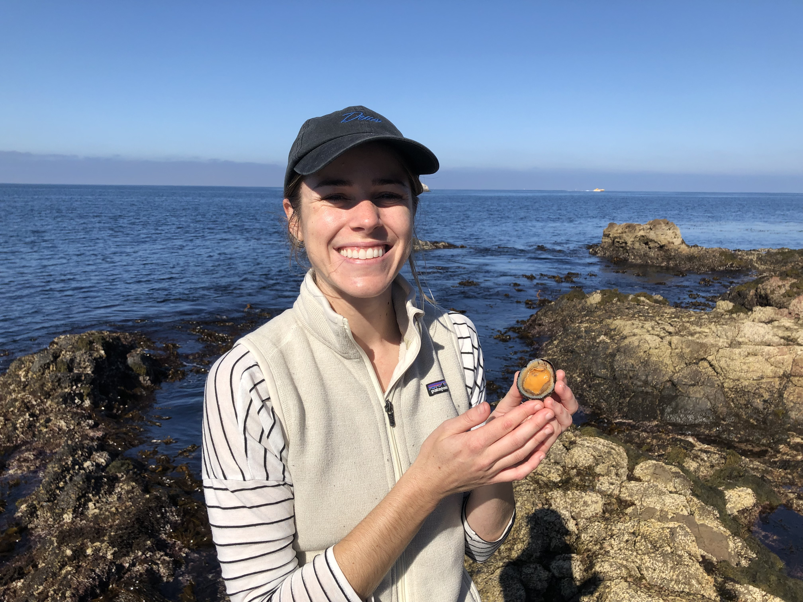
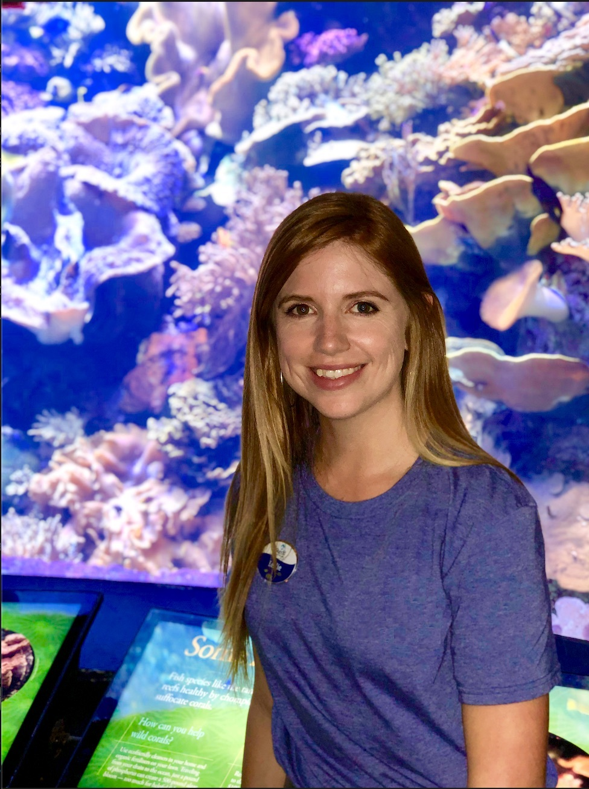

--- 
title: "Marine Genomics"
site: bookdown::bookdown_site
documentclass: book
bibliography: [book.bib, packages.bib]
biblio-style: apalike
link-citations: yes
description: ""
---

# Introduction to Marine Genomics

Welcome to Marine Genomics 2022! This is a course on learning how to analyze genomic data for undergraduate students. We will focus on marine organisms but these lessons can easily be applied to any taxa. We required that students have a background in biology and have completed the general biology series. Additionally, it is helpful if students have taken a course in Evolution, though this was not a requirement. We do not require any coding experience in R or Bash/UNIX. 

The course consists of one 1.5 hour lecture per week. The lectures begin with a power point presentation where we introduce the weeks concept (for example, PCAs) and then are followed by a live coding demonstrations and exercises. 

The first 5 weeks are primarily training in bash/UNIX and R basics. The remaining weeks are focused on performing a specific analysis (PCA, GWAS, Fst outlier analyses, etc). 

We provide all the data for the students to complete each weeks coding activies along with instructions for how to download the data. 

## Cloud computing versus individual laptops

This course was designed to be carried out on the NSF funded Extreme Science and Engineering Discovery Environment (XSEDE) cloud computing resource [Jetstream2](https://docs.jetstream-cloud.org/). 

Jetstream is a unique user-friendly cloud computing resource in that it provides the students with an environment with root privileges, making program installation less complicated. Jetstream also provides a Desktop simulator which allows students to transition between bash and R using the same exact directory paths as the instructor, reducing the confusion of students having unique file paths and providing a more streamlined approach to what for many students is their first coding class. 

Jetstream educational allocations can be applied for through [XSEDE](https://portal.xsede.org/jetstream#allocations:education). The process of applying for a jetstream allocation for educational purposes is relatively straightforward and simply requires a course description, the number of students anticipated to participate, and a calculation of the computing resources required, and the instructors CV. Allocations are typically approved in two to three days and can be submitted ~2 weeks prior to the start of the course.

Alternatively, these course materials can be used on students and instructors individual laptops. The file paths will need to be modified and we cannot guarantee that the installation of programs and R packages will proceed as they did on Jetstream. Thus, progam installation will need to be verified for each week by the instructor.

## Meet our instructors!

Erica Nielsen, Postdoc, lead instructor (esnielsen@ucdavis.edu)-- [Website](https://esnielsen.github.io/).

Tali Magory, Postdoc, co-instructor (talimagory@gmail.com)

Leslie Guerrero, Graduate student, co-instructor (leaguerrero@ucdavis.edu) 

Brooke Benson, Graduate student, teaching assistant (bebenson@ucdavis.edu)

## Schedule
Lecture Thursdays 12:10-1:30

Office hours: TBD

